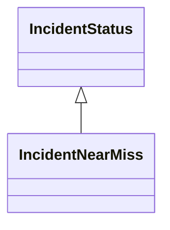

---
search:
  boost: 10.0
---

# Class: IncidentNearMiss 


_The state where an incident was almost successful in taking place i.e._

_"it came very close"_


<div data-search-exclude markdown="1">


URI: [risk:IncidentNearMiss](https://w3id.org/lmodel/dpv/risk/IncidentNearMiss)





## Inheritance
* [IncidentStatus](IncidentStatus.md)
    * **IncidentNearMiss**


## Class Properties

| Property | Value |
| --- | --- |
| Class URI | [risk:IncidentNearMiss](https://w3id.org/lmodel/dpv/risk/IncidentNearMiss) |


## Slots

| Name | Cardinality and Range | Description | Inheritance |
| ---  | --- | --- | --- |


## In Subsets


* [RiskSubset](RiskSubset.md)


## Aliases


* Incident Near Miss


## Identifier and Mapping Information


### Annotations

| property | value |
| --- | --- |
| upstream_iri | https://w3id.org/dpv/risk/owl#IncidentNearMiss |
| dpv_extension_slug | risk |


### Schema Source


* from schema: https://w3id.org/lmodel/dpv/risk


## Mappings

| Mapping Type | Mapped Value |
| ---  | ---  |
| self | risk:IncidentNearMiss |
| native | risk:IncidentNearMiss |
| exact | dpv_risk:IncidentNearMiss, dpv_risk_owl:IncidentNearMiss |
| related | iso42001:AIIncident |


## LinkML Source

<!-- TODO: investigate https://stackoverflow.com/questions/37606292/how-to-create-tabbed-code-blocks-in-mkdocs-or-sphinx -->

### Direct

<details>
```yaml
name: IncidentNearMiss
annotations:
  upstream_iri:
    tag: upstream_iri
    value: https://w3id.org/dpv/risk/owl#IncidentNearMiss
  dpv_extension_slug:
    tag: dpv_extension_slug
    value: risk
description: 'The state where an incident was almost successful in taking place i.e.

  "it came very close"'
in_subset:
- risk_subset
from_schema: https://w3id.org/lmodel/dpv/risk
aliases:
- Incident Near Miss
exact_mappings:
- dpv_risk:IncidentNearMiss
- dpv_risk_owl:IncidentNearMiss
related_mappings:
- iso42001:AIIncident
is_a: IncidentStatus
class_uri: risk:IncidentNearMiss

```
</details>

### Induced

<details>
```yaml
name: IncidentNearMiss
annotations:
  upstream_iri:
    tag: upstream_iri
    value: https://w3id.org/dpv/risk/owl#IncidentNearMiss
  dpv_extension_slug:
    tag: dpv_extension_slug
    value: risk
description: 'The state where an incident was almost successful in taking place i.e.

  "it came very close"'
in_subset:
- risk_subset
from_schema: https://w3id.org/lmodel/dpv/risk
aliases:
- Incident Near Miss
exact_mappings:
- dpv_risk:IncidentNearMiss
- dpv_risk_owl:IncidentNearMiss
related_mappings:
- iso42001:AIIncident
is_a: IncidentStatus
class_uri: risk:IncidentNearMiss

```
</details></div>