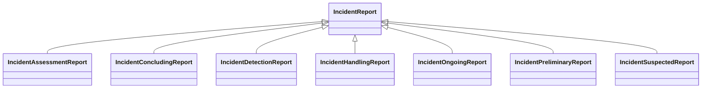

---
search:
  boost: 10.0
---

# Class: IncidentReport 


_Documented information about an incident, its handling, assessments,and_

_notifications_


<div data-search-exclude markdown="1">


URI: [risk:IncidentReport](https://w3id.org/lmodel/dpv/risk/IncidentReport)





## Inheritance
* **IncidentReport**
    * [IncidentAssessmentReport](IncidentAssessmentReport.md)
    * [IncidentConcludingReport](IncidentConcludingReport.md)
    * [IncidentDetectionReport](IncidentDetectionReport.md)
    * [IncidentHandlingReport](IncidentHandlingReport.md)
    * [IncidentOngoingReport](IncidentOngoingReport.md)
    * [IncidentPreliminaryReport](IncidentPreliminaryReport.md)
    * [IncidentSuspectedReport](IncidentSuspectedReport.md)


## Class Properties

| Property | Value |
| --- | --- |
| Class URI | [risk:IncidentReport](https://w3id.org/lmodel/dpv/risk/IncidentReport) |


## Slots

| Name | Cardinality and Range | Description | Inheritance |
| ---  | --- | --- | --- |


## In Subsets


* [RiskSubset](RiskSubset.md)


## Aliases


* Incident Report


## Identifier and Mapping Information


### Annotations

| property | value |
| --- | --- |
| upstream_iri | https://w3id.org/dpv/risk/owl#IncidentReport |
| dpv_extension_slug | risk |


### Schema Source


* from schema: https://w3id.org/lmodel/dpv/risk


## Mappings

| Mapping Type | Mapped Value |
| ---  | ---  |
| self | risk:IncidentReport |
| native | risk:IncidentReport |
| exact | dpv_risk:IncidentReport, dpv_risk_owl:IncidentReport |


## LinkML Source

<!-- TODO: investigate https://stackoverflow.com/questions/37606292/how-to-create-tabbed-code-blocks-in-mkdocs-or-sphinx -->

### Direct

<details>
```yaml
name: IncidentReport
annotations:
  upstream_iri:
    tag: upstream_iri
    value: https://w3id.org/dpv/risk/owl#IncidentReport
  dpv_extension_slug:
    tag: dpv_extension_slug
    value: risk
description: 'Documented information about an incident, its handling, assessments,and

  notifications'
in_subset:
- risk_subset
from_schema: https://w3id.org/lmodel/dpv/risk
aliases:
- Incident Report
exact_mappings:
- dpv_risk:IncidentReport
- dpv_risk_owl:IncidentReport
class_uri: risk:IncidentReport

```
</details>

### Induced

<details>
```yaml
name: IncidentReport
annotations:
  upstream_iri:
    tag: upstream_iri
    value: https://w3id.org/dpv/risk/owl#IncidentReport
  dpv_extension_slug:
    tag: dpv_extension_slug
    value: risk
description: 'Documented information about an incident, its handling, assessments,and

  notifications'
in_subset:
- risk_subset
from_schema: https://w3id.org/lmodel/dpv/risk
aliases:
- Incident Report
exact_mappings:
- dpv_risk:IncidentReport
- dpv_risk_owl:IncidentReport
class_uri: risk:IncidentReport

```
</details></div>