---
search:
  boost: 10.0
---

# Class: IntegrityConcept 


_Indicates a concept is relevant to 'Integrity' in CIA InfoSec model_


<div data-search-exclude markdown="1">


URI: [risk:IntegrityConcept](https://w3id.org/lmodel/dpv/risk/IntegrityConcept)

```mermaid
 classDiagram
    class IntegrityConcept
    click IntegrityConcept href "../IntegrityConcept/"
      IntegrityConcept <|-- AuthorisationFailure
        click AuthorisationFailure href "../AuthorisationFailure/"
      IntegrityConcept <|-- BruteForceAuthorisations
        click BruteForceAuthorisations href "../BruteForceAuthorisations/"
      IntegrityConcept <|-- CompromiseAccount
        click CompromiseAccount href "../CompromiseAccount/"
      IntegrityConcept <|-- DataBreach
        click DataBreach href "../DataBreach/"
      IntegrityConcept <|-- DataCorruption
        click DataCorruption href "../DataCorruption/"
      IntegrityConcept <|-- Deception
        click Deception href "../Deception/"
      IntegrityConcept <|-- Exploitation
        click Exploitation href "../Exploitation/"
      IntegrityConcept <|-- IntegrityBreach
        click IntegrityBreach href "../IntegrityBreach/"
      IntegrityConcept <|-- IntentionalManipulation
        click IntentionalManipulation href "../IntentionalManipulation/"
      IntegrityConcept <|-- MaliciousCodeAttack
        click MaliciousCodeAttack href "../MaliciousCodeAttack/"
      IntegrityConcept <|-- MalwareAttack
        click MalwareAttack href "../MalwareAttack/"
      IntegrityConcept <|-- Sabotage
        click Sabotage href "../Sabotage/"
      IntegrityConcept <|-- SecurityAttack
        click SecurityAttack href "../SecurityAttack/"
      IntegrityConcept <|-- SecurityBreach
        click SecurityBreach href "../SecurityBreach/"
      IntegrityConcept <|-- Spoofing
        click Spoofing href "../Spoofing/"
      IntegrityConcept <|-- SystemIntrusion
        click SystemIntrusion href "../SystemIntrusion/"
      IntegrityConcept <|-- TaskExecutionIncorrect
        click TaskExecutionIncorrect href "../TaskExecutionIncorrect/"
      IntegrityConcept <|-- TaskExecutionRisk
        click TaskExecutionRisk href "../TaskExecutionRisk/"
      IntegrityConcept <|-- TaskOmitted
        click TaskOmitted href "../TaskOmitted/"
      IntegrityConcept <|-- TaskTimingIncorrect
        click TaskTimingIncorrect href "../TaskTimingIncorrect/"
      IntegrityConcept <|-- UnauthorisedAccessToPremises
        click UnauthorisedAccessToPremises href "../UnauthorisedAccessToPremises/"
      IntegrityConcept <|-- UnauthorisedActivity
        click UnauthorisedActivity href "../UnauthorisedActivity/"
      IntegrityConcept <|-- UnauthorisedCodeAccess
        click UnauthorisedCodeAccess href "../UnauthorisedCodeAccess/"
      IntegrityConcept <|-- UnauthorisedCodeModification
        click UnauthorisedCodeModification href "../UnauthorisedCodeModification/"
      IntegrityConcept <|-- UnauthorisedDataModification
        click UnauthorisedDataModification href "../UnauthorisedDataModification/"
      IntegrityConcept <|-- UnauthorisedSystemAccess
        click UnauthorisedSystemAccess href "../UnauthorisedSystemAccess/"
      IntegrityConcept <|-- UnauthorisedSystemModification
        click UnauthorisedSystemModification href "../UnauthorisedSystemModification/"
      IntegrityConcept <|-- UnwantedCodeDeletion
        click UnwantedCodeDeletion href "../UnwantedCodeDeletion/"
      IntegrityConcept <|-- UnwantedDataDeletion
        click UnwantedDataDeletion href "../UnwantedDataDeletion/"
      
      
```





<!-- no inheritance hierarchy -->

## Class Properties

| Property | Value |
| --- | --- |
| Class URI | [risk:IntegrityConcept](https://w3id.org/lmodel/dpv/risk/IntegrityConcept) |


## Slots

| Name | Cardinality and Range | Description | Inheritance |
| ---  | --- | --- | --- |


## In Subsets


* [RiskSubset](RiskSubset.md)


## Aliases


* Integrity Concept


## Comments

* This concept allows indicating the applicability of Integrity dimension
to concepts whether they are a risk source, risk, consequence, or impact


## Identifier and Mapping Information


### Annotations

| property | value |
| --- | --- |
| upstream_iri | https://w3id.org/dpv/risk/owl#IntegrityConcept |
| dpv_extension_slug | risk |


### Schema Source


* from schema: https://w3id.org/lmodel/dpv/risk


## Mappings

| Mapping Type | Mapped Value |
| ---  | ---  |
| self | risk:IntegrityConcept |
| native | risk:IntegrityConcept |
| exact | dpv_risk:IntegrityConcept, dpv_risk_owl:IntegrityConcept |


## LinkML Source

<!-- TODO: investigate https://stackoverflow.com/questions/37606292/how-to-create-tabbed-code-blocks-in-mkdocs-or-sphinx -->

### Direct

<details>
```yaml
name: IntegrityConcept
annotations:
  upstream_iri:
    tag: upstream_iri
    value: https://w3id.org/dpv/risk/owl#IntegrityConcept
  dpv_extension_slug:
    tag: dpv_extension_slug
    value: risk
description: Indicates a concept is relevant to 'Integrity' in CIA InfoSec model
comments:
- 'This concept allows indicating the applicability of Integrity dimension

  to concepts whether they are a risk source, risk, consequence, or impact'
in_subset:
- risk_subset
from_schema: https://w3id.org/lmodel/dpv/risk
aliases:
- Integrity Concept
exact_mappings:
- dpv_risk:IntegrityConcept
- dpv_risk_owl:IntegrityConcept
class_uri: risk:IntegrityConcept

```
</details>

### Induced

<details>
```yaml
name: IntegrityConcept
annotations:
  upstream_iri:
    tag: upstream_iri
    value: https://w3id.org/dpv/risk/owl#IntegrityConcept
  dpv_extension_slug:
    tag: dpv_extension_slug
    value: risk
description: Indicates a concept is relevant to 'Integrity' in CIA InfoSec model
comments:
- 'This concept allows indicating the applicability of Integrity dimension

  to concepts whether they are a risk source, risk, consequence, or impact'
in_subset:
- risk_subset
from_schema: https://w3id.org/lmodel/dpv/risk
aliases:
- Integrity Concept
exact_mappings:
- dpv_risk:IntegrityConcept
- dpv_risk_owl:IntegrityConcept
class_uri: risk:IntegrityConcept

```
</details></div>