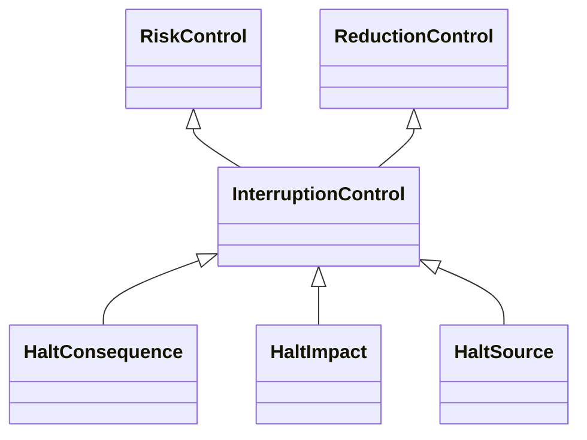

---
search:
  boost: 10.0
---

# Class: InterruptionControl 


_Control that interrupts an event without removing the possibility for it_

_to be resumed and where the aim is to stop the event_


<div data-search-exclude markdown="1">


URI: [risk:InterruptionControl](https://w3id.org/lmodel/dpv/risk/InterruptionControl)





## Inheritance
* [RiskControl](RiskControl.md)
    * [ReactiveControl](ReactiveControl.md)
        * [ReductionControl](ReductionControl.md) [ [RiskControl](RiskControl.md)]
            * **InterruptionControl** [ [RiskControl](RiskControl.md)]
                * [HaltSource](HaltSource.md) [ [RiskControl](RiskControl.md) [SourceControl](SourceControl.md)]


## Class Properties

| Property | Value |
| --- | --- |
| Class URI | [risk:InterruptionControl](https://w3id.org/lmodel/dpv/risk/InterruptionControl) |


## Slots

| Name | Cardinality and Range | Description | Inheritance |
| ---  | --- | --- | --- |


## In Subsets


* [RiskSubset](RiskSubset.md)


## Aliases


* Interruption Control


## Comments

* Interruption refers to the event being temporarily halted, such as an
emergency measure while further suitable measures are identified and put
in place. To indicate stopping the event completely rather than a
temporary interruption, see risk:RemediationControl which fixes the
underlying issue and risk:EliminationControl which prevents the event
from occurring


## Identifier and Mapping Information


### Annotations

| property | value |
| --- | --- |
| upstream_iri | https://w3id.org/dpv/risk/owl#InterruptionControl |
| dpv_extension_slug | risk |


### Schema Source


* from schema: https://w3id.org/lmodel/dpv/risk


## Mappings

| Mapping Type | Mapped Value |
| ---  | ---  |
| self | risk:InterruptionControl |
| native | risk:InterruptionControl |
| exact | dpv_risk:InterruptionControl, dpv_risk_owl:InterruptionControl |


## LinkML Source

<!-- TODO: investigate https://stackoverflow.com/questions/37606292/how-to-create-tabbed-code-blocks-in-mkdocs-or-sphinx -->

### Direct

<details>
```yaml
name: InterruptionControl
annotations:
  upstream_iri:
    tag: upstream_iri
    value: https://w3id.org/dpv/risk/owl#InterruptionControl
  dpv_extension_slug:
    tag: dpv_extension_slug
    value: risk
description: 'Control that interrupts an event without removing the possibility for
  it

  to be resumed and where the aim is to stop the event'
comments:
- 'Interruption refers to the event being temporarily halted, such as an

  emergency measure while further suitable measures are identified and put

  in place. To indicate stopping the event completely rather than a

  temporary interruption, see risk:RemediationControl which fixes the

  underlying issue and risk:EliminationControl which prevents the event

  from occurring'
in_subset:
- risk_subset
from_schema: https://w3id.org/lmodel/dpv/risk
aliases:
- Interruption Control
exact_mappings:
- dpv_risk:InterruptionControl
- dpv_risk_owl:InterruptionControl
is_a: ReductionControl
mixins:
- RiskControl
class_uri: risk:InterruptionControl

```
</details>

### Induced

<details>
```yaml
name: InterruptionControl
annotations:
  upstream_iri:
    tag: upstream_iri
    value: https://w3id.org/dpv/risk/owl#InterruptionControl
  dpv_extension_slug:
    tag: dpv_extension_slug
    value: risk
description: 'Control that interrupts an event without removing the possibility for
  it

  to be resumed and where the aim is to stop the event'
comments:
- 'Interruption refers to the event being temporarily halted, such as an

  emergency measure while further suitable measures are identified and put

  in place. To indicate stopping the event completely rather than a

  temporary interruption, see risk:RemediationControl which fixes the

  underlying issue and risk:EliminationControl which prevents the event

  from occurring'
in_subset:
- risk_subset
from_schema: https://w3id.org/lmodel/dpv/risk
aliases:
- Interruption Control
exact_mappings:
- dpv_risk:InterruptionControl
- dpv_risk_owl:InterruptionControl
is_a: ReductionControl
mixins:
- RiskControl
class_uri: risk:InterruptionControl

```
</details></div>