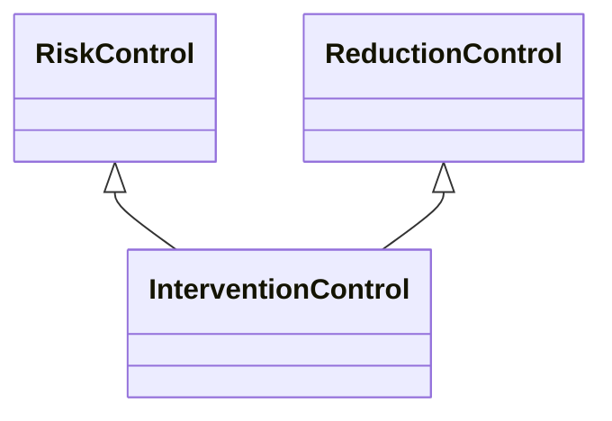

---
search:
  boost: 10.0
---

# Class: InterventionControl 


_Control that intervenes in the operations of the event to change some_

_context with the aim of changing the event or the effects_


<div data-search-exclude markdown="1">


URI: [risk:InterventionControl](https://w3id.org/lmodel/dpv/risk/InterventionControl)





## Inheritance
* [RiskControl](RiskControl.md)
    * [ReactiveControl](ReactiveControl.md)
        * [ReductionControl](ReductionControl.md) [ [RiskControl](RiskControl.md)]
            * **InterventionControl** [ [RiskControl](RiskControl.md)]


## Class Properties

| Property | Value |
| --- | --- |
| Class URI | [risk:InterventionControl](https://w3id.org/lmodel/dpv/risk/InterventionControl) |


## Slots

| Name | Cardinality and Range | Description | Inheritance |
| ---  | --- | --- | --- |


## In Subsets


* [RiskSubset](RiskSubset.md)


## Aliases


* Intervention Control


## Comments

* Intervention implies taking steps to resolve the effects or to prevent
further escalation while the event is still ongoing. For halting the
event, see risk:InterruptionControl, for recovering and undoing the
effects, see risk:RecoveryControl and risk:ReversalControl. Intervention
is a temporary or stop-gap measure which is used while the event is
ongoing to prevent it from escalating or creating additional issues


## Identifier and Mapping Information


### Annotations

| property | value |
| --- | --- |
| upstream_iri | https://w3id.org/dpv/risk/owl#InterventionControl |
| dpv_extension_slug | risk |


### Schema Source


* from schema: https://w3id.org/lmodel/dpv/risk


## Mappings

| Mapping Type | Mapped Value |
| ---  | ---  |
| self | risk:InterventionControl |
| native | risk:InterventionControl |
| exact | dpv_risk:InterventionControl, dpv_risk_owl:InterventionControl |


## LinkML Source

<!-- TODO: investigate https://stackoverflow.com/questions/37606292/how-to-create-tabbed-code-blocks-in-mkdocs-or-sphinx -->

### Direct

<details>
```yaml
name: InterventionControl
annotations:
  upstream_iri:
    tag: upstream_iri
    value: https://w3id.org/dpv/risk/owl#InterventionControl
  dpv_extension_slug:
    tag: dpv_extension_slug
    value: risk
description: 'Control that intervenes in the operations of the event to change some

  context with the aim of changing the event or the effects'
comments:
- 'Intervention implies taking steps to resolve the effects or to prevent

  further escalation while the event is still ongoing. For halting the

  event, see risk:InterruptionControl, for recovering and undoing the

  effects, see risk:RecoveryControl and risk:ReversalControl. Intervention

  is a temporary or stop-gap measure which is used while the event is

  ongoing to prevent it from escalating or creating additional issues'
in_subset:
- risk_subset
from_schema: https://w3id.org/lmodel/dpv/risk
aliases:
- Intervention Control
exact_mappings:
- dpv_risk:InterventionControl
- dpv_risk_owl:InterventionControl
is_a: ReductionControl
mixins:
- RiskControl
class_uri: risk:InterventionControl

```
</details>

### Induced

<details>
```yaml
name: InterventionControl
annotations:
  upstream_iri:
    tag: upstream_iri
    value: https://w3id.org/dpv/risk/owl#InterventionControl
  dpv_extension_slug:
    tag: dpv_extension_slug
    value: risk
description: 'Control that intervenes in the operations of the event to change some

  context with the aim of changing the event or the effects'
comments:
- 'Intervention implies taking steps to resolve the effects or to prevent

  further escalation while the event is still ongoing. For halting the

  event, see risk:InterruptionControl, for recovering and undoing the

  effects, see risk:RecoveryControl and risk:ReversalControl. Intervention

  is a temporary or stop-gap measure which is used while the event is

  ongoing to prevent it from escalating or creating additional issues'
in_subset:
- risk_subset
from_schema: https://w3id.org/lmodel/dpv/risk
aliases:
- Intervention Control
exact_mappings:
- dpv_risk:InterventionControl
- dpv_risk_owl:InterventionControl
is_a: ReductionControl
mixins:
- RiskControl
class_uri: risk:InterventionControl

```
</details></div>