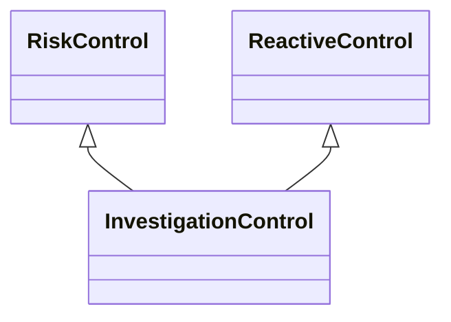

---
search:
  boost: 10.0
---

# Class: InvestigationControl 


_Control that identifies information through an investigative process_

_about an event and its effects after it has occurred_


<div data-search-exclude markdown="1">


URI: [risk:InvestigationControl](https://w3id.org/lmodel/dpv/risk/InvestigationControl)





## Inheritance
* [RiskControl](RiskControl.md)
    * [ReactiveControl](ReactiveControl.md)
        * **InvestigationControl** [ [RiskControl](RiskControl.md)]


## Class Properties

| Property | Value |
| --- | --- |
| Class URI | [risk:InvestigationControl](https://w3id.org/lmodel/dpv/risk/InvestigationControl) |


## Slots

| Name | Cardinality and Range | Description | Inheritance |
| ---  | --- | --- | --- |


## In Subsets


* [RiskSubset](RiskSubset.md)


## Aliases


* Investigation Control


## Comments

* Investigative controls are used to identify information about an event
and its effects which can be used to identify further effective measures
to address them, and to identify processes to remedy and recover from
it. Investigation control therefore is focused on analysis of an event
after its occurrence with the goal of identifying applicability and
effectiveness of other controls to address it


## Identifier and Mapping Information


### Annotations

| property | value |
| --- | --- |
| upstream_iri | https://w3id.org/dpv/risk/owl#InvestigationControl |
| dpv_extension_slug | risk |


### Schema Source


* from schema: https://w3id.org/lmodel/dpv/risk


## Mappings

| Mapping Type | Mapped Value |
| ---  | ---  |
| self | risk:InvestigationControl |
| native | risk:InvestigationControl |
| exact | dpv_risk:InvestigationControl, dpv_risk_owl:InvestigationControl |


## LinkML Source

<!-- TODO: investigate https://stackoverflow.com/questions/37606292/how-to-create-tabbed-code-blocks-in-mkdocs-or-sphinx -->

### Direct

<details>
```yaml
name: InvestigationControl
annotations:
  upstream_iri:
    tag: upstream_iri
    value: https://w3id.org/dpv/risk/owl#InvestigationControl
  dpv_extension_slug:
    tag: dpv_extension_slug
    value: risk
description: 'Control that identifies information through an investigative process

  about an event and its effects after it has occurred'
comments:
- 'Investigative controls are used to identify information about an event

  and its effects which can be used to identify further effective measures

  to address them, and to identify processes to remedy and recover from

  it. Investigation control therefore is focused on analysis of an event

  after its occurrence with the goal of identifying applicability and

  effectiveness of other controls to address it'
in_subset:
- risk_subset
from_schema: https://w3id.org/lmodel/dpv/risk
aliases:
- Investigation Control
exact_mappings:
- dpv_risk:InvestigationControl
- dpv_risk_owl:InvestigationControl
is_a: ReactiveControl
mixins:
- RiskControl
class_uri: risk:InvestigationControl

```
</details>

### Induced

<details>
```yaml
name: InvestigationControl
annotations:
  upstream_iri:
    tag: upstream_iri
    value: https://w3id.org/dpv/risk/owl#InvestigationControl
  dpv_extension_slug:
    tag: dpv_extension_slug
    value: risk
description: 'Control that identifies information through an investigative process

  about an event and its effects after it has occurred'
comments:
- 'Investigative controls are used to identify information about an event

  and its effects which can be used to identify further effective measures

  to address them, and to identify processes to remedy and recover from

  it. Investigation control therefore is focused on analysis of an event

  after its occurrence with the goal of identifying applicability and

  effectiveness of other controls to address it'
in_subset:
- risk_subset
from_schema: https://w3id.org/lmodel/dpv/risk
aliases:
- Investigation Control
exact_mappings:
- dpv_risk:InvestigationControl
- dpv_risk_owl:InvestigationControl
is_a: ReactiveControl
mixins:
- RiskControl
class_uri: risk:InvestigationControl

```
</details></div>