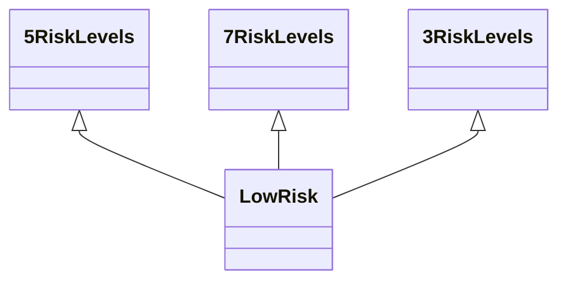

---
search:
  boost: 10.0
---

# Class: LowRisk 


_Level where Risk is Low_


<div data-search-exclude markdown="1">


URI: [risk:LowRisk](https://w3id.org/lmodel/dpv/risk/LowRisk)





## Inheritance
* [3RiskLevels](3RiskLevels.md)
    * **LowRisk** [ [5RiskLevels](5RiskLevels.md) [7RiskLevels](7RiskLevels.md)]


## Class Properties

| Property | Value |
| --- | --- |
| Class URI | [risk:LowRisk](https://w3id.org/lmodel/dpv/risk/LowRisk) |


## Slots

| Name | Cardinality and Range | Description | Inheritance |
| ---  | --- | --- | --- |


## In Subsets


* [RiskSubset](RiskSubset.md)


## Aliases


* Low Risk


## Comments

* The suggested quantitative value for this concept is 0.25 on a scale of
0 to 1


## Identifier and Mapping Information


### Annotations

| property | value |
| --- | --- |
| upstream_iri | https://w3id.org/dpv/risk/owl#LowRisk |
| dpv_extension_slug | risk |


### Schema Source


* from schema: https://w3id.org/lmodel/dpv/risk


## Mappings

| Mapping Type | Mapped Value |
| ---  | ---  |
| self | risk:LowRisk |
| native | risk:LowRisk |
| exact | dpv_risk:LowRisk, dpv_risk_owl:LowRisk |


## LinkML Source

<!-- TODO: investigate https://stackoverflow.com/questions/37606292/how-to-create-tabbed-code-blocks-in-mkdocs-or-sphinx -->

### Direct

<details>
```yaml
name: LowRisk
annotations:
  upstream_iri:
    tag: upstream_iri
    value: https://w3id.org/dpv/risk/owl#LowRisk
  dpv_extension_slug:
    tag: dpv_extension_slug
    value: risk
description: Level where Risk is Low
comments:
- 'The suggested quantitative value for this concept is 0.25 on a scale of

  0 to 1'
in_subset:
- risk_subset
from_schema: https://w3id.org/lmodel/dpv/risk
aliases:
- Low Risk
exact_mappings:
- dpv_risk:LowRisk
- dpv_risk_owl:LowRisk
is_a: 3RiskLevels
mixins:
- 5RiskLevels
- 7RiskLevels
class_uri: risk:LowRisk

```
</details>

### Induced

<details>
```yaml
name: LowRisk
annotations:
  upstream_iri:
    tag: upstream_iri
    value: https://w3id.org/dpv/risk/owl#LowRisk
  dpv_extension_slug:
    tag: dpv_extension_slug
    value: risk
description: Level where Risk is Low
comments:
- 'The suggested quantitative value for this concept is 0.25 on a scale of

  0 to 1'
in_subset:
- risk_subset
from_schema: https://w3id.org/lmodel/dpv/risk
aliases:
- Low Risk
exact_mappings:
- dpv_risk:LowRisk
- dpv_risk_owl:LowRisk
is_a: 3RiskLevels
mixins:
- 5RiskLevels
- 7RiskLevels
class_uri: risk:LowRisk

```
</details></div>