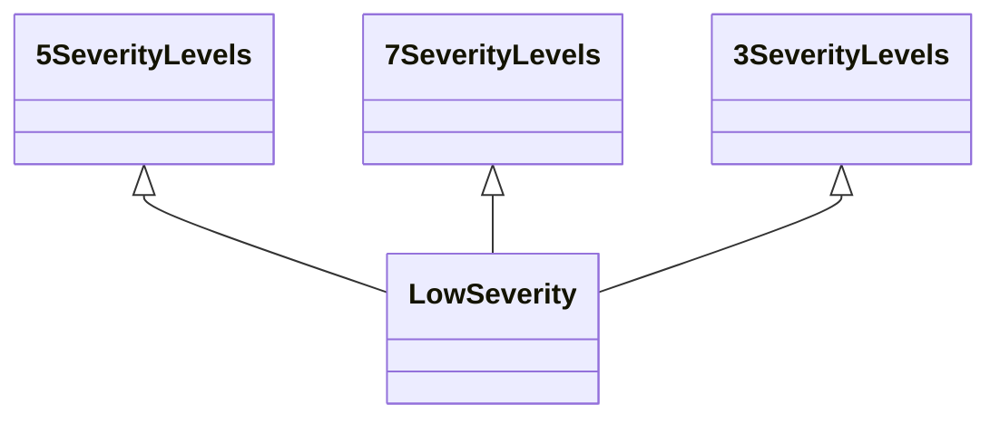

---
search:
  boost: 10.0
---

# Class: LowSeverity 


_Level where Severity is Low_


<div data-search-exclude markdown="1">


URI: [risk:LowSeverity](https://w3id.org/lmodel/dpv/risk/LowSeverity)





## Inheritance
* [3SeverityLevels](3SeverityLevels.md)
    * **LowSeverity** [ [5SeverityLevels](5SeverityLevels.md) [7SeverityLevels](7SeverityLevels.md)]


## Class Properties

| Property | Value |
| --- | --- |
| Class URI | [risk:LowSeverity](https://w3id.org/lmodel/dpv/risk/LowSeverity) |


## Slots

| Name | Cardinality and Range | Description | Inheritance |
| ---  | --- | --- | --- |


## In Subsets


* [RiskSubset](RiskSubset.md)


## Aliases


* Low Severity


## Comments

* The suggested quantitative value for this concept is 0.25 on a scale of
0 to 1


## Identifier and Mapping Information


### Annotations

| property | value |
| --- | --- |
| upstream_iri | https://w3id.org/dpv/risk/owl#LowSeverity |
| dpv_extension_slug | risk |


### Schema Source


* from schema: https://w3id.org/lmodel/dpv/risk


## Mappings

| Mapping Type | Mapped Value |
| ---  | ---  |
| self | risk:LowSeverity |
| native | risk:LowSeverity |
| exact | dpv_risk:LowSeverity, dpv_risk_owl:LowSeverity |


## LinkML Source

<!-- TODO: investigate https://stackoverflow.com/questions/37606292/how-to-create-tabbed-code-blocks-in-mkdocs-or-sphinx -->

### Direct

<details>
```yaml
name: LowSeverity
annotations:
  upstream_iri:
    tag: upstream_iri
    value: https://w3id.org/dpv/risk/owl#LowSeverity
  dpv_extension_slug:
    tag: dpv_extension_slug
    value: risk
description: Level where Severity is Low
comments:
- 'The suggested quantitative value for this concept is 0.25 on a scale of

  0 to 1'
in_subset:
- risk_subset
from_schema: https://w3id.org/lmodel/dpv/risk
aliases:
- Low Severity
exact_mappings:
- dpv_risk:LowSeverity
- dpv_risk_owl:LowSeverity
is_a: 3SeverityLevels
mixins:
- 5SeverityLevels
- 7SeverityLevels
class_uri: risk:LowSeverity

```
</details>

### Induced

<details>
```yaml
name: LowSeverity
annotations:
  upstream_iri:
    tag: upstream_iri
    value: https://w3id.org/dpv/risk/owl#LowSeverity
  dpv_extension_slug:
    tag: dpv_extension_slug
    value: risk
description: Level where Severity is Low
comments:
- 'The suggested quantitative value for this concept is 0.25 on a scale of

  0 to 1'
in_subset:
- risk_subset
from_schema: https://w3id.org/lmodel/dpv/risk
aliases:
- Low Severity
exact_mappings:
- dpv_risk:LowSeverity
- dpv_risk_owl:LowSeverity
is_a: 3SeverityLevels
mixins:
- 5SeverityLevels
- 7SeverityLevels
class_uri: risk:LowSeverity

```
</details></div>