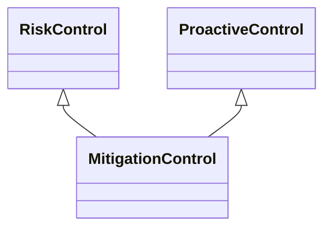

---
search:
  boost: 10.0
---

# Class: MitigationControl 


_Control that aims to reduce the likelihood or effect of an event with_

_the goal of managing an event accepted to occur_


<div data-search-exclude markdown="1">


URI: [risk:MitigationControl](https://w3id.org/lmodel/dpv/risk/MitigationControl)





## Inheritance
* [RiskControl](RiskControl.md)
    * [ProactiveControl](ProactiveControl.md)
        * **MitigationControl** [ [RiskControl](RiskControl.md)]


## Class Properties

| Property | Value |
| --- | --- |
| Class URI | [risk:MitigationControl](https://w3id.org/lmodel/dpv/risk/MitigationControl) |


## Slots

| Name | Cardinality and Range | Description | Inheritance |
| ---  | --- | --- | --- |


## In Subsets


* [RiskSubset](RiskSubset.md)


## Aliases


* Mitigation Control


## Comments

* Mitigation requires accepting that an event will occur, and thereby
focusing on managing it by reducing its likelihood or effects by adding
additional processes to specifically address the event or its effects


## Identifier and Mapping Information


### Annotations

| property | value |
| --- | --- |
| upstream_iri | https://w3id.org/dpv/risk/owl#MitigationControl |
| dpv_extension_slug | risk |


### Schema Source


* from schema: https://w3id.org/lmodel/dpv/risk


## Mappings

| Mapping Type | Mapped Value |
| ---  | ---  |
| self | risk:MitigationControl |
| native | risk:MitigationControl |
| exact | dpv_risk:MitigationControl, dpv_risk_owl:MitigationControl |


## LinkML Source

<!-- TODO: investigate https://stackoverflow.com/questions/37606292/how-to-create-tabbed-code-blocks-in-mkdocs-or-sphinx -->

### Direct

<details>
```yaml
name: MitigationControl
annotations:
  upstream_iri:
    tag: upstream_iri
    value: https://w3id.org/dpv/risk/owl#MitigationControl
  dpv_extension_slug:
    tag: dpv_extension_slug
    value: risk
description: 'Control that aims to reduce the likelihood or effect of an event with

  the goal of managing an event accepted to occur'
comments:
- 'Mitigation requires accepting that an event will occur, and thereby

  focusing on managing it by reducing its likelihood or effects by adding

  additional processes to specifically address the event or its effects'
in_subset:
- risk_subset
from_schema: https://w3id.org/lmodel/dpv/risk
aliases:
- Mitigation Control
exact_mappings:
- dpv_risk:MitigationControl
- dpv_risk_owl:MitigationControl
is_a: ProactiveControl
mixins:
- RiskControl
class_uri: risk:MitigationControl

```
</details>

### Induced

<details>
```yaml
name: MitigationControl
annotations:
  upstream_iri:
    tag: upstream_iri
    value: https://w3id.org/dpv/risk/owl#MitigationControl
  dpv_extension_slug:
    tag: dpv_extension_slug
    value: risk
description: 'Control that aims to reduce the likelihood or effect of an event with

  the goal of managing an event accepted to occur'
comments:
- 'Mitigation requires accepting that an event will occur, and thereby

  focusing on managing it by reducing its likelihood or effects by adding

  additional processes to specifically address the event or its effects'
in_subset:
- risk_subset
from_schema: https://w3id.org/lmodel/dpv/risk
aliases:
- Mitigation Control
exact_mappings:
- dpv_risk:MitigationControl
- dpv_risk_owl:MitigationControl
is_a: ProactiveControl
mixins:
- RiskControl
class_uri: risk:MitigationControl

```
</details></div>