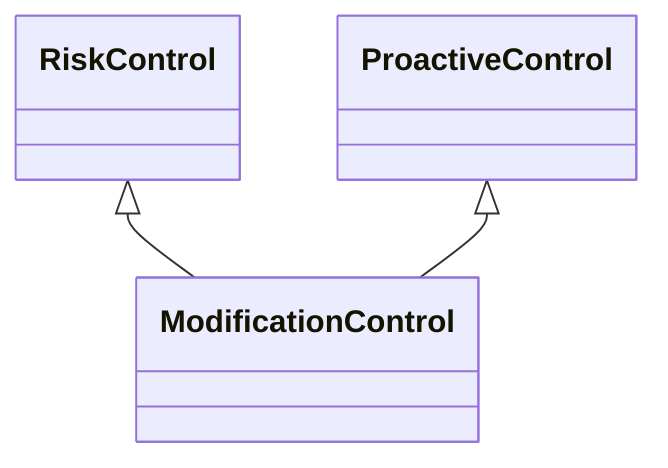

---
search:
  boost: 10.0
---

# Class: ModificationControl 


_Control that modifies the context to change the event's characteristics_

_such that the event still occurs but with the modified characteristics_

_with the goal of managing an event that is accepted to occur_


<div data-search-exclude markdown="1">


URI: [risk:ModificationControl](https://w3id.org/lmodel/dpv/risk/ModificationControl)





## Inheritance
* [RiskControl](RiskControl.md)
    * [ProactiveControl](ProactiveControl.md)
        * **ModificationControl** [ [RiskControl](RiskControl.md)]


## Class Properties

| Property | Value |
| --- | --- |
| Class URI | [risk:ModificationControl](https://w3id.org/lmodel/dpv/risk/ModificationControl) |


## Slots

| Name | Cardinality and Range | Description | Inheritance |
| ---  | --- | --- | --- |


## In Subsets


* [RiskSubset](RiskSubset.md)


## Aliases


* Modification Control


## Comments

* Modification necessitates a change in the context to result in a change
in the event's characteristics. Where such changes reduce the likelihood
or effects of the event, the modification also works as a mitigation for
the event


## Identifier and Mapping Information


### Annotations

| property | value |
| --- | --- |
| upstream_iri | https://w3id.org/dpv/risk/owl#ModificationControl |
| dpv_extension_slug | risk |


### Schema Source


* from schema: https://w3id.org/lmodel/dpv/risk


## Mappings

| Mapping Type | Mapped Value |
| ---  | ---  |
| self | risk:ModificationControl |
| native | risk:ModificationControl |
| exact | dpv_risk:ModificationControl, dpv_risk_owl:ModificationControl |


## LinkML Source

<!-- TODO: investigate https://stackoverflow.com/questions/37606292/how-to-create-tabbed-code-blocks-in-mkdocs-or-sphinx -->

### Direct

<details>
```yaml
name: ModificationControl
annotations:
  upstream_iri:
    tag: upstream_iri
    value: https://w3id.org/dpv/risk/owl#ModificationControl
  dpv_extension_slug:
    tag: dpv_extension_slug
    value: risk
description: 'Control that modifies the context to change the event''s characteristics

  such that the event still occurs but with the modified characteristics

  with the goal of managing an event that is accepted to occur'
comments:
- 'Modification necessitates a change in the context to result in a change

  in the event''s characteristics. Where such changes reduce the likelihood

  or effects of the event, the modification also works as a mitigation for

  the event'
in_subset:
- risk_subset
from_schema: https://w3id.org/lmodel/dpv/risk
aliases:
- Modification Control
exact_mappings:
- dpv_risk:ModificationControl
- dpv_risk_owl:ModificationControl
is_a: ProactiveControl
mixins:
- RiskControl
class_uri: risk:ModificationControl

```
</details>

### Induced

<details>
```yaml
name: ModificationControl
annotations:
  upstream_iri:
    tag: upstream_iri
    value: https://w3id.org/dpv/risk/owl#ModificationControl
  dpv_extension_slug:
    tag: dpv_extension_slug
    value: risk
description: 'Control that modifies the context to change the event''s characteristics

  such that the event still occurs but with the modified characteristics

  with the goal of managing an event that is accepted to occur'
comments:
- 'Modification necessitates a change in the context to result in a change

  in the event''s characteristics. Where such changes reduce the likelihood

  or effects of the event, the modification also works as a mitigation for

  the event'
in_subset:
- risk_subset
from_schema: https://w3id.org/lmodel/dpv/risk
aliases:
- Modification Control
exact_mappings:
- dpv_risk:ModificationControl
- dpv_risk_owl:ModificationControl
is_a: ProactiveControl
mixins:
- RiskControl
class_uri: risk:ModificationControl

```
</details></div>