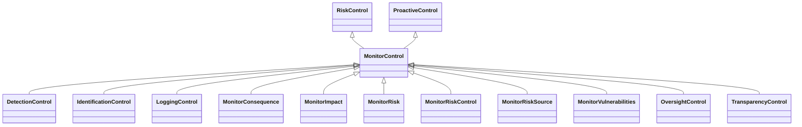

---
search:
  boost: 10.0
---

# Class: MonitorControl 


_Control that monitors for the occurrence of an event_


<div data-search-exclude markdown="1">


URI: [risk:MonitorControl](https://w3id.org/lmodel/dpv/risk/MonitorControl)





## Inheritance
* [RiskControl](RiskControl.md)
    * [ProactiveControl](ProactiveControl.md)
        * **MonitorControl** [ [RiskControl](RiskControl.md)]
            * [DetectionControl](DetectionControl.md) [ [RiskControl](RiskControl.md)]
            * [IdentificationControl](IdentificationControl.md) [ [RiskControl](RiskControl.md)]
            * [LoggingControl](LoggingControl.md) [ [RiskControl](RiskControl.md)]
            * [MonitorConsequence](MonitorConsequence.md) [ [RiskControl](RiskControl.md)]
            * [MonitorImpact](MonitorImpact.md) [ [RiskControl](RiskControl.md)]
            * [MonitorRisk](MonitorRisk.md) [ [RiskControl](RiskControl.md)]
            * [MonitorRiskControl](MonitorRiskControl.md) [ [RiskControl](RiskControl.md)]
            * [MonitorRiskSource](MonitorRiskSource.md) [ [RiskControl](RiskControl.md)]
            * [MonitorVulnerabilities](MonitorVulnerabilities.md) [ [RiskControl](RiskControl.md)]
            * [OversightControl](OversightControl.md) [ [RiskControl](RiskControl.md)]
            * [TransparencyControl](TransparencyControl.md) [ [RiskControl](RiskControl.md)]


## Class Properties

| Property | Value |
| --- | --- |
| Class URI | [risk:MonitorControl](https://w3id.org/lmodel/dpv/risk/MonitorControl) |


## Slots

| Name | Cardinality and Range | Description | Inheritance |
| ---  | --- | --- | --- |


## In Subsets


* [RiskSubset](RiskSubset.md)


## Aliases


* Monitor Control


## Comments

* Monitoring is a broad term that refers to identifying information about
an event, including its occurrence, characteristics such as severity or
specific contextual metrics, affected things and entities, and having
the ability to obtain and use this information to address the event.
Monitoring is also used to refer to the activities associated with
ensuring controls are active and effective. For this reason, specific
concepts are defined which extend this control to express explicit
actions included in the general use of 'monitoring' in risk management


## Identifier and Mapping Information


### Annotations

| property | value |
| --- | --- |
| upstream_iri | https://w3id.org/dpv/risk/owl#MonitorControl |
| dpv_extension_slug | risk |


### Schema Source


* from schema: https://w3id.org/lmodel/dpv/risk


## Mappings

| Mapping Type | Mapped Value |
| ---  | ---  |
| self | risk:MonitorControl |
| native | risk:MonitorControl |
| exact | dpv_risk:MonitorControl, dpv_risk_owl:MonitorControl |


## LinkML Source

<!-- TODO: investigate https://stackoverflow.com/questions/37606292/how-to-create-tabbed-code-blocks-in-mkdocs-or-sphinx -->

### Direct

<details>
```yaml
name: MonitorControl
annotations:
  upstream_iri:
    tag: upstream_iri
    value: https://w3id.org/dpv/risk/owl#MonitorControl
  dpv_extension_slug:
    tag: dpv_extension_slug
    value: risk
description: Control that monitors for the occurrence of an event
comments:
- 'Monitoring is a broad term that refers to identifying information about

  an event, including its occurrence, characteristics such as severity or

  specific contextual metrics, affected things and entities, and having

  the ability to obtain and use this information to address the event.

  Monitoring is also used to refer to the activities associated with

  ensuring controls are active and effective. For this reason, specific

  concepts are defined which extend this control to express explicit

  actions included in the general use of ''monitoring'' in risk management'
in_subset:
- risk_subset
from_schema: https://w3id.org/lmodel/dpv/risk
aliases:
- Monitor Control
exact_mappings:
- dpv_risk:MonitorControl
- dpv_risk_owl:MonitorControl
is_a: ProactiveControl
mixins:
- RiskControl
class_uri: risk:MonitorControl

```
</details>

### Induced

<details>
```yaml
name: MonitorControl
annotations:
  upstream_iri:
    tag: upstream_iri
    value: https://w3id.org/dpv/risk/owl#MonitorControl
  dpv_extension_slug:
    tag: dpv_extension_slug
    value: risk
description: Control that monitors for the occurrence of an event
comments:
- 'Monitoring is a broad term that refers to identifying information about

  an event, including its occurrence, characteristics such as severity or

  specific contextual metrics, affected things and entities, and having

  the ability to obtain and use this information to address the event.

  Monitoring is also used to refer to the activities associated with

  ensuring controls are active and effective. For this reason, specific

  concepts are defined which extend this control to express explicit

  actions included in the general use of ''monitoring'' in risk management'
in_subset:
- risk_subset
from_schema: https://w3id.org/lmodel/dpv/risk
aliases:
- Monitor Control
exact_mappings:
- dpv_risk:MonitorControl
- dpv_risk_owl:MonitorControl
is_a: ProactiveControl
mixins:
- RiskControl
class_uri: risk:MonitorControl

```
</details></div>