---
search:
  boost: 10.0
---

# Class: OperationalSecurityRisk 


_Risks and issues that arise during operational processes_


<div data-search-exclude markdown="1">


URI: [risk:OperationalSecurityRisk](https://w3id.org/lmodel/dpv/risk/OperationalSecurityRisk)

```mermaid
 classDiagram
    class OperationalSecurityRisk
    click OperationalSecurityRisk href "../OperationalSecurityRisk/"
      PotentialConsequence <|-- OperationalSecurityRisk
        click PotentialConsequence href "../PotentialConsequence/"
      PotentialRisk <|-- OperationalSecurityRisk
        click PotentialRisk href "../PotentialRisk/"
      PotentialRiskSource <|-- OperationalSecurityRisk
        click PotentialRiskSource href "../PotentialRiskSource/"
      TechnicalRiskConcept <|-- OperationalSecurityRisk
        click TechnicalRiskConcept href "../TechnicalRiskConcept/"
      

      OperationalSecurityRisk <|-- AuthorisationFailure
        click AuthorisationFailure href "../AuthorisationFailure/"
      OperationalSecurityRisk <|-- ComponentFailure
        click ComponentFailure href "../ComponentFailure/"
      OperationalSecurityRisk <|-- ComponentMalfunction
        click ComponentMalfunction href "../ComponentMalfunction/"
      OperationalSecurityRisk <|-- DataCorruption
        click DataCorruption href "../DataCorruption/"
      OperationalSecurityRisk <|-- EquipmentFailure
        click EquipmentFailure href "../EquipmentFailure/"
      OperationalSecurityRisk <|-- EquipmentMalfunction
        click EquipmentMalfunction href "../EquipmentMalfunction/"
      OperationalSecurityRisk <|-- QualityRisk
        click QualityRisk href "../QualityRisk/"
      OperationalSecurityRisk <|-- Reidentification
        click Reidentification href "../Reidentification/"
      OperationalSecurityRisk <|-- SecurityBreach
        click SecurityBreach href "../SecurityBreach/"
      OperationalSecurityRisk <|-- SystemFailure
        click SystemFailure href "../SystemFailure/"
      OperationalSecurityRisk <|-- SystemMalfunction
        click SystemMalfunction href "../SystemMalfunction/"
      OperationalSecurityRisk <|-- TaskExecutionRisk
        click TaskExecutionRisk href "../TaskExecutionRisk/"
      

      
```





## Inheritance
* [TechnicalRiskConcept](TechnicalRiskConcept.md) [ [PotentialConsequence](PotentialConsequence.md) [PotentialImpact](PotentialImpact.md) [PotentialRisk](PotentialRisk.md) [PotentialRiskSource](PotentialRiskSource.md)]
    * **OperationalSecurityRisk** [ [PotentialConsequence](PotentialConsequence.md) [PotentialRisk](PotentialRisk.md) [PotentialRiskSource](PotentialRiskSource.md)]
        * [AuthorisationFailure](AuthorisationFailure.md) [ [ConfidentialityConcept](ConfidentialityConcept.md) [IntegrityConcept](IntegrityConcept.md) [PotentialRisk](PotentialRisk.md) [PotentialRiskSource](PotentialRiskSource.md)]
        * [ComponentFailure](ComponentFailure.md) [ [AvailabilityConcept](AvailabilityConcept.md) [PotentialConsequence](PotentialConsequence.md) [PotentialRisk](PotentialRisk.md) [PotentialRiskSource](PotentialRiskSource.md)]
        * [ComponentMalfunction](ComponentMalfunction.md) [ [AvailabilityConcept](AvailabilityConcept.md) [PotentialConsequence](PotentialConsequence.md) [PotentialRisk](PotentialRisk.md) [PotentialRiskSource](PotentialRiskSource.md)]
        * [DataCorruption](DataCorruption.md) [ [IntegrityConcept](IntegrityConcept.md) [PotentialConsequence](PotentialConsequence.md) [PotentialRisk](PotentialRisk.md) [PotentialRiskSource](PotentialRiskSource.md)]
        * [EquipmentFailure](EquipmentFailure.md) [ [AvailabilityConcept](AvailabilityConcept.md) [PotentialConsequence](PotentialConsequence.md) [PotentialRisk](PotentialRisk.md) [PotentialRiskSource](PotentialRiskSource.md)]
        * [EquipmentMalfunction](EquipmentMalfunction.md) [ [AvailabilityConcept](AvailabilityConcept.md) [PotentialConsequence](PotentialConsequence.md) [PotentialRisk](PotentialRisk.md) [PotentialRiskSource](PotentialRiskSource.md)]
        * [QualityRisk](QualityRisk.md) [ [PotentialConsequence](PotentialConsequence.md) [PotentialRisk](PotentialRisk.md) [PotentialRiskSource](PotentialRiskSource.md)]
        * [Reidentification](Reidentification.md) [ [ConfidentialityConcept](ConfidentialityConcept.md) [PotentialConsequence](PotentialConsequence.md) [PotentialRisk](PotentialRisk.md) [PotentialRiskSource](PotentialRiskSource.md)]
        * [SecurityBreach](SecurityBreach.md) [ [AvailabilityConcept](AvailabilityConcept.md) [ConfidentialityConcept](ConfidentialityConcept.md) [IntegrityConcept](IntegrityConcept.md) [PotentialConsequence](PotentialConsequence.md) [PotentialRisk](PotentialRisk.md) [PotentialRiskSource](PotentialRiskSource.md)]
        * [SystemFailure](SystemFailure.md) [ [AvailabilityConcept](AvailabilityConcept.md) [PotentialConsequence](PotentialConsequence.md) [PotentialRisk](PotentialRisk.md) [PotentialRiskSource](PotentialRiskSource.md)]
        * [SystemMalfunction](SystemMalfunction.md) [ [AvailabilityConcept](AvailabilityConcept.md) [PotentialConsequence](PotentialConsequence.md) [PotentialRisk](PotentialRisk.md) [PotentialRiskSource](PotentialRiskSource.md)]
        * [TaskExecutionRisk](TaskExecutionRisk.md) [ [IntegrityConcept](IntegrityConcept.md) [PotentialConsequence](PotentialConsequence.md) [PotentialRisk](PotentialRisk.md) [PotentialRiskSource](PotentialRiskSource.md)]


## Class Properties

| Property | Value |
| --- | --- |
| Class URI | [risk:OperationalSecurityRisk](https://w3id.org/lmodel/dpv/risk/OperationalSecurityRisk) |


## Slots

| Name | Cardinality and Range | Description | Inheritance |
| ---  | --- | --- | --- |


## In Subsets


* [RiskSubset](RiskSubset.md)


## Aliases


* Operational Security Risk


## Identifier and Mapping Information


### Annotations

| property | value |
| --- | --- |
| upstream_iri | https://w3id.org/dpv/risk/owl#OperationalSecurityRisk |
| dpv_extension_slug | risk |


### Schema Source


* from schema: https://w3id.org/lmodel/dpv/risk


## Mappings

| Mapping Type | Mapped Value |
| ---  | ---  |
| self | risk:OperationalSecurityRisk |
| native | risk:OperationalSecurityRisk |
| exact | dpv_risk:OperationalSecurityRisk, dpv_risk_owl:OperationalSecurityRisk |


## LinkML Source

<!-- TODO: investigate https://stackoverflow.com/questions/37606292/how-to-create-tabbed-code-blocks-in-mkdocs-or-sphinx -->

### Direct

<details>
```yaml
name: OperationalSecurityRisk
annotations:
  upstream_iri:
    tag: upstream_iri
    value: https://w3id.org/dpv/risk/owl#OperationalSecurityRisk
  dpv_extension_slug:
    tag: dpv_extension_slug
    value: risk
description: Risks and issues that arise during operational processes
in_subset:
- risk_subset
from_schema: https://w3id.org/lmodel/dpv/risk
aliases:
- Operational Security Risk
exact_mappings:
- dpv_risk:OperationalSecurityRisk
- dpv_risk_owl:OperationalSecurityRisk
is_a: TechnicalRiskConcept
mixins:
- PotentialConsequence
- PotentialRisk
- PotentialRiskSource
class_uri: risk:OperationalSecurityRisk

```
</details>

### Induced

<details>
```yaml
name: OperationalSecurityRisk
annotations:
  upstream_iri:
    tag: upstream_iri
    value: https://w3id.org/dpv/risk/owl#OperationalSecurityRisk
  dpv_extension_slug:
    tag: dpv_extension_slug
    value: risk
description: Risks and issues that arise during operational processes
in_subset:
- risk_subset
from_schema: https://w3id.org/lmodel/dpv/risk
aliases:
- Operational Security Risk
exact_mappings:
- dpv_risk:OperationalSecurityRisk
- dpv_risk_owl:OperationalSecurityRisk
is_a: TechnicalRiskConcept
mixins:
- PotentialConsequence
- PotentialRisk
- PotentialRiskSource
class_uri: risk:OperationalSecurityRisk

```
</details></div>