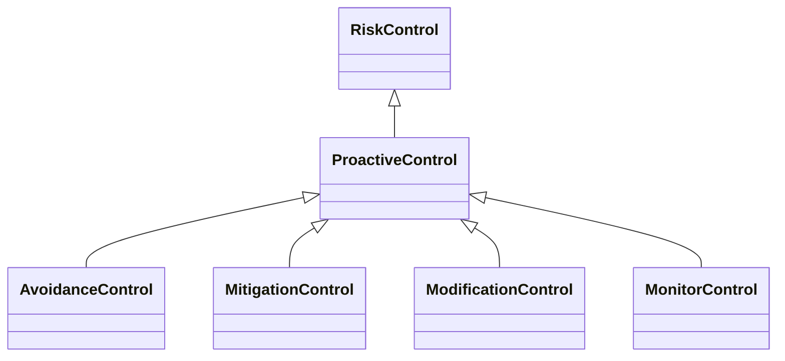

---
search:
  boost: 10.0
---

# Class: ProactiveControl 


_Control that is established or functions before an event occurs_


<div data-search-exclude markdown="1">


URI: [risk:ProactiveControl](https://w3id.org/lmodel/dpv/risk/ProactiveControl)





## Inheritance
* [RiskControl](RiskControl.md)
    * **ProactiveControl**
        * [AvoidanceControl](AvoidanceControl.md) [ [RiskControl](RiskControl.md)]
        * [MitigationControl](MitigationControl.md) [ [RiskControl](RiskControl.md)]
        * [ModificationControl](ModificationControl.md) [ [RiskControl](RiskControl.md)]
        * [MonitorControl](MonitorControl.md) [ [RiskControl](RiskControl.md)]


## Class Properties

| Property | Value |
| --- | --- |
| Class URI | [risk:ProactiveControl](https://w3id.org/lmodel/dpv/risk/ProactiveControl) |


## Slots

| Name | Cardinality and Range | Description | Inheritance |
| ---  | --- | --- | --- |


## In Subsets


* [RiskSubset](RiskSubset.md)


## Aliases


* Proactive Control


## Comments

* The use of 'proactive' here refers to this control being established to
address events before they occur. It does not indicate putting in place
controls before the event such as planning ahead for potential use of
controls to respond to an incident


## Identifier and Mapping Information


### Annotations

| property | value |
| --- | --- |
| upstream_iri | https://w3id.org/dpv/risk/owl#ProactiveControl |
| dpv_extension_slug | risk |


### Schema Source


* from schema: https://w3id.org/lmodel/dpv/risk


## Mappings

| Mapping Type | Mapped Value |
| ---  | ---  |
| self | risk:ProactiveControl |
| native | risk:ProactiveControl |
| exact | dpv_risk:ProactiveControl, dpv_risk_owl:ProactiveControl |


## LinkML Source

<!-- TODO: investigate https://stackoverflow.com/questions/37606292/how-to-create-tabbed-code-blocks-in-mkdocs-or-sphinx -->

### Direct

<details>
```yaml
name: ProactiveControl
annotations:
  upstream_iri:
    tag: upstream_iri
    value: https://w3id.org/dpv/risk/owl#ProactiveControl
  dpv_extension_slug:
    tag: dpv_extension_slug
    value: risk
description: Control that is established or functions before an event occurs
comments:
- 'The use of ''proactive'' here refers to this control being established to

  address events before they occur. It does not indicate putting in place

  controls before the event such as planning ahead for potential use of

  controls to respond to an incident'
in_subset:
- risk_subset
from_schema: https://w3id.org/lmodel/dpv/risk
aliases:
- Proactive Control
exact_mappings:
- dpv_risk:ProactiveControl
- dpv_risk_owl:ProactiveControl
is_a: RiskControl
class_uri: risk:ProactiveControl

```
</details>

### Induced

<details>
```yaml
name: ProactiveControl
annotations:
  upstream_iri:
    tag: upstream_iri
    value: https://w3id.org/dpv/risk/owl#ProactiveControl
  dpv_extension_slug:
    tag: dpv_extension_slug
    value: risk
description: Control that is established or functions before an event occurs
comments:
- 'The use of ''proactive'' here refers to this control being established to

  address events before they occur. It does not indicate putting in place

  controls before the event such as planning ahead for potential use of

  controls to respond to an incident'
in_subset:
- risk_subset
from_schema: https://w3id.org/lmodel/dpv/risk
aliases:
- Proactive Control
exact_mappings:
- dpv_risk:ProactiveControl
- dpv_risk_owl:ProactiveControl
is_a: RiskControl
class_uri: risk:ProactiveControl

```
</details></div>