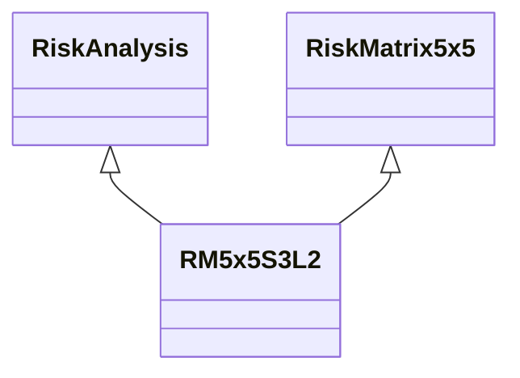

---
search:
  boost: 10.0
---

# Class: RM5x5S3L2 


_Node in a 5x5 Risk Matrix with Risk Severity: Moderate; Likelihood: Low;_

_and Risk Level: Moderate_


<div data-search-exclude markdown="1">


URI: [risk:RM5x5S3L2](https://w3id.org/lmodel/dpv/risk/RM5x5S3L2)





## Inheritance
* [RiskManagement](RiskManagement.md)
    * [RiskAssessment](RiskAssessment.md)
        * [RiskAnalysis](RiskAnalysis.md)
            * [RiskMatrix](RiskMatrix.md)
                * [RiskMatrix5x5](RiskMatrix5x5.md) [ [RiskAnalysis](RiskAnalysis.md)]
                    * **RM5x5S3L2** [ [RiskAnalysis](RiskAnalysis.md)]


## Class Properties

| Property | Value |
| --- | --- |
| Class URI | [risk:RM5x5S3L2](https://w3id.org/lmodel/dpv/risk/RM5x5S3L2) |


## Slots

| Name | Cardinality and Range | Description | Inheritance |
| ---  | --- | --- | --- |


## In Subsets


* [RiskSubset](RiskSubset.md)


## Aliases


* Moderate Risk (RM5x5 S:3 L:2)


## Identifier and Mapping Information


### Annotations

| property | value |
| --- | --- |
| upstream_iri | https://w3id.org/dpv/risk/owl#RM5x5S3L2 |
| dpv_extension_slug | risk |


### Schema Source


* from schema: https://w3id.org/lmodel/dpv/risk


## Mappings

| Mapping Type | Mapped Value |
| ---  | ---  |
| self | risk:RM5x5S3L2 |
| native | risk:RM5x5S3L2 |
| exact | dpv_risk:RM5x5S3L2, dpv_risk_owl:RM5x5S3L2 |


## LinkML Source

<!-- TODO: investigate https://stackoverflow.com/questions/37606292/how-to-create-tabbed-code-blocks-in-mkdocs-or-sphinx -->

### Direct

<details>
```yaml
name: RM5x5S3L2
annotations:
  upstream_iri:
    tag: upstream_iri
    value: https://w3id.org/dpv/risk/owl#RM5x5S3L2
  dpv_extension_slug:
    tag: dpv_extension_slug
    value: risk
description: 'Node in a 5x5 Risk Matrix with Risk Severity: Moderate; Likelihood:
  Low;

  and Risk Level: Moderate'
in_subset:
- risk_subset
from_schema: https://w3id.org/lmodel/dpv/risk
aliases:
- Moderate Risk (RM5x5 S:3 L:2)
exact_mappings:
- dpv_risk:RM5x5S3L2
- dpv_risk_owl:RM5x5S3L2
is_a: RiskMatrix5x5
mixins:
- RiskAnalysis
class_uri: risk:RM5x5S3L2

```
</details>

### Induced

<details>
```yaml
name: RM5x5S3L2
annotations:
  upstream_iri:
    tag: upstream_iri
    value: https://w3id.org/dpv/risk/owl#RM5x5S3L2
  dpv_extension_slug:
    tag: dpv_extension_slug
    value: risk
description: 'Node in a 5x5 Risk Matrix with Risk Severity: Moderate; Likelihood:
  Low;

  and Risk Level: Moderate'
in_subset:
- risk_subset
from_schema: https://w3id.org/lmodel/dpv/risk
aliases:
- Moderate Risk (RM5x5 S:3 L:2)
exact_mappings:
- dpv_risk:RM5x5S3L2
- dpv_risk_owl:RM5x5S3L2
is_a: RiskMatrix5x5
mixins:
- RiskAnalysis
class_uri: risk:RM5x5S3L2

```
</details></div>