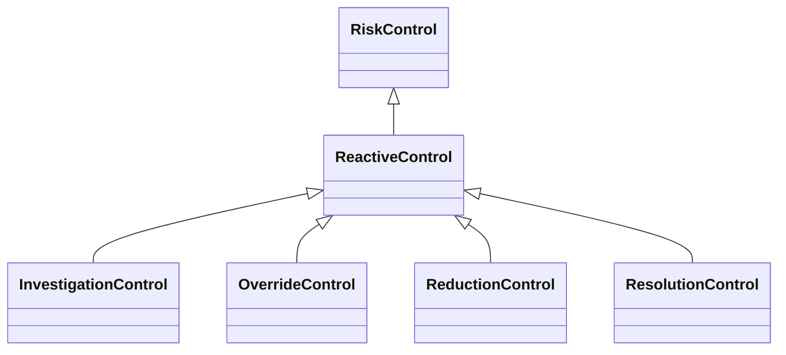

---
search:
  boost: 10.0
---

# Class: ReactiveControl 


_Control that is established or functions after an event occurs_


<div data-search-exclude markdown="1">


URI: [risk:ReactiveControl](https://w3id.org/lmodel/dpv/risk/ReactiveControl)





## Inheritance
* [RiskControl](RiskControl.md)
    * **ReactiveControl**
        * [InvestigationControl](InvestigationControl.md) [ [RiskControl](RiskControl.md)]
        * [OverrideControl](OverrideControl.md) [ [RiskControl](RiskControl.md)]
        * [ReductionControl](ReductionControl.md) [ [RiskControl](RiskControl.md)]
        * [ResolutionControl](ResolutionControl.md) [ [RiskControl](RiskControl.md)]


## Class Properties

| Property | Value |
| --- | --- |
| Class URI | [risk:ReactiveControl](https://w3id.org/lmodel/dpv/risk/ReactiveControl) |


## Slots

| Name | Cardinality and Range | Description | Inheritance |
| ---  | --- | --- | --- |


## In Subsets


* [RiskSubset](RiskSubset.md)


## Aliases


* Reactive Control


## Comments

* The use of 'reactive' here refers to this control being established i.e.
becoming active to address the effects of an event after they occur. It
does not imply that the controls are put in place after the event or
that there is no planned procedure for handling an incident


## Identifier and Mapping Information


### Annotations

| property | value |
| --- | --- |
| upstream_iri | https://w3id.org/dpv/risk/owl#ReactiveControl |
| dpv_extension_slug | risk |


### Schema Source


* from schema: https://w3id.org/lmodel/dpv/risk


## Mappings

| Mapping Type | Mapped Value |
| ---  | ---  |
| self | risk:ReactiveControl |
| native | risk:ReactiveControl |
| exact | dpv_risk:ReactiveControl, dpv_risk_owl:ReactiveControl |


## LinkML Source

<!-- TODO: investigate https://stackoverflow.com/questions/37606292/how-to-create-tabbed-code-blocks-in-mkdocs-or-sphinx -->

### Direct

<details>
```yaml
name: ReactiveControl
annotations:
  upstream_iri:
    tag: upstream_iri
    value: https://w3id.org/dpv/risk/owl#ReactiveControl
  dpv_extension_slug:
    tag: dpv_extension_slug
    value: risk
description: Control that is established or functions after an event occurs
comments:
- 'The use of ''reactive'' here refers to this control being established i.e.

  becoming active to address the effects of an event after they occur. It

  does not imply that the controls are put in place after the event or

  that there is no planned procedure for handling an incident'
in_subset:
- risk_subset
from_schema: https://w3id.org/lmodel/dpv/risk
aliases:
- Reactive Control
exact_mappings:
- dpv_risk:ReactiveControl
- dpv_risk_owl:ReactiveControl
is_a: RiskControl
class_uri: risk:ReactiveControl

```
</details>

### Induced

<details>
```yaml
name: ReactiveControl
annotations:
  upstream_iri:
    tag: upstream_iri
    value: https://w3id.org/dpv/risk/owl#ReactiveControl
  dpv_extension_slug:
    tag: dpv_extension_slug
    value: risk
description: Control that is established or functions after an event occurs
comments:
- 'The use of ''reactive'' here refers to this control being established i.e.

  becoming active to address the effects of an event after they occur. It

  does not imply that the controls are put in place after the event or

  that there is no planned procedure for handling an incident'
in_subset:
- risk_subset
from_schema: https://w3id.org/lmodel/dpv/risk
aliases:
- Reactive Control
exact_mappings:
- dpv_risk:ReactiveControl
- dpv_risk_owl:ReactiveControl
is_a: RiskControl
class_uri: risk:ReactiveControl

```
</details></div>