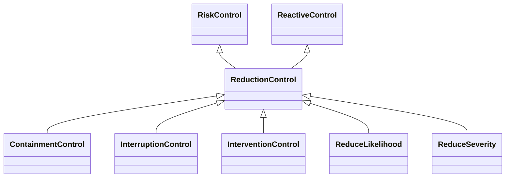

---
search:
  boost: 10.0
---

# Class: ReductionControl 


_Control that reduces the effects of an event_


<div data-search-exclude markdown="1">


URI: [risk:ReductionControl](https://w3id.org/lmodel/dpv/risk/ReductionControl)





## Inheritance
* [RiskControl](RiskControl.md)
    * [ReactiveControl](ReactiveControl.md)
        * **ReductionControl** [ [RiskControl](RiskControl.md)]
            * [ContainmentControl](ContainmentControl.md) [ [RiskControl](RiskControl.md)]
            * [InterruptionControl](InterruptionControl.md) [ [RiskControl](RiskControl.md)]
            * [InterventionControl](InterventionControl.md) [ [RiskControl](RiskControl.md)]
            * [ReduceLikelihood](ReduceLikelihood.md) [ [RiskControl](RiskControl.md)]
            * [ReduceSeverity](ReduceSeverity.md) [ [RiskControl](RiskControl.md)]


## Class Properties

| Property | Value |
| --- | --- |
| Class URI | [risk:ReductionControl](https://w3id.org/lmodel/dpv/risk/ReductionControl) |


## Slots

| Name | Cardinality and Range | Description | Inheritance |
| ---  | --- | --- | --- |


## In Subsets


* [RiskSubset](RiskSubset.md)


## Aliases


* Reduction Control


## Comments

* Reduction here refers to a lessening of the effects after the event has
occurred by either reducing their likelihood or their severity in the
context. This can involve changing the underlying context such that the
effects have a reduced chance of occurring, or to create additional
measures such that the effects do not have the initial severity for an
entity


## Identifier and Mapping Information


### Annotations

| property | value |
| --- | --- |
| upstream_iri | https://w3id.org/dpv/risk/owl#ReductionControl |
| dpv_extension_slug | risk |


### Schema Source


* from schema: https://w3id.org/lmodel/dpv/risk


## Mappings

| Mapping Type | Mapped Value |
| ---  | ---  |
| self | risk:ReductionControl |
| native | risk:ReductionControl |
| exact | dpv_risk:ReductionControl, dpv_risk_owl:ReductionControl |


## LinkML Source

<!-- TODO: investigate https://stackoverflow.com/questions/37606292/how-to-create-tabbed-code-blocks-in-mkdocs-or-sphinx -->

### Direct

<details>
```yaml
name: ReductionControl
annotations:
  upstream_iri:
    tag: upstream_iri
    value: https://w3id.org/dpv/risk/owl#ReductionControl
  dpv_extension_slug:
    tag: dpv_extension_slug
    value: risk
description: Control that reduces the effects of an event
comments:
- 'Reduction here refers to a lessening of the effects after the event has

  occurred by either reducing their likelihood or their severity in the

  context. This can involve changing the underlying context such that the

  effects have a reduced chance of occurring, or to create additional

  measures such that the effects do not have the initial severity for an

  entity'
in_subset:
- risk_subset
from_schema: https://w3id.org/lmodel/dpv/risk
aliases:
- Reduction Control
exact_mappings:
- dpv_risk:ReductionControl
- dpv_risk_owl:ReductionControl
is_a: ReactiveControl
mixins:
- RiskControl
class_uri: risk:ReductionControl

```
</details>

### Induced

<details>
```yaml
name: ReductionControl
annotations:
  upstream_iri:
    tag: upstream_iri
    value: https://w3id.org/dpv/risk/owl#ReductionControl
  dpv_extension_slug:
    tag: dpv_extension_slug
    value: risk
description: Control that reduces the effects of an event
comments:
- 'Reduction here refers to a lessening of the effects after the event has

  occurred by either reducing their likelihood or their severity in the

  context. This can involve changing the underlying context such that the

  effects have a reduced chance of occurring, or to create additional

  measures such that the effects do not have the initial severity for an

  entity'
in_subset:
- risk_subset
from_schema: https://w3id.org/lmodel/dpv/risk
aliases:
- Reduction Control
exact_mappings:
- dpv_risk:ReductionControl
- dpv_risk_owl:ReductionControl
is_a: ReactiveControl
mixins:
- RiskControl
class_uri: risk:ReductionControl

```
</details></div>