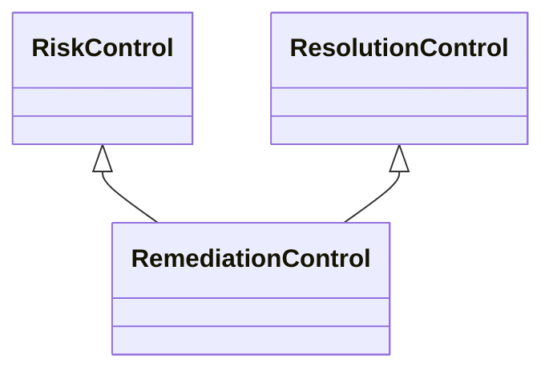

---
search:
  boost: 10.0
---

# Class: RemediationControl 


_Control that aims to fix or remedy the causes of an event to prevent_

_further occurrences_


<div data-search-exclude markdown="1">


URI: [risk:RemediationControl](https://w3id.org/lmodel/dpv/risk/RemediationControl)





## Inheritance
* [RiskControl](RiskControl.md)
    * [ReactiveControl](ReactiveControl.md)
        * [ResolutionControl](ResolutionControl.md) [ [RiskControl](RiskControl.md)]
            * **RemediationControl** [ [RiskControl](RiskControl.md)]


## Class Properties

| Property | Value |
| --- | --- |
| Class URI | [risk:RemediationControl](https://w3id.org/lmodel/dpv/risk/RemediationControl) |


## Slots

| Name | Cardinality and Range | Description | Inheritance |
| ---  | --- | --- | --- |


## In Subsets


* [RiskSubset](RiskSubset.md)


## Aliases


* Remediation Control


## Comments

* Remediation involves making changes in the context to avoid further
events and effects, which may be for the specific event or for other
similar events and effects. As such, remediation can also be undertaken
as a proactive measure in the risk management lifecycle following an
incident


## Identifier and Mapping Information


### Annotations

| property | value |
| --- | --- |
| upstream_iri | https://w3id.org/dpv/risk/owl#RemediationControl |
| dpv_extension_slug | risk |


### Schema Source


* from schema: https://w3id.org/lmodel/dpv/risk


## Mappings

| Mapping Type | Mapped Value |
| ---  | ---  |
| self | risk:RemediationControl |
| native | risk:RemediationControl |
| exact | dpv_risk:RemediationControl, dpv_risk_owl:RemediationControl |


## LinkML Source

<!-- TODO: investigate https://stackoverflow.com/questions/37606292/how-to-create-tabbed-code-blocks-in-mkdocs-or-sphinx -->

### Direct

<details>
```yaml
name: RemediationControl
annotations:
  upstream_iri:
    tag: upstream_iri
    value: https://w3id.org/dpv/risk/owl#RemediationControl
  dpv_extension_slug:
    tag: dpv_extension_slug
    value: risk
description: 'Control that aims to fix or remedy the causes of an event to prevent

  further occurrences'
comments:
- 'Remediation involves making changes in the context to avoid further

  events and effects, which may be for the specific event or for other

  similar events and effects. As such, remediation can also be undertaken

  as a proactive measure in the risk management lifecycle following an

  incident'
in_subset:
- risk_subset
from_schema: https://w3id.org/lmodel/dpv/risk
aliases:
- Remediation Control
exact_mappings:
- dpv_risk:RemediationControl
- dpv_risk_owl:RemediationControl
is_a: ResolutionControl
mixins:
- RiskControl
class_uri: risk:RemediationControl

```
</details>

### Induced

<details>
```yaml
name: RemediationControl
annotations:
  upstream_iri:
    tag: upstream_iri
    value: https://w3id.org/dpv/risk/owl#RemediationControl
  dpv_extension_slug:
    tag: dpv_extension_slug
    value: risk
description: 'Control that aims to fix or remedy the causes of an event to prevent

  further occurrences'
comments:
- 'Remediation involves making changes in the context to avoid further

  events and effects, which may be for the specific event or for other

  similar events and effects. As such, remediation can also be undertaken

  as a proactive measure in the risk management lifecycle following an

  incident'
in_subset:
- risk_subset
from_schema: https://w3id.org/lmodel/dpv/risk
aliases:
- Remediation Control
exact_mappings:
- dpv_risk:RemediationControl
- dpv_risk_owl:RemediationControl
is_a: ResolutionControl
mixins:
- RiskControl
class_uri: risk:RemediationControl

```
</details></div>