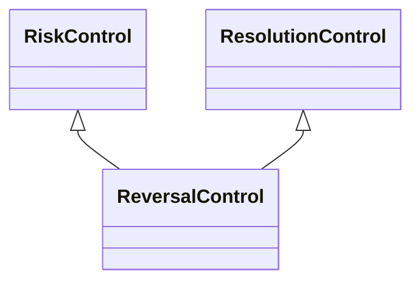

---
search:
  boost: 10.0
---

# Class: ReversalControl 


_Control that aims to reverse or undo the effects of an event_


<div data-search-exclude markdown="1">


URI: [risk:ReversalControl](https://w3id.org/lmodel/dpv/risk/ReversalControl)





## Inheritance
* [RiskControl](RiskControl.md)
    * [ReactiveControl](ReactiveControl.md)
        * [ResolutionControl](ResolutionControl.md) [ [RiskControl](RiskControl.md)]
            * **ReversalControl** [ [RiskControl](RiskControl.md)]


## Class Properties

| Property | Value |
| --- | --- |
| Class URI | [risk:ReversalControl](https://w3id.org/lmodel/dpv/risk/ReversalControl) |


## Slots

| Name | Cardinality and Range | Description | Inheritance |
| ---  | --- | --- | --- |


## In Subsets


* [RiskSubset](RiskSubset.md)


## Aliases


* Reversal Control


## Comments

* Reversal can be achieved through measures such as restoring information
from a backup or replacing things such that the initial context not
containing the event's effects is restored


## Identifier and Mapping Information


### Annotations

| property | value |
| --- | --- |
| upstream_iri | https://w3id.org/dpv/risk/owl#ReversalControl |
| dpv_extension_slug | risk |


### Schema Source


* from schema: https://w3id.org/lmodel/dpv/risk


## Mappings

| Mapping Type | Mapped Value |
| ---  | ---  |
| self | risk:ReversalControl |
| native | risk:ReversalControl |
| exact | dpv_risk:ReversalControl, dpv_risk_owl:ReversalControl |


## LinkML Source

<!-- TODO: investigate https://stackoverflow.com/questions/37606292/how-to-create-tabbed-code-blocks-in-mkdocs-or-sphinx -->

### Direct

<details>
```yaml
name: ReversalControl
annotations:
  upstream_iri:
    tag: upstream_iri
    value: https://w3id.org/dpv/risk/owl#ReversalControl
  dpv_extension_slug:
    tag: dpv_extension_slug
    value: risk
description: Control that aims to reverse or undo the effects of an event
comments:
- 'Reversal can be achieved through measures such as restoring information

  from a backup or replacing things such that the initial context not

  containing the event''s effects is restored'
in_subset:
- risk_subset
from_schema: https://w3id.org/lmodel/dpv/risk
aliases:
- Reversal Control
exact_mappings:
- dpv_risk:ReversalControl
- dpv_risk_owl:ReversalControl
is_a: ResolutionControl
mixins:
- RiskControl
class_uri: risk:ReversalControl

```
</details>

### Induced

<details>
```yaml
name: ReversalControl
annotations:
  upstream_iri:
    tag: upstream_iri
    value: https://w3id.org/dpv/risk/owl#ReversalControl
  dpv_extension_slug:
    tag: dpv_extension_slug
    value: risk
description: Control that aims to reverse or undo the effects of an event
comments:
- 'Reversal can be achieved through measures such as restoring information

  from a backup or replacing things such that the initial context not

  containing the event''s effects is restored'
in_subset:
- risk_subset
from_schema: https://w3id.org/lmodel/dpv/risk
aliases:
- Reversal Control
exact_mappings:
- dpv_risk:ReversalControl
- dpv_risk_owl:ReversalControl
is_a: ResolutionControl
mixins:
- RiskControl
class_uri: risk:ReversalControl

```
</details></div>