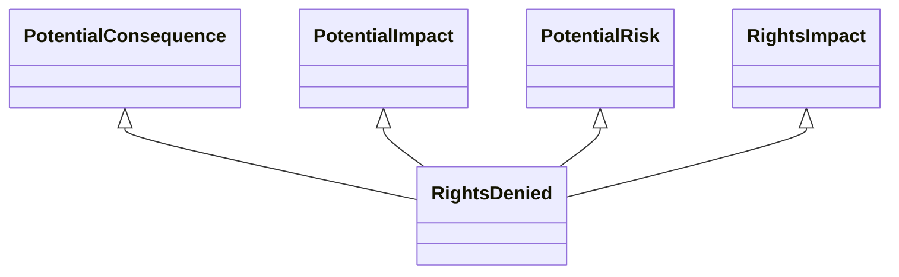

---
search:
  boost: 10.0
---

# Class: RightsDenied 


_The refusal or withholding or denial of the existence or applicability_

_of rights_


<div data-search-exclude markdown="1">


URI: [risk:RightsDenied](https://w3id.org/lmodel/dpv/risk/RightsDenied)





## Inheritance
* [SocietalRiskConcept](SocietalRiskConcept.md) [ [PotentialConsequence](PotentialConsequence.md) [PotentialImpact](PotentialImpact.md) [PotentialRisk](PotentialRisk.md) [PotentialRiskSource](PotentialRiskSource.md)]
    * [RightsImpact](RightsImpact.md) [ [PotentialConsequence](PotentialConsequence.md) [PotentialImpact](PotentialImpact.md) [PotentialRisk](PotentialRisk.md)]
        * **RightsDenied** [ [PotentialConsequence](PotentialConsequence.md) [PotentialImpact](PotentialImpact.md) [PotentialRisk](PotentialRisk.md)]


## Class Properties

| Property | Value |
| --- | --- |
| Class URI | [risk:RightsDenied](https://w3id.org/lmodel/dpv/risk/RightsDenied) |


## Slots

| Name | Cardinality and Range | Description | Inheritance |
| ---  | --- | --- | --- |


## In Subsets


* [RiskSubset](RiskSubset.md)


## Aliases


* Rights Denied


## Comments

* The denial of the right refers to the argument that a right does not
apply at all for a particular case. Though specified as a plural i.e.
'rights', this concept can be applied to a singular right


## Identifier and Mapping Information


### Annotations

| property | value |
| --- | --- |
| upstream_iri | https://w3id.org/dpv/risk/owl#RightsDenied |
| dpv_extension_slug | risk |


### Schema Source


* from schema: https://w3id.org/lmodel/dpv/risk


## Mappings

| Mapping Type | Mapped Value |
| ---  | ---  |
| self | risk:RightsDenied |
| native | risk:RightsDenied |
| exact | dpv_risk:RightsDenied, dpv_risk_owl:RightsDenied |


## LinkML Source

<!-- TODO: investigate https://stackoverflow.com/questions/37606292/how-to-create-tabbed-code-blocks-in-mkdocs-or-sphinx -->

### Direct

<details>
```yaml
name: RightsDenied
annotations:
  upstream_iri:
    tag: upstream_iri
    value: https://w3id.org/dpv/risk/owl#RightsDenied
  dpv_extension_slug:
    tag: dpv_extension_slug
    value: risk
description: 'The refusal or withholding or denial of the existence or applicability

  of rights'
comments:
- 'The denial of the right refers to the argument that a right does not

  apply at all for a particular case. Though specified as a plural i.e.

  ''rights'', this concept can be applied to a singular right'
in_subset:
- risk_subset
from_schema: https://w3id.org/lmodel/dpv/risk
aliases:
- Rights Denied
exact_mappings:
- dpv_risk:RightsDenied
- dpv_risk_owl:RightsDenied
is_a: RightsImpact
mixins:
- PotentialConsequence
- PotentialImpact
- PotentialRisk
class_uri: risk:RightsDenied

```
</details>

### Induced

<details>
```yaml
name: RightsDenied
annotations:
  upstream_iri:
    tag: upstream_iri
    value: https://w3id.org/dpv/risk/owl#RightsDenied
  dpv_extension_slug:
    tag: dpv_extension_slug
    value: risk
description: 'The refusal or withholding or denial of the existence or applicability

  of rights'
comments:
- 'The denial of the right refers to the argument that a right does not

  apply at all for a particular case. Though specified as a plural i.e.

  ''rights'', this concept can be applied to a singular right'
in_subset:
- risk_subset
from_schema: https://w3id.org/lmodel/dpv/risk
aliases:
- Rights Denied
exact_mappings:
- dpv_risk:RightsDenied
- dpv_risk_owl:RightsDenied
is_a: RightsImpact
mixins:
- PotentialConsequence
- PotentialImpact
- PotentialRisk
class_uri: risk:RightsDenied

```
</details></div>