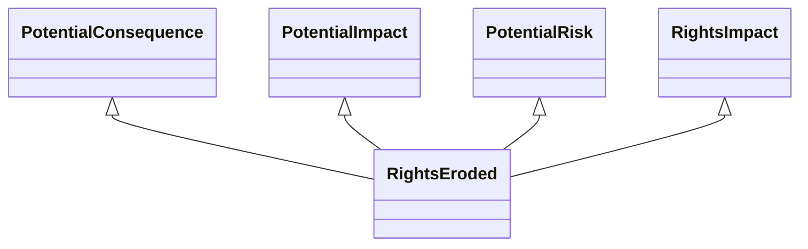

---
search:
  boost: 10.0
---

# Class: RightsEroded 


_The gradual weakening or reduction of the scope and protection of rights_


<div data-search-exclude markdown="1">


URI: [risk:RightsEroded](https://w3id.org/lmodel/dpv/risk/RightsEroded)





## Inheritance
* [SocietalRiskConcept](SocietalRiskConcept.md) [ [PotentialConsequence](PotentialConsequence.md) [PotentialImpact](PotentialImpact.md) [PotentialRisk](PotentialRisk.md) [PotentialRiskSource](PotentialRiskSource.md)]
    * [RightsImpact](RightsImpact.md) [ [PotentialConsequence](PotentialConsequence.md) [PotentialImpact](PotentialImpact.md) [PotentialRisk](PotentialRisk.md)]
        * **RightsEroded** [ [PotentialConsequence](PotentialConsequence.md) [PotentialImpact](PotentialImpact.md) [PotentialRisk](PotentialRisk.md)]


## Class Properties

| Property | Value |
| --- | --- |
| Class URI | [risk:RightsEroded](https://w3id.org/lmodel/dpv/risk/RightsEroded) |


## Slots

| Name | Cardinality and Range | Description | Inheritance |
| ---  | --- | --- | --- |


## In Subsets


* [RiskSubset](RiskSubset.md)


## Aliases


* Rights Eroded


## Comments

* Erosion of rights typically only applies to passive rights which always
apply, since for active rights the exercise of that right is what
enables it. An active right can be eroded over time it is limited
consistently and increasingly such that the scope of the right is
reduced over time. Though specified as a plural i.e. 'rights', this
concept can be applied to a singular right


## Identifier and Mapping Information


### Annotations

| property | value |
| --- | --- |
| upstream_iri | https://w3id.org/dpv/risk/owl#RightsEroded |
| dpv_extension_slug | risk |


### Schema Source


* from schema: https://w3id.org/lmodel/dpv/risk


## Mappings

| Mapping Type | Mapped Value |
| ---  | ---  |
| self | risk:RightsEroded |
| native | risk:RightsEroded |
| exact | dpv_risk:RightsEroded, dpv_risk_owl:RightsEroded |


## LinkML Source

<!-- TODO: investigate https://stackoverflow.com/questions/37606292/how-to-create-tabbed-code-blocks-in-mkdocs-or-sphinx -->

### Direct

<details>
```yaml
name: RightsEroded
annotations:
  upstream_iri:
    tag: upstream_iri
    value: https://w3id.org/dpv/risk/owl#RightsEroded
  dpv_extension_slug:
    tag: dpv_extension_slug
    value: risk
description: The gradual weakening or reduction of the scope and protection of rights
comments:
- 'Erosion of rights typically only applies to passive rights which always

  apply, since for active rights the exercise of that right is what

  enables it. An active right can be eroded over time it is limited

  consistently and increasingly such that the scope of the right is

  reduced over time. Though specified as a plural i.e. ''rights'', this

  concept can be applied to a singular right'
in_subset:
- risk_subset
from_schema: https://w3id.org/lmodel/dpv/risk
aliases:
- Rights Eroded
exact_mappings:
- dpv_risk:RightsEroded
- dpv_risk_owl:RightsEroded
is_a: RightsImpact
mixins:
- PotentialConsequence
- PotentialImpact
- PotentialRisk
class_uri: risk:RightsEroded

```
</details>

### Induced

<details>
```yaml
name: RightsEroded
annotations:
  upstream_iri:
    tag: upstream_iri
    value: https://w3id.org/dpv/risk/owl#RightsEroded
  dpv_extension_slug:
    tag: dpv_extension_slug
    value: risk
description: The gradual weakening or reduction of the scope and protection of rights
comments:
- 'Erosion of rights typically only applies to passive rights which always

  apply, since for active rights the exercise of that right is what

  enables it. An active right can be eroded over time it is limited

  consistently and increasingly such that the scope of the right is

  reduced over time. Though specified as a plural i.e. ''rights'', this

  concept can be applied to a singular right'
in_subset:
- risk_subset
from_schema: https://w3id.org/lmodel/dpv/risk
aliases:
- Rights Eroded
exact_mappings:
- dpv_risk:RightsEroded
- dpv_risk_owl:RightsEroded
is_a: RightsImpact
mixins:
- PotentialConsequence
- PotentialImpact
- PotentialRisk
class_uri: risk:RightsEroded

```
</details></div>