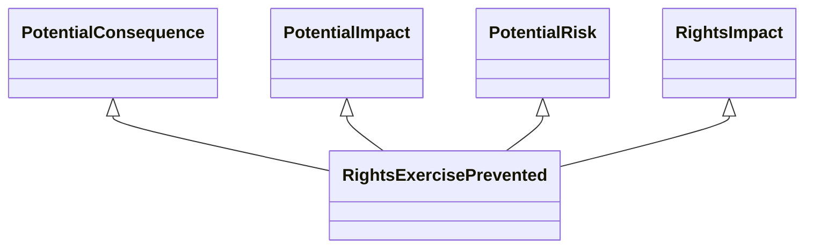

---
search:
  boost: 10.0
---

# Class: RightsExercisePrevented 


_Actions or measures that prevent an individual or group from exercising_

_their legal rights._


<div data-search-exclude markdown="1">


URI: [risk:RightsExercisePrevented](https://w3id.org/lmodel/dpv/risk/RightsExercisePrevented)





## Inheritance
* [SocietalRiskConcept](SocietalRiskConcept.md) [ [PotentialConsequence](PotentialConsequence.md) [PotentialImpact](PotentialImpact.md) [PotentialRisk](PotentialRisk.md) [PotentialRiskSource](PotentialRiskSource.md)]
    * [RightsImpact](RightsImpact.md) [ [PotentialConsequence](PotentialConsequence.md) [PotentialImpact](PotentialImpact.md) [PotentialRisk](PotentialRisk.md)]
        * **RightsExercisePrevented** [ [PotentialConsequence](PotentialConsequence.md) [PotentialImpact](PotentialImpact.md) [PotentialRisk](PotentialRisk.md)]


## Class Properties

| Property | Value |
| --- | --- |
| Class URI | [risk:RightsExercisePrevented](https://w3id.org/lmodel/dpv/risk/RightsExercisePrevented) |


## Slots

| Name | Cardinality and Range | Description | Inheritance |
| ---  | --- | --- | --- |


## In Subsets


* [RiskSubset](RiskSubset.md)


## Aliases


* Rights Exercise Prevented


## Comments

* This concept was called "PreventExercisingOfRights" in DPV 2.0.
Violation of a right is a bar for actionable actions by an authority.
Other impacts on right may be found to construe a violation of the
right, but that is not necessarily always the case i.e. not all impacts
are violations of a right. Though specified as a plural i.e. 'rights',
this concept can be applied to a singular right


## Identifier and Mapping Information


### Annotations

| property | value |
| --- | --- |
| upstream_iri | https://w3id.org/dpv/risk/owl#RightsExercisePrevented |
| dpv_extension_slug | risk |


### Schema Source


* from schema: https://w3id.org/lmodel/dpv/risk


## Mappings

| Mapping Type | Mapped Value |
| ---  | ---  |
| self | risk:RightsExercisePrevented |
| native | risk:RightsExercisePrevented |
| exact | dpv_risk:RightsExercisePrevented, dpv_risk_owl:RightsExercisePrevented |


## LinkML Source

<!-- TODO: investigate https://stackoverflow.com/questions/37606292/how-to-create-tabbed-code-blocks-in-mkdocs-or-sphinx -->

### Direct

<details>
```yaml
name: RightsExercisePrevented
annotations:
  upstream_iri:
    tag: upstream_iri
    value: https://w3id.org/dpv/risk/owl#RightsExercisePrevented
  dpv_extension_slug:
    tag: dpv_extension_slug
    value: risk
description: 'Actions or measures that prevent an individual or group from exercising

  their legal rights.'
comments:
- 'This concept was called "PreventExercisingOfRights" in DPV 2.0.

  Violation of a right is a bar for actionable actions by an authority.

  Other impacts on right may be found to construe a violation of the

  right, but that is not necessarily always the case i.e. not all impacts

  are violations of a right. Though specified as a plural i.e. ''rights'',

  this concept can be applied to a singular right'
in_subset:
- risk_subset
from_schema: https://w3id.org/lmodel/dpv/risk
aliases:
- Rights Exercise Prevented
exact_mappings:
- dpv_risk:RightsExercisePrevented
- dpv_risk_owl:RightsExercisePrevented
is_a: RightsImpact
mixins:
- PotentialConsequence
- PotentialImpact
- PotentialRisk
class_uri: risk:RightsExercisePrevented

```
</details>

### Induced

<details>
```yaml
name: RightsExercisePrevented
annotations:
  upstream_iri:
    tag: upstream_iri
    value: https://w3id.org/dpv/risk/owl#RightsExercisePrevented
  dpv_extension_slug:
    tag: dpv_extension_slug
    value: risk
description: 'Actions or measures that prevent an individual or group from exercising

  their legal rights.'
comments:
- 'This concept was called "PreventExercisingOfRights" in DPV 2.0.

  Violation of a right is a bar for actionable actions by an authority.

  Other impacts on right may be found to construe a violation of the

  right, but that is not necessarily always the case i.e. not all impacts

  are violations of a right. Though specified as a plural i.e. ''rights'',

  this concept can be applied to a singular right'
in_subset:
- risk_subset
from_schema: https://w3id.org/lmodel/dpv/risk
aliases:
- Rights Exercise Prevented
exact_mappings:
- dpv_risk:RightsExercisePrevented
- dpv_risk_owl:RightsExercisePrevented
is_a: RightsImpact
mixins:
- PotentialConsequence
- PotentialImpact
- PotentialRisk
class_uri: risk:RightsExercisePrevented

```
</details></div>