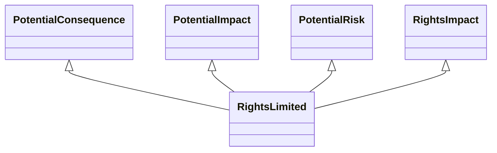

---
search:
  boost: 10.0
---

# Class: RightsLimited 


_A limitation or restrictions on the scope or exercise of rights_


<div data-search-exclude markdown="1">


URI: [risk:RightsLimited](https://w3id.org/lmodel/dpv/risk/RightsLimited)





## Inheritance
* [SocietalRiskConcept](SocietalRiskConcept.md) [ [PotentialConsequence](PotentialConsequence.md) [PotentialImpact](PotentialImpact.md) [PotentialRisk](PotentialRisk.md) [PotentialRiskSource](PotentialRiskSource.md)]
    * [RightsImpact](RightsImpact.md) [ [PotentialConsequence](PotentialConsequence.md) [PotentialImpact](PotentialImpact.md) [PotentialRisk](PotentialRisk.md)]
        * **RightsLimited** [ [PotentialConsequence](PotentialConsequence.md) [PotentialImpact](PotentialImpact.md) [PotentialRisk](PotentialRisk.md)]


## Class Properties

| Property | Value |
| --- | --- |
| Class URI | [risk:RightsLimited](https://w3id.org/lmodel/dpv/risk/RightsLimited) |


## Slots

| Name | Cardinality and Range | Description | Inheritance |
| ---  | --- | --- | --- |


## In Subsets


* [RiskSubset](RiskSubset.md)


## Aliases


* Rights Limited


## Comments

* This concept was called "LimitationOfRights" in DPV 2.0. The limitation
refers to the applicability and scope of the right, and not in the
ability to exercise that right. Limitation is therefore fulfilment of
the right and its obligations - but for a scope other than what was
intended or expected. Though specified as a plural i.e. 'rights', this
concept can be applied to a singular right


## Identifier and Mapping Information


### Annotations

| property | value |
| --- | --- |
| upstream_iri | https://w3id.org/dpv/risk/owl#RightsLimited |
| dpv_extension_slug | risk |


### Schema Source


* from schema: https://w3id.org/lmodel/dpv/risk


## Mappings

| Mapping Type | Mapped Value |
| ---  | ---  |
| self | risk:RightsLimited |
| native | risk:RightsLimited |
| exact | dpv_risk:RightsLimited, dpv_risk_owl:RightsLimited |


## LinkML Source

<!-- TODO: investigate https://stackoverflow.com/questions/37606292/how-to-create-tabbed-code-blocks-in-mkdocs-or-sphinx -->

### Direct

<details>
```yaml
name: RightsLimited
annotations:
  upstream_iri:
    tag: upstream_iri
    value: https://w3id.org/dpv/risk/owl#RightsLimited
  dpv_extension_slug:
    tag: dpv_extension_slug
    value: risk
description: A limitation or restrictions on the scope or exercise of rights
comments:
- 'This concept was called "LimitationOfRights" in DPV 2.0. The limitation

  refers to the applicability and scope of the right, and not in the

  ability to exercise that right. Limitation is therefore fulfilment of

  the right and its obligations - but for a scope other than what was

  intended or expected. Though specified as a plural i.e. ''rights'', this

  concept can be applied to a singular right'
in_subset:
- risk_subset
from_schema: https://w3id.org/lmodel/dpv/risk
aliases:
- Rights Limited
exact_mappings:
- dpv_risk:RightsLimited
- dpv_risk_owl:RightsLimited
is_a: RightsImpact
mixins:
- PotentialConsequence
- PotentialImpact
- PotentialRisk
class_uri: risk:RightsLimited

```
</details>

### Induced

<details>
```yaml
name: RightsLimited
annotations:
  upstream_iri:
    tag: upstream_iri
    value: https://w3id.org/dpv/risk/owl#RightsLimited
  dpv_extension_slug:
    tag: dpv_extension_slug
    value: risk
description: A limitation or restrictions on the scope or exercise of rights
comments:
- 'This concept was called "LimitationOfRights" in DPV 2.0. The limitation

  refers to the applicability and scope of the right, and not in the

  ability to exercise that right. Limitation is therefore fulfilment of

  the right and its obligations - but for a scope other than what was

  intended or expected. Though specified as a plural i.e. ''rights'', this

  concept can be applied to a singular right'
in_subset:
- risk_subset
from_schema: https://w3id.org/lmodel/dpv/risk
aliases:
- Rights Limited
exact_mappings:
- dpv_risk:RightsLimited
- dpv_risk_owl:RightsLimited
is_a: RightsImpact
mixins:
- PotentialConsequence
- PotentialImpact
- PotentialRisk
class_uri: risk:RightsLimited

```
</details></div>