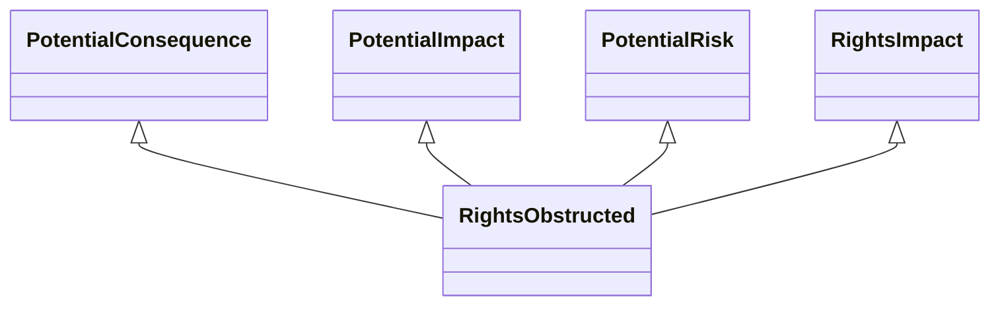

---
search:
  boost: 10.0
---

# Class: RightsObstructed 


_Interference with or blocking of the exercise of rights_


<div data-search-exclude markdown="1">


URI: [risk:RightsObstructed](https://w3id.org/lmodel/dpv/risk/RightsObstructed)





## Inheritance
* [SocietalRiskConcept](SocietalRiskConcept.md) [ [PotentialConsequence](PotentialConsequence.md) [PotentialImpact](PotentialImpact.md) [PotentialRisk](PotentialRisk.md) [PotentialRiskSource](PotentialRiskSource.md)]
    * [RightsImpact](RightsImpact.md) [ [PotentialConsequence](PotentialConsequence.md) [PotentialImpact](PotentialImpact.md) [PotentialRisk](PotentialRisk.md)]
        * **RightsObstructed** [ [PotentialConsequence](PotentialConsequence.md) [PotentialImpact](PotentialImpact.md) [PotentialRisk](PotentialRisk.md)]


## Class Properties

| Property | Value |
| --- | --- |
| Class URI | [risk:RightsObstructed](https://w3id.org/lmodel/dpv/risk/RightsObstructed) |


## Slots

| Name | Cardinality and Range | Description | Inheritance |
| ---  | --- | --- | --- |


## In Subsets


* [RiskSubset](RiskSubset.md)


## Aliases


* Rights Obstructed


## Comments

* In obstruction, the right is not denied, limited, or unfulfilled - but
the requirements to enable exercise of the rights are increased to the
point of discouraging or obstructing the exercise of that right. Though
specified as a plural i.e. 'rights', this concept can be applied to a
singular right


## Identifier and Mapping Information


### Annotations

| property | value |
| --- | --- |
| upstream_iri | https://w3id.org/dpv/risk/owl#RightsObstructed |
| dpv_extension_slug | risk |


### Schema Source


* from schema: https://w3id.org/lmodel/dpv/risk


## Mappings

| Mapping Type | Mapped Value |
| ---  | ---  |
| self | risk:RightsObstructed |
| native | risk:RightsObstructed |
| exact | dpv_risk:RightsObstructed, dpv_risk_owl:RightsObstructed |


## LinkML Source

<!-- TODO: investigate https://stackoverflow.com/questions/37606292/how-to-create-tabbed-code-blocks-in-mkdocs-or-sphinx -->

### Direct

<details>
```yaml
name: RightsObstructed
annotations:
  upstream_iri:
    tag: upstream_iri
    value: https://w3id.org/dpv/risk/owl#RightsObstructed
  dpv_extension_slug:
    tag: dpv_extension_slug
    value: risk
description: Interference with or blocking of the exercise of rights
comments:
- 'In obstruction, the right is not denied, limited, or unfulfilled - but

  the requirements to enable exercise of the rights are increased to the

  point of discouraging or obstructing the exercise of that right. Though

  specified as a plural i.e. ''rights'', this concept can be applied to a

  singular right'
in_subset:
- risk_subset
from_schema: https://w3id.org/lmodel/dpv/risk
aliases:
- Rights Obstructed
exact_mappings:
- dpv_risk:RightsObstructed
- dpv_risk_owl:RightsObstructed
is_a: RightsImpact
mixins:
- PotentialConsequence
- PotentialImpact
- PotentialRisk
class_uri: risk:RightsObstructed

```
</details>

### Induced

<details>
```yaml
name: RightsObstructed
annotations:
  upstream_iri:
    tag: upstream_iri
    value: https://w3id.org/dpv/risk/owl#RightsObstructed
  dpv_extension_slug:
    tag: dpv_extension_slug
    value: risk
description: Interference with or blocking of the exercise of rights
comments:
- 'In obstruction, the right is not denied, limited, or unfulfilled - but

  the requirements to enable exercise of the rights are increased to the

  point of discouraging or obstructing the exercise of that right. Though

  specified as a plural i.e. ''rights'', this concept can be applied to a

  singular right'
in_subset:
- risk_subset
from_schema: https://w3id.org/lmodel/dpv/risk
aliases:
- Rights Obstructed
exact_mappings:
- dpv_risk:RightsObstructed
- dpv_risk_owl:RightsObstructed
is_a: RightsImpact
mixins:
- PotentialConsequence
- PotentialImpact
- PotentialRisk
class_uri: risk:RightsObstructed

```
</details></div>