---
search:
  boost: 10.0
---

# Class: RiskControl 


_Control that modifies risk_


<div data-search-exclude markdown="1">


URI: [risk:RiskControl](https://w3id.org/lmodel/dpv/risk/RiskControl)

```mermaid
 classDiagram
    class RiskControl
    click RiskControl href "../RiskControl/"
      RiskControl <|-- AvoidConsequence
        click AvoidConsequence href "../AvoidConsequence/"
      RiskControl <|-- AvoidImpact
        click AvoidImpact href "../AvoidImpact/"
      RiskControl <|-- AvoidSource
        click AvoidSource href "../AvoidSource/"
      RiskControl <|-- AvoidanceControl
        click AvoidanceControl href "../AvoidanceControl/"
      RiskControl <|-- ChangeConsequence
        click ChangeConsequence href "../ChangeConsequence/"
      RiskControl <|-- ChangeImpact
        click ChangeImpact href "../ChangeImpact/"
      RiskControl <|-- ConsequenceControl
        click ConsequenceControl href "../ConsequenceControl/"
      RiskControl <|-- ContainmentControl
        click ContainmentControl href "../ContainmentControl/"
      RiskControl <|-- DetectionControl
        click DetectionControl href "../DetectionControl/"
      RiskControl <|-- EliminationControl
        click EliminationControl href "../EliminationControl/"
      RiskControl <|-- HaltConsequence
        click HaltConsequence href "../HaltConsequence/"
      RiskControl <|-- HaltImpact
        click HaltImpact href "../HaltImpact/"
      RiskControl <|-- HaltSource
        click HaltSource href "../HaltSource/"
      RiskControl <|-- IdentificationControl
        click IdentificationControl href "../IdentificationControl/"
      RiskControl <|-- ImpactControl
        click ImpactControl href "../ImpactControl/"
      RiskControl <|-- InterruptionControl
        click InterruptionControl href "../InterruptionControl/"
      RiskControl <|-- InterventionControl
        click InterventionControl href "../InterventionControl/"
      RiskControl <|-- InvestigationControl
        click InvestigationControl href "../InvestigationControl/"
      RiskControl <|-- LoggingControl
        click LoggingControl href "../LoggingControl/"
      RiskControl <|-- MitigationControl
        click MitigationControl href "../MitigationControl/"
      RiskControl <|-- ModificationControl
        click ModificationControl href "../ModificationControl/"
      RiskControl <|-- MonitorConsequence
        click MonitorConsequence href "../MonitorConsequence/"
      RiskControl <|-- MonitorControl
        click MonitorControl href "../MonitorControl/"
      RiskControl <|-- MonitorImpact
        click MonitorImpact href "../MonitorImpact/"
      RiskControl <|-- MonitorRisk
        click MonitorRisk href "../MonitorRisk/"
      RiskControl <|-- MonitorRiskControl
        click MonitorRiskControl href "../MonitorRiskControl/"
      RiskControl <|-- MonitorRiskSource
        click MonitorRiskSource href "../MonitorRiskSource/"
      RiskControl <|-- MonitorVulnerabilities
        click MonitorVulnerabilities href "../MonitorVulnerabilities/"
      RiskControl <|-- OverrideControl
        click OverrideControl href "../OverrideControl/"
      RiskControl <|-- OversightControl
        click OversightControl href "../OversightControl/"
      RiskControl <|-- ProactiveControl
        click ProactiveControl href "../ProactiveControl/"
      RiskControl <|-- ReactiveControl
        click ReactiveControl href "../ReactiveControl/"
      RiskControl <|-- RecoveryControl
        click RecoveryControl href "../RecoveryControl/"
      RiskControl <|-- ReduceLikelihood
        click ReduceLikelihood href "../ReduceLikelihood/"
      RiskControl <|-- ReduceSeverity
        click ReduceSeverity href "../ReduceSeverity/"
      RiskControl <|-- ReductionControl
        click ReductionControl href "../ReductionControl/"
      RiskControl <|-- RemediationControl
        click RemediationControl href "../RemediationControl/"
      RiskControl <|-- RemoveConsequence
        click RemoveConsequence href "../RemoveConsequence/"
      RiskControl <|-- RemoveImpact
        click RemoveImpact href "../RemoveImpact/"
      RiskControl <|-- RemoveSource
        click RemoveSource href "../RemoveSource/"
      RiskControl <|-- ResolutionControl
        click ResolutionControl href "../ResolutionControl/"
      RiskControl <|-- ReversalControl
        click ReversalControl href "../ReversalControl/"
      RiskControl <|-- ShareControl
        click ShareControl href "../ShareControl/"
      RiskControl <|-- ShareRisk
        click ShareRisk href "../ShareRisk/"
      RiskControl <|-- SourceControl
        click SourceControl href "../SourceControl/"
      RiskControl <|-- SubstitutionControl
        click SubstitutionControl href "../SubstitutionControl/"
      RiskControl <|-- TransferControl
        click TransferControl href "../TransferControl/"
      RiskControl <|-- TransparencyControl
        click TransparencyControl href "../TransparencyControl/"
      
      
```





## Inheritance
* **RiskControl**
    * [ConsequenceControl](ConsequenceControl.md)
    * [ImpactControl](ImpactControl.md)
    * [ProactiveControl](ProactiveControl.md)
    * [ReactiveControl](ReactiveControl.md)
    * [SourceControl](SourceControl.md)
    * [TransferControl](TransferControl.md)


## Class Properties

| Property | Value |
| --- | --- |
| Class URI | [risk:RiskControl](https://w3id.org/lmodel/dpv/risk/RiskControl) |


## Slots

| Name | Cardinality and Range | Description | Inheritance |
| ---  | --- | --- | --- |


## In Subsets


* [RiskSubset](RiskSubset.md)


## Aliases


* Risk Control


## Identifier and Mapping Information


### Annotations

| property | value |
| --- | --- |
| upstream_iri | https://w3id.org/dpv/risk/owl#RiskControl |
| dpv_extension_slug | risk |


### Schema Source


* from schema: https://w3id.org/lmodel/dpv/risk


## Mappings

| Mapping Type | Mapped Value |
| ---  | ---  |
| self | risk:RiskControl |
| native | risk:RiskControl |
| exact | dpv_risk:RiskControl, dpv_risk_owl:RiskControl |


## LinkML Source

<!-- TODO: investigate https://stackoverflow.com/questions/37606292/how-to-create-tabbed-code-blocks-in-mkdocs-or-sphinx -->

### Direct

<details>
```yaml
name: RiskControl
annotations:
  upstream_iri:
    tag: upstream_iri
    value: https://w3id.org/dpv/risk/owl#RiskControl
  dpv_extension_slug:
    tag: dpv_extension_slug
    value: risk
description: Control that modifies risk
in_subset:
- risk_subset
from_schema: https://w3id.org/lmodel/dpv/risk
aliases:
- Risk Control
exact_mappings:
- dpv_risk:RiskControl
- dpv_risk_owl:RiskControl
class_uri: risk:RiskControl

```
</details>

### Induced

<details>
```yaml
name: RiskControl
annotations:
  upstream_iri:
    tag: upstream_iri
    value: https://w3id.org/dpv/risk/owl#RiskControl
  dpv_extension_slug:
    tag: dpv_extension_slug
    value: risk
description: Control that modifies risk
in_subset:
- risk_subset
from_schema: https://w3id.org/lmodel/dpv/risk
aliases:
- Risk Control
exact_mappings:
- dpv_risk:RiskControl
- dpv_risk_owl:RiskControl
class_uri: risk:RiskControl

```
</details></div>