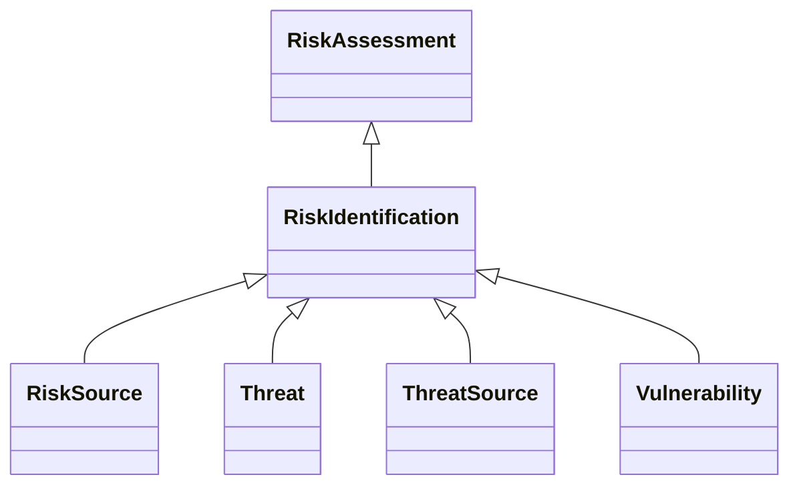

---
search:
  boost: 10.0
---

# Class: RiskIdentification 


_Identification of risks involving identification of risk sources,_

_potential incidents, their causes, and their potential consequences_


<div data-search-exclude markdown="1">


URI: [risk:RiskIdentification](https://w3id.org/lmodel/dpv/risk/RiskIdentification)





## Inheritance
* [RiskManagement](RiskManagement.md)
    * [RiskAssessment](RiskAssessment.md)
        * **RiskIdentification**
            * [RiskSource](RiskSource.md)
            * [Threat](Threat.md)
            * [ThreatSource](ThreatSource.md)
            * [Vulnerability](Vulnerability.md)


## Class Properties

| Property | Value |
| --- | --- |
| Class URI | [risk:RiskIdentification](https://w3id.org/lmodel/dpv/risk/RiskIdentification) |


## Slots

| Name | Cardinality and Range | Description | Inheritance |
| ---  | --- | --- | --- |


## In Subsets


* [RiskSubset](RiskSubset.md)


## Aliases


* Risk Identification


## Identifier and Mapping Information


### Annotations

| property | value |
| --- | --- |
| upstream_iri | https://w3id.org/dpv/risk/owl#RiskIdentification |
| dpv_extension_slug | risk |


### Schema Source


* from schema: https://w3id.org/lmodel/dpv/risk


## Mappings

| Mapping Type | Mapped Value |
| ---  | ---  |
| self | risk:RiskIdentification |
| native | risk:RiskIdentification |
| exact | dpv_risk:RiskIdentification, dpv_risk_owl:RiskIdentification |


## LinkML Source

<!-- TODO: investigate https://stackoverflow.com/questions/37606292/how-to-create-tabbed-code-blocks-in-mkdocs-or-sphinx -->

### Direct

<details>
```yaml
name: RiskIdentification
annotations:
  upstream_iri:
    tag: upstream_iri
    value: https://w3id.org/dpv/risk/owl#RiskIdentification
  dpv_extension_slug:
    tag: dpv_extension_slug
    value: risk
description: 'Identification of risks involving identification of risk sources,

  potential incidents, their causes, and their potential consequences'
in_subset:
- risk_subset
from_schema: https://w3id.org/lmodel/dpv/risk
aliases:
- Risk Identification
exact_mappings:
- dpv_risk:RiskIdentification
- dpv_risk_owl:RiskIdentification
is_a: RiskAssessment
class_uri: risk:RiskIdentification

```
</details>

### Induced

<details>
```yaml
name: RiskIdentification
annotations:
  upstream_iri:
    tag: upstream_iri
    value: https://w3id.org/dpv/risk/owl#RiskIdentification
  dpv_extension_slug:
    tag: dpv_extension_slug
    value: risk
description: 'Identification of risks involving identification of risk sources,

  potential incidents, their causes, and their potential consequences'
in_subset:
- risk_subset
from_schema: https://w3id.org/lmodel/dpv/risk
aliases:
- Risk Identification
exact_mappings:
- dpv_risk:RiskIdentification
- dpv_risk_owl:RiskIdentification
is_a: RiskAssessment
class_uri: risk:RiskIdentification

```
</details></div>