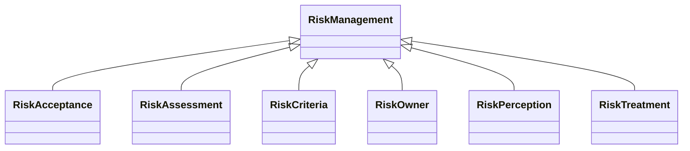

---
search:
  boost: 10.0
---

# Class: RiskManagement 


_Systematic application of management policies, procedures, and practices_

_for communicating, consulting, establishing context, and identifying,_

_analysing, evaluating, treating, monitoring and reviewing risk. ISO_

_31000 definition: coordinated activities to direct and control an_

_organization with regard to risk_


<div data-search-exclude markdown="1">


URI: [risk:RiskManagement](https://w3id.org/lmodel/dpv/risk/RiskManagement)





## Inheritance
* **RiskManagement**
    * [RiskAcceptance](RiskAcceptance.md)
    * [RiskAssessment](RiskAssessment.md)
    * [RiskCriteria](RiskCriteria.md)
    * [RiskOwner](RiskOwner.md)
    * [RiskPerception](RiskPerception.md)
    * [RiskTreatment](RiskTreatment.md)


## Class Properties

| Property | Value |
| --- | --- |
| Class URI | [risk:RiskManagement](https://w3id.org/lmodel/dpv/risk/RiskManagement) |


## Slots

| Name | Cardinality and Range | Description | Inheritance |
| ---  | --- | --- | --- |


## In Subsets


* [RiskSubset](RiskSubset.md)


## Aliases


* Risk Management


## Identifier and Mapping Information


### Annotations

| property | value |
| --- | --- |
| dct_source | ISO 31073:2022 Risk management vocabulary |
| upstream_iri | https://w3id.org/dpv/risk/owl#RiskManagement |
| dpv_extension_slug | risk |


### Schema Source


* from schema: https://w3id.org/lmodel/dpv/risk


## Mappings

| Mapping Type | Mapped Value |
| ---  | ---  |
| self | risk:RiskManagement |
| native | risk:RiskManagement |
| exact | dpv_risk:RiskManagement, dpv_risk_owl:RiskManagement |


## LinkML Source

<!-- TODO: investigate https://stackoverflow.com/questions/37606292/how-to-create-tabbed-code-blocks-in-mkdocs-or-sphinx -->

### Direct

<details>
```yaml
name: RiskManagement
annotations:
  dct_source:
    tag: dct_source
    value: ISO 31073:2022 Risk management vocabulary
  upstream_iri:
    tag: upstream_iri
    value: https://w3id.org/dpv/risk/owl#RiskManagement
  dpv_extension_slug:
    tag: dpv_extension_slug
    value: risk
description: 'Systematic application of management policies, procedures, and practices

  for communicating, consulting, establishing context, and identifying,

  analysing, evaluating, treating, monitoring and reviewing risk. ISO

  31000 definition: coordinated activities to direct and control an

  organization with regard to risk'
in_subset:
- risk_subset
from_schema: https://w3id.org/lmodel/dpv/risk
aliases:
- Risk Management
exact_mappings:
- dpv_risk:RiskManagement
- dpv_risk_owl:RiskManagement
class_uri: risk:RiskManagement

```
</details>

### Induced

<details>
```yaml
name: RiskManagement
annotations:
  dct_source:
    tag: dct_source
    value: ISO 31073:2022 Risk management vocabulary
  upstream_iri:
    tag: upstream_iri
    value: https://w3id.org/dpv/risk/owl#RiskManagement
  dpv_extension_slug:
    tag: dpv_extension_slug
    value: risk
description: 'Systematic application of management policies, procedures, and practices

  for communicating, consulting, establishing context, and identifying,

  analysing, evaluating, treating, monitoring and reviewing risk. ISO

  31000 definition: coordinated activities to direct and control an

  organization with regard to risk'
in_subset:
- risk_subset
from_schema: https://w3id.org/lmodel/dpv/risk
aliases:
- Risk Management
exact_mappings:
- dpv_risk:RiskManagement
- dpv_risk_owl:RiskManagement
class_uri: risk:RiskManagement

```
</details></div>