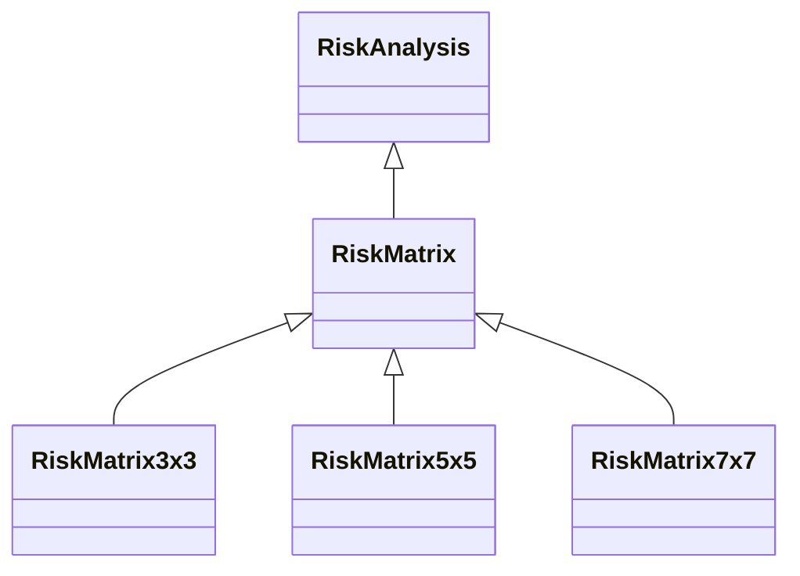

---
search:
  boost: 10.0
---

# Class: RiskMatrix 


_Compares individual risks by selecting a consequence/ likelihood pair_

_and displaying them on a matrix with consequence on one axis and_

_likelihood on the other._


<div data-search-exclude markdown="1">


URI: [risk:RiskMatrix](https://w3id.org/lmodel/dpv/risk/RiskMatrix)





## Inheritance
* [RiskManagement](RiskManagement.md)
    * [RiskAssessment](RiskAssessment.md)
        * [RiskAnalysis](RiskAnalysis.md)
            * **RiskMatrix**
                * [RiskMatrix3x3](RiskMatrix3x3.md) [ [RiskAnalysis](RiskAnalysis.md)]
                * [RiskMatrix5x5](RiskMatrix5x5.md) [ [RiskAnalysis](RiskAnalysis.md)]
                * [RiskMatrix7x7](RiskMatrix7x7.md) [ [RiskAnalysis](RiskAnalysis.md)]


## Class Properties

| Property | Value |
| --- | --- |
| Class URI | [risk:RiskMatrix](https://w3id.org/lmodel/dpv/risk/RiskMatrix) |


## Slots

| Name | Cardinality and Range | Description | Inheritance |
| ---  | --- | --- | --- |


## In Subsets


* [RiskSubset](RiskSubset.md)


## Aliases


* Risk Matrix


## Identifier and Mapping Information


### Annotations

| property | value |
| --- | --- |
| upstream_iri | https://w3id.org/dpv/risk/owl#RiskMatrix |
| dpv_extension_slug | risk |


### Schema Source


* from schema: https://w3id.org/lmodel/dpv/risk


## Mappings

| Mapping Type | Mapped Value |
| ---  | ---  |
| self | risk:RiskMatrix |
| native | risk:RiskMatrix |
| exact | dpv_risk:RiskMatrix, dpv_risk_owl:RiskMatrix |


## LinkML Source

<!-- TODO: investigate https://stackoverflow.com/questions/37606292/how-to-create-tabbed-code-blocks-in-mkdocs-or-sphinx -->

### Direct

<details>
```yaml
name: RiskMatrix
annotations:
  upstream_iri:
    tag: upstream_iri
    value: https://w3id.org/dpv/risk/owl#RiskMatrix
  dpv_extension_slug:
    tag: dpv_extension_slug
    value: risk
description: 'Compares individual risks by selecting a consequence/ likelihood pair

  and displaying them on a matrix with consequence on one axis and

  likelihood on the other.'
in_subset:
- risk_subset
from_schema: https://w3id.org/lmodel/dpv/risk
aliases:
- Risk Matrix
exact_mappings:
- dpv_risk:RiskMatrix
- dpv_risk_owl:RiskMatrix
is_a: RiskAnalysis
class_uri: risk:RiskMatrix

```
</details>

### Induced

<details>
```yaml
name: RiskMatrix
annotations:
  upstream_iri:
    tag: upstream_iri
    value: https://w3id.org/dpv/risk/owl#RiskMatrix
  dpv_extension_slug:
    tag: dpv_extension_slug
    value: risk
description: 'Compares individual risks by selecting a consequence/ likelihood pair

  and displaying them on a matrix with consequence on one axis and

  likelihood on the other.'
in_subset:
- risk_subset
from_schema: https://w3id.org/lmodel/dpv/risk
aliases:
- Risk Matrix
exact_mappings:
- dpv_risk:RiskMatrix
- dpv_risk_owl:RiskMatrix
is_a: RiskAnalysis
class_uri: risk:RiskMatrix

```
</details></div>