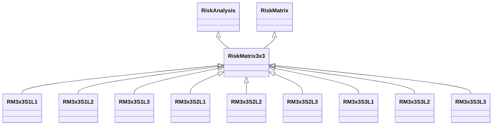

---
search:
  boost: 10.0
---

# Class: RiskMatrix3x3 


_A Risk Matrix with 3 Likelihood, 3 Severity, and 3 Risk Level types_


<div data-search-exclude markdown="1">


URI: [risk:RiskMatrix3x3](https://w3id.org/lmodel/dpv/risk/RiskMatrix3x3)





## Inheritance
* [RiskManagement](RiskManagement.md)
    * [RiskAssessment](RiskAssessment.md)
        * [RiskAnalysis](RiskAnalysis.md)
            * [RiskMatrix](RiskMatrix.md)
                * **RiskMatrix3x3** [ [RiskAnalysis](RiskAnalysis.md)]
                    * [RM3x3S1L1](RM3x3S1L1.md) [ [RiskAnalysis](RiskAnalysis.md)]
                    * [RM3x3S1L2](RM3x3S1L2.md) [ [RiskAnalysis](RiskAnalysis.md)]
                    * [RM3x3S1L3](RM3x3S1L3.md) [ [RiskAnalysis](RiskAnalysis.md)]
                    * [RM3x3S2L1](RM3x3S2L1.md) [ [RiskAnalysis](RiskAnalysis.md)]
                    * [RM3x3S2L2](RM3x3S2L2.md) [ [RiskAnalysis](RiskAnalysis.md)]
                    * [RM3x3S2L3](RM3x3S2L3.md) [ [RiskAnalysis](RiskAnalysis.md)]
                    * [RM3x3S3L1](RM3x3S3L1.md) [ [RiskAnalysis](RiskAnalysis.md)]
                    * [RM3x3S3L2](RM3x3S3L2.md) [ [RiskAnalysis](RiskAnalysis.md)]
                    * [RM3x3S3L3](RM3x3S3L3.md) [ [RiskAnalysis](RiskAnalysis.md)]


## Class Properties

| Property | Value |
| --- | --- |
| Class URI | [risk:RiskMatrix3x3](https://w3id.org/lmodel/dpv/risk/RiskMatrix3x3) |


## Slots

| Name | Cardinality and Range | Description | Inheritance |
| ---  | --- | --- | --- |


## In Subsets


* [RiskSubset](RiskSubset.md)


## Aliases


* Risk Matrix 3x3


## Identifier and Mapping Information


### Annotations

| property | value |
| --- | --- |
| upstream_iri | https://w3id.org/dpv/risk/owl#RiskMatrix3x3 |
| dpv_extension_slug | risk |


### Schema Source


* from schema: https://w3id.org/lmodel/dpv/risk


## Mappings

| Mapping Type | Mapped Value |
| ---  | ---  |
| self | risk:RiskMatrix3x3 |
| native | risk:RiskMatrix3x3 |
| exact | dpv_risk:RiskMatrix3x3, dpv_risk_owl:RiskMatrix3x3 |


## LinkML Source

<!-- TODO: investigate https://stackoverflow.com/questions/37606292/how-to-create-tabbed-code-blocks-in-mkdocs-or-sphinx -->

### Direct

<details>
```yaml
name: RiskMatrix3x3
annotations:
  upstream_iri:
    tag: upstream_iri
    value: https://w3id.org/dpv/risk/owl#RiskMatrix3x3
  dpv_extension_slug:
    tag: dpv_extension_slug
    value: risk
description: A Risk Matrix with 3 Likelihood, 3 Severity, and 3 Risk Level types
in_subset:
- risk_subset
from_schema: https://w3id.org/lmodel/dpv/risk
aliases:
- Risk Matrix 3x3
exact_mappings:
- dpv_risk:RiskMatrix3x3
- dpv_risk_owl:RiskMatrix3x3
is_a: RiskMatrix
mixins:
- RiskAnalysis
class_uri: risk:RiskMatrix3x3

```
</details>

### Induced

<details>
```yaml
name: RiskMatrix3x3
annotations:
  upstream_iri:
    tag: upstream_iri
    value: https://w3id.org/dpv/risk/owl#RiskMatrix3x3
  dpv_extension_slug:
    tag: dpv_extension_slug
    value: risk
description: A Risk Matrix with 3 Likelihood, 3 Severity, and 3 Risk Level types
in_subset:
- risk_subset
from_schema: https://w3id.org/lmodel/dpv/risk
aliases:
- Risk Matrix 3x3
exact_mappings:
- dpv_risk:RiskMatrix3x3
- dpv_risk_owl:RiskMatrix3x3
is_a: RiskMatrix
mixins:
- RiskAnalysis
class_uri: risk:RiskMatrix3x3

```
</details></div>