---
search:
  boost: 10.0
---

# Class: RiskMatrix5x5 


_A Risk Matrix with 5 Likelihood, 5 Severity, and 5 Risk Level types_


<div data-search-exclude markdown="1">


URI: [risk:RiskMatrix5x5](https://w3id.org/lmodel/dpv/risk/RiskMatrix5x5)

```mermaid
 classDiagram
    class RiskMatrix5x5
    click RiskMatrix5x5 href "../RiskMatrix5x5/"
      RiskAnalysis <|-- RiskMatrix5x5
        click RiskAnalysis href "../RiskAnalysis/"
      RiskMatrix <|-- RiskMatrix5x5
        click RiskMatrix href "../RiskMatrix/"
      

      RiskMatrix5x5 <|-- RM5x5S1L1
        click RM5x5S1L1 href "../RM5x5S1L1/"
      RiskMatrix5x5 <|-- RM5x5S1L2
        click RM5x5S1L2 href "../RM5x5S1L2/"
      RiskMatrix5x5 <|-- RM5x5S1L3
        click RM5x5S1L3 href "../RM5x5S1L3/"
      RiskMatrix5x5 <|-- RM5x5S1L4
        click RM5x5S1L4 href "../RM5x5S1L4/"
      RiskMatrix5x5 <|-- RM5x5S1L5
        click RM5x5S1L5 href "../RM5x5S1L5/"
      RiskMatrix5x5 <|-- RM5x5S2L1
        click RM5x5S2L1 href "../RM5x5S2L1/"
      RiskMatrix5x5 <|-- RM5x5S2L2
        click RM5x5S2L2 href "../RM5x5S2L2/"
      RiskMatrix5x5 <|-- RM5x5S2L3
        click RM5x5S2L3 href "../RM5x5S2L3/"
      RiskMatrix5x5 <|-- RM5x5S2L4
        click RM5x5S2L4 href "../RM5x5S2L4/"
      RiskMatrix5x5 <|-- RM5x5S2L5
        click RM5x5S2L5 href "../RM5x5S2L5/"
      RiskMatrix5x5 <|-- RM5x5S3L1
        click RM5x5S3L1 href "../RM5x5S3L1/"
      RiskMatrix5x5 <|-- RM5x5S3L2
        click RM5x5S3L2 href "../RM5x5S3L2/"
      RiskMatrix5x5 <|-- RM5x5S3L3
        click RM5x5S3L3 href "../RM5x5S3L3/"
      RiskMatrix5x5 <|-- RM5x5S3L4
        click RM5x5S3L4 href "../RM5x5S3L4/"
      RiskMatrix5x5 <|-- RM5x5S3L5
        click RM5x5S3L5 href "../RM5x5S3L5/"
      RiskMatrix5x5 <|-- RM5x5S4L1
        click RM5x5S4L1 href "../RM5x5S4L1/"
      RiskMatrix5x5 <|-- RM5x5S4L2
        click RM5x5S4L2 href "../RM5x5S4L2/"
      RiskMatrix5x5 <|-- RM5x5S4L3
        click RM5x5S4L3 href "../RM5x5S4L3/"
      RiskMatrix5x5 <|-- RM5x5S4L4
        click RM5x5S4L4 href "../RM5x5S4L4/"
      RiskMatrix5x5 <|-- RM5x5S4L5
        click RM5x5S4L5 href "../RM5x5S4L5/"
      RiskMatrix5x5 <|-- RM5x5S5L1
        click RM5x5S5L1 href "../RM5x5S5L1/"
      RiskMatrix5x5 <|-- RM5x5S5L2
        click RM5x5S5L2 href "../RM5x5S5L2/"
      RiskMatrix5x5 <|-- RM5x5S5L3
        click RM5x5S5L3 href "../RM5x5S5L3/"
      RiskMatrix5x5 <|-- RM5x5S5L4
        click RM5x5S5L4 href "../RM5x5S5L4/"
      RiskMatrix5x5 <|-- RM5x5S5L5
        click RM5x5S5L5 href "../RM5x5S5L5/"
      

      
```





## Inheritance
* [RiskManagement](RiskManagement.md)
    * [RiskAssessment](RiskAssessment.md)
        * [RiskAnalysis](RiskAnalysis.md)
            * [RiskMatrix](RiskMatrix.md)
                * **RiskMatrix5x5** [ [RiskAnalysis](RiskAnalysis.md)]
                    * [RM5x5S1L1](RM5x5S1L1.md) [ [RiskAnalysis](RiskAnalysis.md)]
                    * [RM5x5S1L2](RM5x5S1L2.md) [ [RiskAnalysis](RiskAnalysis.md)]
                    * [RM5x5S1L3](RM5x5S1L3.md) [ [RiskAnalysis](RiskAnalysis.md)]
                    * [RM5x5S1L4](RM5x5S1L4.md) [ [RiskAnalysis](RiskAnalysis.md)]
                    * [RM5x5S1L5](RM5x5S1L5.md) [ [RiskAnalysis](RiskAnalysis.md)]
                    * [RM5x5S2L1](RM5x5S2L1.md) [ [RiskAnalysis](RiskAnalysis.md)]
                    * [RM5x5S2L2](RM5x5S2L2.md) [ [RiskAnalysis](RiskAnalysis.md)]
                    * [RM5x5S2L3](RM5x5S2L3.md) [ [RiskAnalysis](RiskAnalysis.md)]
                    * [RM5x5S2L4](RM5x5S2L4.md) [ [RiskAnalysis](RiskAnalysis.md)]
                    * [RM5x5S2L5](RM5x5S2L5.md) [ [RiskAnalysis](RiskAnalysis.md)]
                    * [RM5x5S3L1](RM5x5S3L1.md) [ [RiskAnalysis](RiskAnalysis.md)]
                    * [RM5x5S3L2](RM5x5S3L2.md) [ [RiskAnalysis](RiskAnalysis.md)]
                    * [RM5x5S3L3](RM5x5S3L3.md) [ [RiskAnalysis](RiskAnalysis.md)]
                    * [RM5x5S3L4](RM5x5S3L4.md) [ [RiskAnalysis](RiskAnalysis.md)]
                    * [RM5x5S3L5](RM5x5S3L5.md) [ [RiskAnalysis](RiskAnalysis.md)]
                    * [RM5x5S4L1](RM5x5S4L1.md) [ [RiskAnalysis](RiskAnalysis.md)]
                    * [RM5x5S4L2](RM5x5S4L2.md) [ [RiskAnalysis](RiskAnalysis.md)]
                    * [RM5x5S4L3](RM5x5S4L3.md) [ [RiskAnalysis](RiskAnalysis.md)]
                    * [RM5x5S4L4](RM5x5S4L4.md) [ [RiskAnalysis](RiskAnalysis.md)]
                    * [RM5x5S4L5](RM5x5S4L5.md) [ [RiskAnalysis](RiskAnalysis.md)]
                    * [RM5x5S5L1](RM5x5S5L1.md) [ [RiskAnalysis](RiskAnalysis.md)]
                    * [RM5x5S5L2](RM5x5S5L2.md) [ [RiskAnalysis](RiskAnalysis.md)]
                    * [RM5x5S5L3](RM5x5S5L3.md) [ [RiskAnalysis](RiskAnalysis.md)]
                    * [RM5x5S5L4](RM5x5S5L4.md) [ [RiskAnalysis](RiskAnalysis.md)]
                    * [RM5x5S5L5](RM5x5S5L5.md) [ [RiskAnalysis](RiskAnalysis.md)]


## Class Properties

| Property | Value |
| --- | --- |
| Class URI | [risk:RiskMatrix5x5](https://w3id.org/lmodel/dpv/risk/RiskMatrix5x5) |


## Slots

| Name | Cardinality and Range | Description | Inheritance |
| ---  | --- | --- | --- |


## In Subsets


* [RiskSubset](RiskSubset.md)


## Aliases


* Risk Matrix 5x5


## Identifier and Mapping Information


### Annotations

| property | value |
| --- | --- |
| upstream_iri | https://w3id.org/dpv/risk/owl#RiskMatrix5x5 |
| dpv_extension_slug | risk |


### Schema Source


* from schema: https://w3id.org/lmodel/dpv/risk


## Mappings

| Mapping Type | Mapped Value |
| ---  | ---  |
| self | risk:RiskMatrix5x5 |
| native | risk:RiskMatrix5x5 |
| exact | dpv_risk:RiskMatrix5x5, dpv_risk_owl:RiskMatrix5x5 |


## LinkML Source

<!-- TODO: investigate https://stackoverflow.com/questions/37606292/how-to-create-tabbed-code-blocks-in-mkdocs-or-sphinx -->

### Direct

<details>
```yaml
name: RiskMatrix5x5
annotations:
  upstream_iri:
    tag: upstream_iri
    value: https://w3id.org/dpv/risk/owl#RiskMatrix5x5
  dpv_extension_slug:
    tag: dpv_extension_slug
    value: risk
description: A Risk Matrix with 5 Likelihood, 5 Severity, and 5 Risk Level types
in_subset:
- risk_subset
from_schema: https://w3id.org/lmodel/dpv/risk
aliases:
- Risk Matrix 5x5
exact_mappings:
- dpv_risk:RiskMatrix5x5
- dpv_risk_owl:RiskMatrix5x5
is_a: RiskMatrix
mixins:
- RiskAnalysis
class_uri: risk:RiskMatrix5x5

```
</details>

### Induced

<details>
```yaml
name: RiskMatrix5x5
annotations:
  upstream_iri:
    tag: upstream_iri
    value: https://w3id.org/dpv/risk/owl#RiskMatrix5x5
  dpv_extension_slug:
    tag: dpv_extension_slug
    value: risk
description: A Risk Matrix with 5 Likelihood, 5 Severity, and 5 Risk Level types
in_subset:
- risk_subset
from_schema: https://w3id.org/lmodel/dpv/risk
aliases:
- Risk Matrix 5x5
exact_mappings:
- dpv_risk:RiskMatrix5x5
- dpv_risk_owl:RiskMatrix5x5
is_a: RiskMatrix
mixins:
- RiskAnalysis
class_uri: risk:RiskMatrix5x5

```
</details></div>