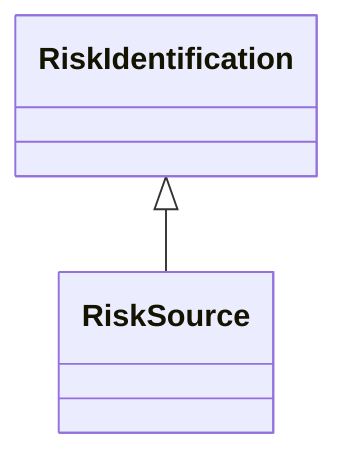

---
search:
  boost: 10.0
---

# Class: RiskSource 


_The 'cause' or 'source', which by itself or with another source has the_

_potential to give rise to risk_


<div data-search-exclude markdown="1">


URI: [risk:RiskSource](https://w3id.org/lmodel/dpv/risk/RiskSource)





## Inheritance
* [RiskManagement](RiskManagement.md)
    * [RiskAssessment](RiskAssessment.md)
        * [RiskIdentification](RiskIdentification.md)
            * **RiskSource**


## Class Properties

| Property | Value |
| --- | --- |
| Class URI | [risk:RiskSource](https://w3id.org/lmodel/dpv/risk/RiskSource) |


## Slots

| Name | Cardinality and Range | Description | Inheritance |
| ---  | --- | --- | --- |


## In Subsets


* [RiskSubset](RiskSubset.md)


## Aliases


* Risk Source


## Identifier and Mapping Information


### Annotations

| property | value |
| --- | --- |
| upstream_iri | https://w3id.org/dpv/risk/owl#RiskSource |
| dpv_extension_slug | risk |


### Schema Source


* from schema: https://w3id.org/lmodel/dpv/risk


## Mappings

| Mapping Type | Mapped Value |
| ---  | ---  |
| self | risk:RiskSource |
| native | risk:RiskSource |
| exact | dpv_risk:RiskSource, dpv_risk_owl:RiskSource |


## LinkML Source

<!-- TODO: investigate https://stackoverflow.com/questions/37606292/how-to-create-tabbed-code-blocks-in-mkdocs-or-sphinx -->

### Direct

<details>
```yaml
name: RiskSource
annotations:
  upstream_iri:
    tag: upstream_iri
    value: https://w3id.org/dpv/risk/owl#RiskSource
  dpv_extension_slug:
    tag: dpv_extension_slug
    value: risk
description: 'The ''cause'' or ''source'', which by itself or with another source
  has the

  potential to give rise to risk'
in_subset:
- risk_subset
from_schema: https://w3id.org/lmodel/dpv/risk
aliases:
- Risk Source
exact_mappings:
- dpv_risk:RiskSource
- dpv_risk_owl:RiskSource
is_a: RiskIdentification
class_uri: risk:RiskSource

```
</details>

### Induced

<details>
```yaml
name: RiskSource
annotations:
  upstream_iri:
    tag: upstream_iri
    value: https://w3id.org/dpv/risk/owl#RiskSource
  dpv_extension_slug:
    tag: dpv_extension_slug
    value: risk
description: 'The ''cause'' or ''source'', which by itself or with another source
  has the

  potential to give rise to risk'
in_subset:
- risk_subset
from_schema: https://w3id.org/lmodel/dpv/risk
aliases:
- Risk Source
exact_mappings:
- dpv_risk:RiskSource
- dpv_risk_owl:RiskSource
is_a: RiskIdentification
class_uri: risk:RiskSource

```
</details></div>