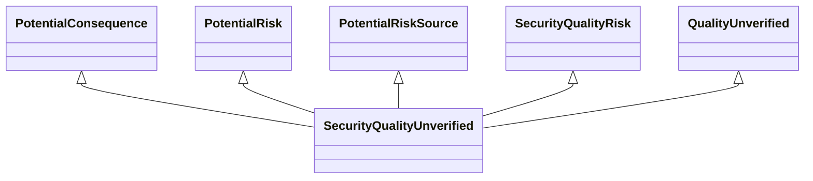

---
search:
  boost: 10.0
---

# Class: SecurityQualityUnverified 


_Concepts representing risks and issues where Quality of Security is_

_Unverified_


<div data-search-exclude markdown="1">


URI: [risk:SecurityQualityUnverified](https://w3id.org/lmodel/dpv/risk/SecurityQualityUnverified)





## Inheritance
* [TechnicalRiskConcept](TechnicalRiskConcept.md) [ [PotentialConsequence](PotentialConsequence.md) [PotentialImpact](PotentialImpact.md) [PotentialRisk](PotentialRisk.md) [PotentialRiskSource](PotentialRiskSource.md)]
    * [OperationalSecurityRisk](OperationalSecurityRisk.md) [ [PotentialConsequence](PotentialConsequence.md) [PotentialRisk](PotentialRisk.md) [PotentialRiskSource](PotentialRiskSource.md)]
        * [QualityRisk](QualityRisk.md) [ [PotentialConsequence](PotentialConsequence.md) [PotentialRisk](PotentialRisk.md) [PotentialRiskSource](PotentialRiskSource.md)]
            * [QualityUnverified](QualityUnverified.md) [ [PotentialConsequence](PotentialConsequence.md) [PotentialRisk](PotentialRisk.md) [PotentialRiskSource](PotentialRiskSource.md)]
                * **SecurityQualityUnverified** [ [PotentialConsequence](PotentialConsequence.md) [PotentialRisk](PotentialRisk.md) [PotentialRiskSource](PotentialRiskSource.md) [SecurityQualityRisk](SecurityQualityRisk.md)]


## Class Properties

| Property | Value |
| --- | --- |
| Class URI | [risk:SecurityQualityUnverified](https://w3id.org/lmodel/dpv/risk/SecurityQualityUnverified) |


## Slots

| Name | Cardinality and Range | Description | Inheritance |
| ---  | --- | --- | --- |


## In Subsets


* [RiskSubset](RiskSubset.md)


## Aliases


* Security Quality Unverified


## Identifier and Mapping Information


### Annotations

| property | value |
| --- | --- |
| upstream_iri | https://w3id.org/dpv/risk/owl#SecurityQualityUnverified |
| dpv_extension_slug | risk |


### Schema Source


* from schema: https://w3id.org/lmodel/dpv/risk


## Mappings

| Mapping Type | Mapped Value |
| ---  | ---  |
| self | risk:SecurityQualityUnverified |
| native | risk:SecurityQualityUnverified |
| exact | dpv_risk:SecurityQualityUnverified, dpv_risk_owl:SecurityQualityUnverified |


## LinkML Source

<!-- TODO: investigate https://stackoverflow.com/questions/37606292/how-to-create-tabbed-code-blocks-in-mkdocs-or-sphinx -->

### Direct

<details>
```yaml
name: SecurityQualityUnverified
annotations:
  upstream_iri:
    tag: upstream_iri
    value: https://w3id.org/dpv/risk/owl#SecurityQualityUnverified
  dpv_extension_slug:
    tag: dpv_extension_slug
    value: risk
description: 'Concepts representing risks and issues where Quality of Security is

  Unverified'
in_subset:
- risk_subset
from_schema: https://w3id.org/lmodel/dpv/risk
aliases:
- Security Quality Unverified
exact_mappings:
- dpv_risk:SecurityQualityUnverified
- dpv_risk_owl:SecurityQualityUnverified
is_a: QualityUnverified
mixins:
- PotentialConsequence
- PotentialRisk
- PotentialRiskSource
- SecurityQualityRisk
class_uri: risk:SecurityQualityUnverified

```
</details>

### Induced

<details>
```yaml
name: SecurityQualityUnverified
annotations:
  upstream_iri:
    tag: upstream_iri
    value: https://w3id.org/dpv/risk/owl#SecurityQualityUnverified
  dpv_extension_slug:
    tag: dpv_extension_slug
    value: risk
description: 'Concepts representing risks and issues where Quality of Security is

  Unverified'
in_subset:
- risk_subset
from_schema: https://w3id.org/lmodel/dpv/risk
aliases:
- Security Quality Unverified
exact_mappings:
- dpv_risk:SecurityQualityUnverified
- dpv_risk_owl:SecurityQualityUnverified
is_a: QualityUnverified
mixins:
- PotentialConsequence
- PotentialRisk
- PotentialRiskSource
- SecurityQualityRisk
class_uri: risk:SecurityQualityUnverified

```
</details></div>