---
search:
  boost: 10.0
---

# Class: ServiceRelatedConsequence 


_A consequence related to the provision of a service_


<div data-search-exclude markdown="1">


URI: [risk:ServiceRelatedConsequence](https://w3id.org/lmodel/dpv/risk/ServiceRelatedConsequence)

```mermaid
 classDiagram
    class ServiceRelatedConsequence
    click ServiceRelatedConsequence href "../ServiceRelatedConsequence/"
      PotentialConsequence <|-- ServiceRelatedConsequence
        click PotentialConsequence href "../PotentialConsequence/"
      PotentialImpact <|-- ServiceRelatedConsequence
        click PotentialImpact href "../PotentialImpact/"
      PotentialRisk <|-- ServiceRelatedConsequence
        click PotentialRisk href "../PotentialRisk/"
      OrganisationalRiskConcept <|-- ServiceRelatedConsequence
        click OrganisationalRiskConcept href "../OrganisationalRiskConcept/"
      

      ServiceRelatedConsequence <|-- CustomerSupportLimited
        click CustomerSupportLimited href "../CustomerSupportLimited/"
      ServiceRelatedConsequence <|-- DelayedApplicationProcessing
        click DelayedApplicationProcessing href "../DelayedApplicationProcessing/"
      ServiceRelatedConsequence <|-- IdentityVerificationFailure
        click IdentityVerificationFailure href "../IdentityVerificationFailure/"
      ServiceRelatedConsequence <|-- InabilityToEnterIntoContract
        click InabilityToEnterIntoContract href "../InabilityToEnterIntoContract/"
      ServiceRelatedConsequence <|-- InabilityToEstablishLegalClaims
        click InabilityToEstablishLegalClaims href "../InabilityToEstablishLegalClaims/"
      ServiceRelatedConsequence <|-- InabilityToFulfilLegalObligations
        click InabilityToFulfilLegalObligations href "../InabilityToFulfilLegalObligations/"
      ServiceRelatedConsequence <|-- InabilityToProcessPayments
        click InabilityToProcessPayments href "../InabilityToProcessPayments/"
      ServiceRelatedConsequence <|-- InabilityToProtectVitalInterests
        click InabilityToProtectVitalInterests href "../InabilityToProtectVitalInterests/"
      ServiceRelatedConsequence <|-- InabilityToProvideHealthCare
        click InabilityToProvideHealthCare href "../InabilityToProvideHealthCare/"
      ServiceRelatedConsequence <|-- LegalSupportLimited
        click LegalSupportLimited href "../LegalSupportLimited/"
      ServiceRelatedConsequence <|-- LoyaltyProgramExclusion
        click LoyaltyProgramExclusion href "../LoyaltyProgramExclusion/"
      ServiceRelatedConsequence <|-- PersonalisationDisabled
        click PersonalisationDisabled href "../PersonalisationDisabled/"
      ServiceRelatedConsequence <|-- PersonalisationEnabled
        click PersonalisationEnabled href "../PersonalisationEnabled/"
      ServiceRelatedConsequence <|-- PublicServicesExclusion
        click PublicServicesExclusion href "../PublicServicesExclusion/"
      ServiceRelatedConsequence <|-- ServiceAlternativeOffered
        click ServiceAlternativeOffered href "../ServiceAlternativeOffered/"
      ServiceRelatedConsequence <|-- ServiceCostIncreased
        click ServiceCostIncreased href "../ServiceCostIncreased/"
      ServiceRelatedConsequence <|-- ServiceDenied
        click ServiceDenied href "../ServiceDenied/"
      ServiceRelatedConsequence <|-- ServiceLimited
        click ServiceLimited href "../ServiceLimited/"
      ServiceRelatedConsequence <|-- ServiceNotProvided
        click ServiceNotProvided href "../ServiceNotProvided/"
      ServiceRelatedConsequence <|-- ServicePartiallyProvided
        click ServicePartiallyProvided href "../ServicePartiallyProvided/"
      ServiceRelatedConsequence <|-- ServiceProvided
        click ServiceProvided href "../ServiceProvided/"
      ServiceRelatedConsequence <|-- ServiceProvisionDelayed
        click ServiceProvisionDelayed href "../ServiceProvisionDelayed/"
      ServiceRelatedConsequence <|-- ServiceQualityReduced
        click ServiceQualityReduced href "../ServiceQualityReduced/"
      ServiceRelatedConsequence <|-- ServiceSecurityReduced
        click ServiceSecurityReduced href "../ServiceSecurityReduced/"
      ServiceRelatedConsequence <|-- ServiceTermination
        click ServiceTermination href "../ServiceTermination/"
      

      
```





## Inheritance
* [OrganisationalRiskConcept](OrganisationalRiskConcept.md) [ [PotentialConsequence](PotentialConsequence.md) [PotentialImpact](PotentialImpact.md) [PotentialRisk](PotentialRisk.md) [PotentialRiskSource](PotentialRiskSource.md)]
    * **ServiceRelatedConsequence** [ [PotentialConsequence](PotentialConsequence.md) [PotentialImpact](PotentialImpact.md) [PotentialRisk](PotentialRisk.md)]
        * [CustomerSupportLimited](CustomerSupportLimited.md) [ [PotentialConsequence](PotentialConsequence.md) [PotentialImpact](PotentialImpact.md) [PotentialRisk](PotentialRisk.md)]
        * [DelayedApplicationProcessing](DelayedApplicationProcessing.md) [ [PotentialConsequence](PotentialConsequence.md) [PotentialImpact](PotentialImpact.md) [PotentialRisk](PotentialRisk.md)]
        * [IdentityVerificationFailure](IdentityVerificationFailure.md) [ [PotentialConsequence](PotentialConsequence.md) [PotentialImpact](PotentialImpact.md) [PotentialRisk](PotentialRisk.md)]
        * [InabilityToEnterIntoContract](InabilityToEnterIntoContract.md) [ [PotentialConsequence](PotentialConsequence.md) [PotentialImpact](PotentialImpact.md) [PotentialRisk](PotentialRisk.md)]
        * [InabilityToEstablishLegalClaims](InabilityToEstablishLegalClaims.md) [ [PotentialConsequence](PotentialConsequence.md) [PotentialImpact](PotentialImpact.md) [PotentialRisk](PotentialRisk.md)]
        * [InabilityToFulfilLegalObligations](InabilityToFulfilLegalObligations.md) [ [PotentialConsequence](PotentialConsequence.md) [PotentialImpact](PotentialImpact.md) [PotentialRisk](PotentialRisk.md)]
        * [InabilityToProcessPayments](InabilityToProcessPayments.md) [ [PotentialConsequence](PotentialConsequence.md) [PotentialImpact](PotentialImpact.md) [PotentialRisk](PotentialRisk.md)]
        * [InabilityToProtectVitalInterests](InabilityToProtectVitalInterests.md) [ [PotentialConsequence](PotentialConsequence.md) [PotentialImpact](PotentialImpact.md) [PotentialRisk](PotentialRisk.md)]
        * [InabilityToProvideHealthCare](InabilityToProvideHealthCare.md) [ [PotentialConsequence](PotentialConsequence.md) [PotentialImpact](PotentialImpact.md) [PotentialRisk](PotentialRisk.md)]
        * [LegalSupportLimited](LegalSupportLimited.md) [ [PotentialConsequence](PotentialConsequence.md) [PotentialImpact](PotentialImpact.md) [PotentialRisk](PotentialRisk.md)]
        * [LoyaltyProgramExclusion](LoyaltyProgramExclusion.md) [ [PotentialConsequence](PotentialConsequence.md) [PotentialImpact](PotentialImpact.md) [PotentialRisk](PotentialRisk.md)]
        * [PersonalisationDisabled](PersonalisationDisabled.md) [ [PotentialConsequence](PotentialConsequence.md) [PotentialImpact](PotentialImpact.md) [PotentialRisk](PotentialRisk.md)]
        * [PersonalisationEnabled](PersonalisationEnabled.md) [ [PotentialConsequence](PotentialConsequence.md) [PotentialImpact](PotentialImpact.md) [PotentialRisk](PotentialRisk.md)]
        * [PublicServicesExclusion](PublicServicesExclusion.md) [ [PotentialConsequence](PotentialConsequence.md) [PotentialImpact](PotentialImpact.md) [PotentialRisk](PotentialRisk.md)]
        * [ServiceAlternativeOffered](ServiceAlternativeOffered.md) [ [PotentialConsequence](PotentialConsequence.md) [PotentialImpact](PotentialImpact.md) [PotentialRisk](PotentialRisk.md)]
        * [ServiceCostIncreased](ServiceCostIncreased.md) [ [PotentialConsequence](PotentialConsequence.md) [PotentialImpact](PotentialImpact.md) [PotentialRisk](PotentialRisk.md)]
        * [ServiceDenied](ServiceDenied.md) [ [PotentialConsequence](PotentialConsequence.md) [PotentialImpact](PotentialImpact.md) [PotentialRisk](PotentialRisk.md)]
        * [ServiceLimited](ServiceLimited.md) [ [PotentialConsequence](PotentialConsequence.md) [PotentialImpact](PotentialImpact.md) [PotentialRisk](PotentialRisk.md)]
        * [ServiceNotProvided](ServiceNotProvided.md) [ [PotentialConsequence](PotentialConsequence.md) [PotentialImpact](PotentialImpact.md) [PotentialRisk](PotentialRisk.md)]
        * [ServicePartiallyProvided](ServicePartiallyProvided.md) [ [PotentialConsequence](PotentialConsequence.md) [PotentialImpact](PotentialImpact.md) [PotentialRisk](PotentialRisk.md)]
        * [ServiceProvided](ServiceProvided.md) [ [PotentialConsequence](PotentialConsequence.md) [PotentialImpact](PotentialImpact.md) [PotentialRisk](PotentialRisk.md)]
        * [ServiceProvisionDelayed](ServiceProvisionDelayed.md) [ [PotentialConsequence](PotentialConsequence.md) [PotentialImpact](PotentialImpact.md) [PotentialRisk](PotentialRisk.md)]
        * [ServiceQualityReduced](ServiceQualityReduced.md) [ [PotentialConsequence](PotentialConsequence.md) [PotentialImpact](PotentialImpact.md) [PotentialRisk](PotentialRisk.md)]
        * [ServiceSecurityReduced](ServiceSecurityReduced.md) [ [PotentialConsequence](PotentialConsequence.md) [PotentialImpact](PotentialImpact.md) [PotentialRisk](PotentialRisk.md)]
        * [ServiceTermination](ServiceTermination.md) [ [PotentialConsequence](PotentialConsequence.md) [PotentialImpact](PotentialImpact.md) [PotentialRisk](PotentialRisk.md)]


## Class Properties

| Property | Value |
| --- | --- |
| Class URI | [risk:ServiceRelatedConsequence](https://w3id.org/lmodel/dpv/risk/ServiceRelatedConsequence) |


## Slots

| Name | Cardinality and Range | Description | Inheritance |
| ---  | --- | --- | --- |


## In Subsets


* [RiskSubset](RiskSubset.md)


## Aliases


* Service Related Consequence


## Identifier and Mapping Information


### Annotations

| property | value |
| --- | --- |
| upstream_iri | https://w3id.org/dpv/risk/owl#ServiceRelatedConsequence |
| dpv_extension_slug | risk |


### Schema Source


* from schema: https://w3id.org/lmodel/dpv/risk


## Mappings

| Mapping Type | Mapped Value |
| ---  | ---  |
| self | risk:ServiceRelatedConsequence |
| native | risk:ServiceRelatedConsequence |
| exact | dpv_risk:ServiceRelatedConsequence, dpv_risk_owl:ServiceRelatedConsequence |


## LinkML Source

<!-- TODO: investigate https://stackoverflow.com/questions/37606292/how-to-create-tabbed-code-blocks-in-mkdocs-or-sphinx -->

### Direct

<details>
```yaml
name: ServiceRelatedConsequence
annotations:
  upstream_iri:
    tag: upstream_iri
    value: https://w3id.org/dpv/risk/owl#ServiceRelatedConsequence
  dpv_extension_slug:
    tag: dpv_extension_slug
    value: risk
description: A consequence related to the provision of a service
in_subset:
- risk_subset
from_schema: https://w3id.org/lmodel/dpv/risk
aliases:
- Service Related Consequence
exact_mappings:
- dpv_risk:ServiceRelatedConsequence
- dpv_risk_owl:ServiceRelatedConsequence
is_a: OrganisationalRiskConcept
mixins:
- PotentialConsequence
- PotentialImpact
- PotentialRisk
class_uri: risk:ServiceRelatedConsequence

```
</details>

### Induced

<details>
```yaml
name: ServiceRelatedConsequence
annotations:
  upstream_iri:
    tag: upstream_iri
    value: https://w3id.org/dpv/risk/owl#ServiceRelatedConsequence
  dpv_extension_slug:
    tag: dpv_extension_slug
    value: risk
description: A consequence related to the provision of a service
in_subset:
- risk_subset
from_schema: https://w3id.org/lmodel/dpv/risk
aliases:
- Service Related Consequence
exact_mappings:
- dpv_risk:ServiceRelatedConsequence
- dpv_risk_owl:ServiceRelatedConsequence
is_a: OrganisationalRiskConcept
mixins:
- PotentialConsequence
- PotentialImpact
- PotentialRisk
class_uri: risk:ServiceRelatedConsequence

```
</details></div>