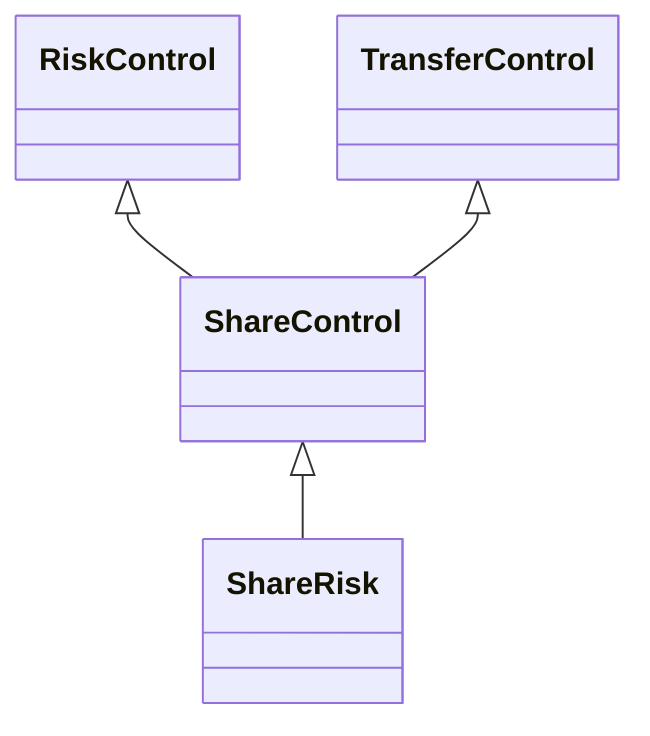

---
search:
  boost: 10.0
---

# Class: ShareControl 


_Control that aims to share or distribute the event (or risk) with_

_another context or entity_


<div data-search-exclude markdown="1">


URI: [risk:ShareControl](https://w3id.org/lmodel/dpv/risk/ShareControl)





## Inheritance
* [RiskControl](RiskControl.md)
    * [TransferControl](TransferControl.md)
        * **ShareControl** [ [RiskControl](RiskControl.md)]
            * [ShareRisk](ShareRisk.md) [ [RiskControl](RiskControl.md)]


## Class Properties

| Property | Value |
| --- | --- |
| Class URI | [risk:ShareControl](https://w3id.org/lmodel/dpv/risk/ShareControl) |


## Slots

| Name | Cardinality and Range | Description | Inheritance |
| ---  | --- | --- | --- |


## In Subsets


* [RiskSubset](RiskSubset.md)


## Aliases


* Share Control


## Comments

* Sharing implies a combined responsibility or sharing of effects from an
event - which can be between entities or processes (or other contexts).
The use of 'event' here broadly refers to any event, which may be a risk
event or could also be specific measures being adopted in response to an
event. For specifically indicating sharing of risk per typical risk
management processes, see risk:ShareRisk


## Identifier and Mapping Information


### Annotations

| property | value |
| --- | --- |
| upstream_iri | https://w3id.org/dpv/risk/owl#ShareControl |
| dpv_extension_slug | risk |


### Schema Source


* from schema: https://w3id.org/lmodel/dpv/risk


## Mappings

| Mapping Type | Mapped Value |
| ---  | ---  |
| self | risk:ShareControl |
| native | risk:ShareControl |
| exact | dpv_risk:ShareControl, dpv_risk_owl:ShareControl |


## LinkML Source

<!-- TODO: investigate https://stackoverflow.com/questions/37606292/how-to-create-tabbed-code-blocks-in-mkdocs-or-sphinx -->

### Direct

<details>
```yaml
name: ShareControl
annotations:
  upstream_iri:
    tag: upstream_iri
    value: https://w3id.org/dpv/risk/owl#ShareControl
  dpv_extension_slug:
    tag: dpv_extension_slug
    value: risk
description: 'Control that aims to share or distribute the event (or risk) with

  another context or entity'
comments:
- 'Sharing implies a combined responsibility or sharing of effects from an

  event - which can be between entities or processes (or other contexts).

  The use of ''event'' here broadly refers to any event, which may be a risk

  event or could also be specific measures being adopted in response to an

  event. For specifically indicating sharing of risk per typical risk

  management processes, see risk:ShareRisk'
in_subset:
- risk_subset
from_schema: https://w3id.org/lmodel/dpv/risk
aliases:
- Share Control
exact_mappings:
- dpv_risk:ShareControl
- dpv_risk_owl:ShareControl
is_a: TransferControl
mixins:
- RiskControl
class_uri: risk:ShareControl

```
</details>

### Induced

<details>
```yaml
name: ShareControl
annotations:
  upstream_iri:
    tag: upstream_iri
    value: https://w3id.org/dpv/risk/owl#ShareControl
  dpv_extension_slug:
    tag: dpv_extension_slug
    value: risk
description: 'Control that aims to share or distribute the event (or risk) with

  another context or entity'
comments:
- 'Sharing implies a combined responsibility or sharing of effects from an

  event - which can be between entities or processes (or other contexts).

  The use of ''event'' here broadly refers to any event, which may be a risk

  event or could also be specific measures being adopted in response to an

  event. For specifically indicating sharing of risk per typical risk

  management processes, see risk:ShareRisk'
in_subset:
- risk_subset
from_schema: https://w3id.org/lmodel/dpv/risk
aliases:
- Share Control
exact_mappings:
- dpv_risk:ShareControl
- dpv_risk_owl:ShareControl
is_a: TransferControl
mixins:
- RiskControl
class_uri: risk:ShareControl

```
</details></div>