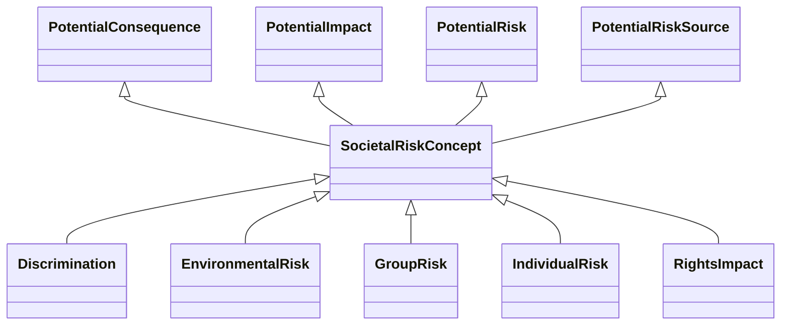

---
search:
  boost: 10.0
---

# Class: SocietalRiskConcept 


_Risk concepts, including any potential risk sources, consequences, or_

_impacts, that are societal in nature or relate to a social setting or_

_process_


<div data-search-exclude markdown="1">


URI: [risk:SocietalRiskConcept](https://w3id.org/lmodel/dpv/risk/SocietalRiskConcept)





## Inheritance
* **SocietalRiskConcept** [ [PotentialConsequence](PotentialConsequence.md) [PotentialImpact](PotentialImpact.md) [PotentialRisk](PotentialRisk.md) [PotentialRiskSource](PotentialRiskSource.md)]
    * [Discrimination](Discrimination.md) [ [PotentialConsequence](PotentialConsequence.md) [PotentialImpact](PotentialImpact.md) [PotentialRisk](PotentialRisk.md)]
    * [EnvironmentalRisk](EnvironmentalRisk.md) [ [PotentialConsequence](PotentialConsequence.md) [PotentialImpact](PotentialImpact.md) [PotentialRisk](PotentialRisk.md)]
    * [GroupRisk](GroupRisk.md) [ [PotentialConsequence](PotentialConsequence.md) [PotentialImpact](PotentialImpact.md) [PotentialRisk](PotentialRisk.md)]
    * [IndividualRisk](IndividualRisk.md) [ [PotentialConsequence](PotentialConsequence.md) [PotentialImpact](PotentialImpact.md) [PotentialRisk](PotentialRisk.md)]
    * [RightsImpact](RightsImpact.md) [ [PotentialConsequence](PotentialConsequence.md) [PotentialImpact](PotentialImpact.md) [PotentialRisk](PotentialRisk.md)]


## Class Properties

| Property | Value |
| --- | --- |
| Class URI | [risk:SocietalRiskConcept](https://w3id.org/lmodel/dpv/risk/SocietalRiskConcept) |


## Slots

| Name | Cardinality and Range | Description | Inheritance |
| ---  | --- | --- | --- |


## In Subsets


* [RiskSubset](RiskSubset.md)


## Aliases


* Societal Risk Concept


## Comments

* Societal in this context includes both individuals and groups in a
social context, as well as wider implications for society - such as
environmental impacts or economic consequences of inflation that can
affect both human and non-human entities as part of the social structure


## Identifier and Mapping Information


### Annotations

| property | value |
| --- | --- |
| upstream_iri | https://w3id.org/dpv/risk/owl#SocietalRiskConcept |
| dpv_extension_slug | risk |


### Schema Source


* from schema: https://w3id.org/lmodel/dpv/risk


## Mappings

| Mapping Type | Mapped Value |
| ---  | ---  |
| self | risk:SocietalRiskConcept |
| native | risk:SocietalRiskConcept |
| exact | dpv_risk:SocietalRiskConcept, dpv_risk_owl:SocietalRiskConcept |


## LinkML Source

<!-- TODO: investigate https://stackoverflow.com/questions/37606292/how-to-create-tabbed-code-blocks-in-mkdocs-or-sphinx -->

### Direct

<details>
```yaml
name: SocietalRiskConcept
annotations:
  upstream_iri:
    tag: upstream_iri
    value: https://w3id.org/dpv/risk/owl#SocietalRiskConcept
  dpv_extension_slug:
    tag: dpv_extension_slug
    value: risk
description: 'Risk concepts, including any potential risk sources, consequences, or

  impacts, that are societal in nature or relate to a social setting or

  process'
comments:
- 'Societal in this context includes both individuals and groups in a

  social context, as well as wider implications for society - such as

  environmental impacts or economic consequences of inflation that can

  affect both human and non-human entities as part of the social structure'
in_subset:
- risk_subset
from_schema: https://w3id.org/lmodel/dpv/risk
aliases:
- Societal Risk Concept
exact_mappings:
- dpv_risk:SocietalRiskConcept
- dpv_risk_owl:SocietalRiskConcept
mixins:
- PotentialConsequence
- PotentialImpact
- PotentialRisk
- PotentialRiskSource
class_uri: risk:SocietalRiskConcept

```
</details>

### Induced

<details>
```yaml
name: SocietalRiskConcept
annotations:
  upstream_iri:
    tag: upstream_iri
    value: https://w3id.org/dpv/risk/owl#SocietalRiskConcept
  dpv_extension_slug:
    tag: dpv_extension_slug
    value: risk
description: 'Risk concepts, including any potential risk sources, consequences, or

  impacts, that are societal in nature or relate to a social setting or

  process'
comments:
- 'Societal in this context includes both individuals and groups in a

  social context, as well as wider implications for society - such as

  environmental impacts or economic consequences of inflation that can

  affect both human and non-human entities as part of the social structure'
in_subset:
- risk_subset
from_schema: https://w3id.org/lmodel/dpv/risk
aliases:
- Societal Risk Concept
exact_mappings:
- dpv_risk:SocietalRiskConcept
- dpv_risk_owl:SocietalRiskConcept
mixins:
- PotentialConsequence
- PotentialImpact
- PotentialRisk
- PotentialRiskSource
class_uri: risk:SocietalRiskConcept

```
</details></div>