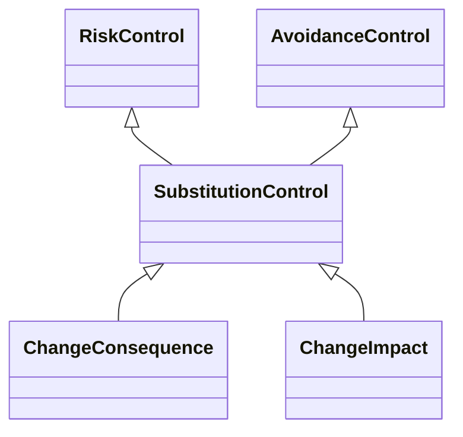

---
search:
  boost: 10.0
---

# Class: SubstitutionControl 


_Control that substitutes an event with another such that the initial_

_event no longer takes place while the substituted event takes place in_

_place of it_


<div data-search-exclude markdown="1">


URI: [risk:SubstitutionControl](https://w3id.org/lmodel/dpv/risk/SubstitutionControl)





## Inheritance
* [RiskControl](RiskControl.md)
    * [ProactiveControl](ProactiveControl.md)
        * [AvoidanceControl](AvoidanceControl.md) [ [RiskControl](RiskControl.md)]
            * **SubstitutionControl** [ [RiskControl](RiskControl.md)]


## Class Properties

| Property | Value |
| --- | --- |
| Class URI | [risk:SubstitutionControl](https://w3id.org/lmodel/dpv/risk/SubstitutionControl) |


## Slots

| Name | Cardinality and Range | Description | Inheritance |
| ---  | --- | --- | --- |


## In Subsets


* [RiskSubset](RiskSubset.md)


## Aliases


* Substitution Control


## Comments

* Substitution implies that the replacement event is less risky or is more
safe than the replaced event, which is distinct from elimination where
no event occurs and thus there is an elimination of risk entirely


## Identifier and Mapping Information


### Annotations

| property | value |
| --- | --- |
| upstream_iri | https://w3id.org/dpv/risk/owl#SubstitutionControl |
| dpv_extension_slug | risk |


### Schema Source


* from schema: https://w3id.org/lmodel/dpv/risk


## Mappings

| Mapping Type | Mapped Value |
| ---  | ---  |
| self | risk:SubstitutionControl |
| native | risk:SubstitutionControl |
| exact | dpv_risk:SubstitutionControl, dpv_risk_owl:SubstitutionControl |


## LinkML Source

<!-- TODO: investigate https://stackoverflow.com/questions/37606292/how-to-create-tabbed-code-blocks-in-mkdocs-or-sphinx -->

### Direct

<details>
```yaml
name: SubstitutionControl
annotations:
  upstream_iri:
    tag: upstream_iri
    value: https://w3id.org/dpv/risk/owl#SubstitutionControl
  dpv_extension_slug:
    tag: dpv_extension_slug
    value: risk
description: 'Control that substitutes an event with another such that the initial

  event no longer takes place while the substituted event takes place in

  place of it'
comments:
- 'Substitution implies that the replacement event is less risky or is more

  safe than the replaced event, which is distinct from elimination where

  no event occurs and thus there is an elimination of risk entirely'
in_subset:
- risk_subset
from_schema: https://w3id.org/lmodel/dpv/risk
aliases:
- Substitution Control
exact_mappings:
- dpv_risk:SubstitutionControl
- dpv_risk_owl:SubstitutionControl
is_a: AvoidanceControl
mixins:
- RiskControl
class_uri: risk:SubstitutionControl

```
</details>

### Induced

<details>
```yaml
name: SubstitutionControl
annotations:
  upstream_iri:
    tag: upstream_iri
    value: https://w3id.org/dpv/risk/owl#SubstitutionControl
  dpv_extension_slug:
    tag: dpv_extension_slug
    value: risk
description: 'Control that substitutes an event with another such that the initial

  event no longer takes place while the substituted event takes place in

  place of it'
comments:
- 'Substitution implies that the replacement event is less risky or is more

  safe than the replaced event, which is distinct from elimination where

  no event occurs and thus there is an elimination of risk entirely'
in_subset:
- risk_subset
from_schema: https://w3id.org/lmodel/dpv/risk
aliases:
- Substitution Control
exact_mappings:
- dpv_risk:SubstitutionControl
- dpv_risk_owl:SubstitutionControl
is_a: AvoidanceControl
mixins:
- RiskControl
class_uri: risk:SubstitutionControl

```
</details></div>