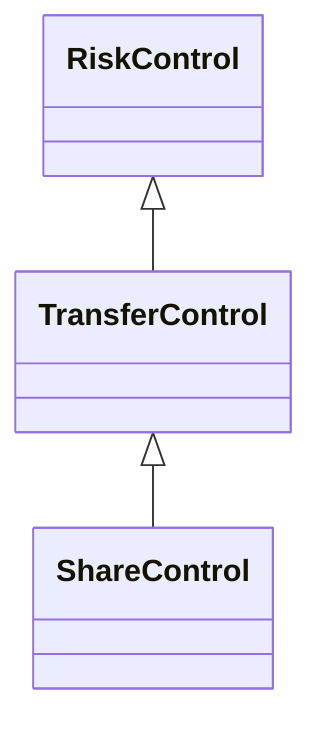

---
search:
  boost: 10.0
---

# Class: TransferControl 


_Control that aims to transfer the event (or risk) to another context or_

_entity_


<div data-search-exclude markdown="1">


URI: [risk:TransferControl](https://w3id.org/lmodel/dpv/risk/TransferControl)





## Inheritance
* [RiskControl](RiskControl.md)
    * **TransferControl**
        * [ShareControl](ShareControl.md) [ [RiskControl](RiskControl.md)]


## Class Properties

| Property | Value |
| --- | --- |
| Class URI | [risk:TransferControl](https://w3id.org/lmodel/dpv/risk/TransferControl) |


## Slots

| Name | Cardinality and Range | Description | Inheritance |
| ---  | --- | --- | --- |


## In Subsets


* [RiskSubset](RiskSubset.md)


## Aliases


* Transfer Control


## Comments

* Transfer implies moving (physically or logically) the event to another
context or entity. While Risk Management methods indicate risk transfer
as occurring between entities, this concept is defined more broadly by
including 'context or entity' so as to enable modelling cases where the
transfer takes place between processes - which may be managed by the
same or different entity. Additionally, typical use of 'Transfer'
implies a formal mechanism such as an agreement, which is absent from
this concept. If only partial responsibility is transferred, such as for
a specific measure, then this can be considered as an instance of
sharing the risk - for which risk:ShareControl is provided


## Identifier and Mapping Information


### Annotations

| property | value |
| --- | --- |
| upstream_iri | https://w3id.org/dpv/risk/owl#TransferControl |
| dpv_extension_slug | risk |


### Schema Source


* from schema: https://w3id.org/lmodel/dpv/risk


## Mappings

| Mapping Type | Mapped Value |
| ---  | ---  |
| self | risk:TransferControl |
| native | risk:TransferControl |
| exact | dpv_risk:TransferControl, dpv_risk_owl:TransferControl |


## LinkML Source

<!-- TODO: investigate https://stackoverflow.com/questions/37606292/how-to-create-tabbed-code-blocks-in-mkdocs-or-sphinx -->

### Direct

<details>
```yaml
name: TransferControl
annotations:
  upstream_iri:
    tag: upstream_iri
    value: https://w3id.org/dpv/risk/owl#TransferControl
  dpv_extension_slug:
    tag: dpv_extension_slug
    value: risk
description: 'Control that aims to transfer the event (or risk) to another context
  or

  entity'
comments:
- 'Transfer implies moving (physically or logically) the event to another

  context or entity. While Risk Management methods indicate risk transfer

  as occurring between entities, this concept is defined more broadly by

  including ''context or entity'' so as to enable modelling cases where the

  transfer takes place between processes - which may be managed by the

  same or different entity. Additionally, typical use of ''Transfer''

  implies a formal mechanism such as an agreement, which is absent from

  this concept. If only partial responsibility is transferred, such as for

  a specific measure, then this can be considered as an instance of

  sharing the risk - for which risk:ShareControl is provided'
in_subset:
- risk_subset
from_schema: https://w3id.org/lmodel/dpv/risk
aliases:
- Transfer Control
exact_mappings:
- dpv_risk:TransferControl
- dpv_risk_owl:TransferControl
is_a: RiskControl
class_uri: risk:TransferControl

```
</details>

### Induced

<details>
```yaml
name: TransferControl
annotations:
  upstream_iri:
    tag: upstream_iri
    value: https://w3id.org/dpv/risk/owl#TransferControl
  dpv_extension_slug:
    tag: dpv_extension_slug
    value: risk
description: 'Control that aims to transfer the event (or risk) to another context
  or

  entity'
comments:
- 'Transfer implies moving (physically or logically) the event to another

  context or entity. While Risk Management methods indicate risk transfer

  as occurring between entities, this concept is defined more broadly by

  including ''context or entity'' so as to enable modelling cases where the

  transfer takes place between processes - which may be managed by the

  same or different entity. Additionally, typical use of ''Transfer''

  implies a formal mechanism such as an agreement, which is absent from

  this concept. If only partial responsibility is transferred, such as for

  a specific measure, then this can be considered as an instance of

  sharing the risk - for which risk:ShareControl is provided'
in_subset:
- risk_subset
from_schema: https://w3id.org/lmodel/dpv/risk
aliases:
- Transfer Control
exact_mappings:
- dpv_risk:TransferControl
- dpv_risk_owl:TransferControl
is_a: RiskControl
class_uri: risk:TransferControl

```
</details></div>