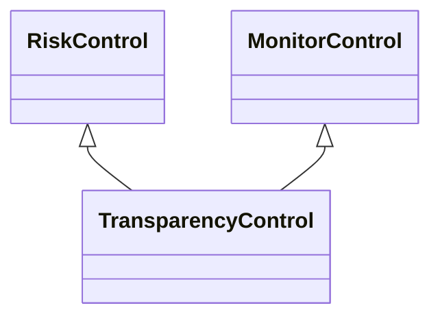

---
search:
  boost: 10.0
---

# Class: TransparencyControl 


_Control that provides information about an event_


<div data-search-exclude markdown="1">


URI: [risk:TransparencyControl](https://w3id.org/lmodel/dpv/risk/TransparencyControl)





## Inheritance
* [RiskControl](RiskControl.md)
    * [ProactiveControl](ProactiveControl.md)
        * [MonitorControl](MonitorControl.md) [ [RiskControl](RiskControl.md)]
            * **TransparencyControl** [ [RiskControl](RiskControl.md)]


## Class Properties

| Property | Value |
| --- | --- |
| Class URI | [risk:TransparencyControl](https://w3id.org/lmodel/dpv/risk/TransparencyControl) |


## Slots

| Name | Cardinality and Range | Description | Inheritance |
| ---  | --- | --- | --- |


## In Subsets


* [RiskSubset](RiskSubset.md)


## Aliases


* Transparency Control


## Comments

* Transparency refers to the availability of information, whether for the
same or different entity in relation to who establishes and operates the
control, and where transparency implies having the means to obtain and
use information about an event


## Identifier and Mapping Information


### Annotations

| property | value |
| --- | --- |
| upstream_iri | https://w3id.org/dpv/risk/owl#TransparencyControl |
| dpv_extension_slug | risk |


### Schema Source


* from schema: https://w3id.org/lmodel/dpv/risk


## Mappings

| Mapping Type | Mapped Value |
| ---  | ---  |
| self | risk:TransparencyControl |
| native | risk:TransparencyControl |
| exact | dpv_risk:TransparencyControl, dpv_risk_owl:TransparencyControl |


## LinkML Source

<!-- TODO: investigate https://stackoverflow.com/questions/37606292/how-to-create-tabbed-code-blocks-in-mkdocs-or-sphinx -->

### Direct

<details>
```yaml
name: TransparencyControl
annotations:
  upstream_iri:
    tag: upstream_iri
    value: https://w3id.org/dpv/risk/owl#TransparencyControl
  dpv_extension_slug:
    tag: dpv_extension_slug
    value: risk
description: Control that provides information about an event
comments:
- 'Transparency refers to the availability of information, whether for the

  same or different entity in relation to who establishes and operates the

  control, and where transparency implies having the means to obtain and

  use information about an event'
in_subset:
- risk_subset
from_schema: https://w3id.org/lmodel/dpv/risk
aliases:
- Transparency Control
exact_mappings:
- dpv_risk:TransparencyControl
- dpv_risk_owl:TransparencyControl
is_a: MonitorControl
mixins:
- RiskControl
class_uri: risk:TransparencyControl

```
</details>

### Induced

<details>
```yaml
name: TransparencyControl
annotations:
  upstream_iri:
    tag: upstream_iri
    value: https://w3id.org/dpv/risk/owl#TransparencyControl
  dpv_extension_slug:
    tag: dpv_extension_slug
    value: risk
description: Control that provides information about an event
comments:
- 'Transparency refers to the availability of information, whether for the

  same or different entity in relation to who establishes and operates the

  control, and where transparency implies having the means to obtain and

  use information about an event'
in_subset:
- risk_subset
from_schema: https://w3id.org/lmodel/dpv/risk
aliases:
- Transparency Control
exact_mappings:
- dpv_risk:TransparencyControl
- dpv_risk_owl:TransparencyControl
is_a: MonitorControl
mixins:
- RiskControl
class_uri: risk:TransparencyControl

```
</details></div>