---
search:
  boost: 10.0
---

# Class: UnauthorisedActivity 


_Concept representing Unauthorised Activity_


<div data-search-exclude markdown="1">


URI: [risk:UnauthorisedActivity](https://w3id.org/lmodel/dpv/risk/UnauthorisedActivity)

```mermaid
 classDiagram
    class UnauthorisedActivity
    click UnauthorisedActivity href "../UnauthorisedActivity/"
      AvailabilityConcept <|-- UnauthorisedActivity
        click AvailabilityConcept href "../AvailabilityConcept/"
      ConfidentialityConcept <|-- UnauthorisedActivity
        click ConfidentialityConcept href "../ConfidentialityConcept/"
      IntegrityConcept <|-- UnauthorisedActivity
        click IntegrityConcept href "../IntegrityConcept/"
      PotentialConsequence <|-- UnauthorisedActivity
        click PotentialConsequence href "../PotentialConsequence/"
      PotentialRisk <|-- UnauthorisedActivity
        click PotentialRisk href "../PotentialRisk/"
      PotentialRiskSource <|-- UnauthorisedActivity
        click PotentialRiskSource href "../PotentialRiskSource/"
      ExternalSecurityThreat <|-- UnauthorisedActivity
        click ExternalSecurityThreat href "../ExternalSecurityThreat/"
      

      UnauthorisedActivity <|-- UnauthorisedAccessToPremises
        click UnauthorisedAccessToPremises href "../UnauthorisedAccessToPremises/"
      UnauthorisedActivity <|-- UnauthorisedCodeAccess
        click UnauthorisedCodeAccess href "../UnauthorisedCodeAccess/"
      UnauthorisedActivity <|-- UnauthorisedCodeDisclosure
        click UnauthorisedCodeDisclosure href "../UnauthorisedCodeDisclosure/"
      UnauthorisedActivity <|-- UnauthorisedCodeModification
        click UnauthorisedCodeModification href "../UnauthorisedCodeModification/"
      UnauthorisedActivity <|-- UnauthorisedDataAccess
        click UnauthorisedDataAccess href "../UnauthorisedDataAccess/"
      UnauthorisedActivity <|-- UnauthorisedDataDisclosure
        click UnauthorisedDataDisclosure href "../UnauthorisedDataDisclosure/"
      UnauthorisedActivity <|-- UnauthorisedDataModification
        click UnauthorisedDataModification href "../UnauthorisedDataModification/"
      UnauthorisedActivity <|-- UnauthorisedInformationDisclosure
        click UnauthorisedInformationDisclosure href "../UnauthorisedInformationDisclosure/"
      UnauthorisedActivity <|-- UnauthorisedReidentification
        click UnauthorisedReidentification href "../UnauthorisedReidentification/"
      UnauthorisedActivity <|-- UnauthorisedResourceUse
        click UnauthorisedResourceUse href "../UnauthorisedResourceUse/"
      UnauthorisedActivity <|-- UnauthorisedSystemAccess
        click UnauthorisedSystemAccess href "../UnauthorisedSystemAccess/"
      UnauthorisedActivity <|-- UnauthorisedSystemModification
        click UnauthorisedSystemModification href "../UnauthorisedSystemModification/"
      UnauthorisedActivity <|-- UnwantedCodeDeletion
        click UnwantedCodeDeletion href "../UnwantedCodeDeletion/"
      UnauthorisedActivity <|-- UnwantedDataDeletion
        click UnwantedDataDeletion href "../UnwantedDataDeletion/"
      UnauthorisedActivity <|-- UnwantedDisclosureData
        click UnwantedDisclosureData href "../UnwantedDisclosureData/"
      

      
```





## Inheritance
* [TechnicalRiskConcept](TechnicalRiskConcept.md) [ [PotentialConsequence](PotentialConsequence.md) [PotentialImpact](PotentialImpact.md) [PotentialRisk](PotentialRisk.md) [PotentialRiskSource](PotentialRiskSource.md)]
    * [ExternalSecurityThreat](ExternalSecurityThreat.md) [ [PotentialConsequence](PotentialConsequence.md) [PotentialRisk](PotentialRisk.md) [PotentialRiskSource](PotentialRiskSource.md)]
        * **UnauthorisedActivity** [ [AvailabilityConcept](AvailabilityConcept.md) [ConfidentialityConcept](ConfidentialityConcept.md) [IntegrityConcept](IntegrityConcept.md) [PotentialConsequence](PotentialConsequence.md) [PotentialRisk](PotentialRisk.md) [PotentialRiskSource](PotentialRiskSource.md)]
            * [UnauthorisedAccessToPremises](UnauthorisedAccessToPremises.md) [ [AvailabilityConcept](AvailabilityConcept.md) [ConfidentialityConcept](ConfidentialityConcept.md) [IntegrityConcept](IntegrityConcept.md) [PotentialConsequence](PotentialConsequence.md) [PotentialRisk](PotentialRisk.md) [PotentialRiskSource](PotentialRiskSource.md)]
            * [UnauthorisedCodeAccess](UnauthorisedCodeAccess.md) [ [ConfidentialityConcept](ConfidentialityConcept.md) [IntegrityConcept](IntegrityConcept.md) [PotentialConsequence](PotentialConsequence.md) [PotentialRisk](PotentialRisk.md) [PotentialRiskSource](PotentialRiskSource.md)]
            * [UnauthorisedCodeDisclosure](UnauthorisedCodeDisclosure.md) [ [ConfidentialityConcept](ConfidentialityConcept.md) [PotentialConsequence](PotentialConsequence.md) [PotentialRisk](PotentialRisk.md) [PotentialRiskSource](PotentialRiskSource.md)]
            * [UnauthorisedCodeModification](UnauthorisedCodeModification.md) [ [IntegrityConcept](IntegrityConcept.md) [PotentialConsequence](PotentialConsequence.md) [PotentialRisk](PotentialRisk.md) [PotentialRiskSource](PotentialRiskSource.md)]
            * [UnauthorisedDataAccess](UnauthorisedDataAccess.md) [ [ConfidentialityConcept](ConfidentialityConcept.md) [PotentialConsequence](PotentialConsequence.md) [PotentialRisk](PotentialRisk.md) [PotentialRiskSource](PotentialRiskSource.md)]
            * [UnauthorisedDataDisclosure](UnauthorisedDataDisclosure.md) [ [ConfidentialityConcept](ConfidentialityConcept.md) [PotentialConsequence](PotentialConsequence.md) [PotentialRisk](PotentialRisk.md) [PotentialRiskSource](PotentialRiskSource.md)]
            * [UnauthorisedDataModification](UnauthorisedDataModification.md) [ [IntegrityConcept](IntegrityConcept.md) [PotentialConsequence](PotentialConsequence.md) [PotentialRisk](PotentialRisk.md) [PotentialRiskSource](PotentialRiskSource.md)]
            * [UnauthorisedInformationDisclosure](UnauthorisedInformationDisclosure.md) [ [ConfidentialityConcept](ConfidentialityConcept.md) [PotentialConsequence](PotentialConsequence.md) [PotentialRisk](PotentialRisk.md) [PotentialRiskSource](PotentialRiskSource.md)]
            * [UnauthorisedReidentification](UnauthorisedReidentification.md) [ [ConfidentialityConcept](ConfidentialityConcept.md) [PotentialConsequence](PotentialConsequence.md) [PotentialRisk](PotentialRisk.md) [PotentialRiskSource](PotentialRiskSource.md)]
            * [UnauthorisedResourceUse](UnauthorisedResourceUse.md) [ [AvailabilityConcept](AvailabilityConcept.md) [PotentialConsequence](PotentialConsequence.md) [PotentialRisk](PotentialRisk.md) [PotentialRiskSource](PotentialRiskSource.md)]
            * [UnauthorisedSystemAccess](UnauthorisedSystemAccess.md) [ [ConfidentialityConcept](ConfidentialityConcept.md) [IntegrityConcept](IntegrityConcept.md) [PotentialConsequence](PotentialConsequence.md) [PotentialRisk](PotentialRisk.md) [PotentialRiskSource](PotentialRiskSource.md)]
            * [UnauthorisedSystemModification](UnauthorisedSystemModification.md) [ [IntegrityConcept](IntegrityConcept.md) [PotentialConsequence](PotentialConsequence.md) [PotentialRisk](PotentialRisk.md) [PotentialRiskSource](PotentialRiskSource.md)]
            * [UnwantedCodeDeletion](UnwantedCodeDeletion.md) [ [AvailabilityConcept](AvailabilityConcept.md) [IntegrityConcept](IntegrityConcept.md) [PotentialConsequence](PotentialConsequence.md) [PotentialRisk](PotentialRisk.md) [PotentialRiskSource](PotentialRiskSource.md)]
            * [UnwantedDataDeletion](UnwantedDataDeletion.md) [ [AvailabilityConcept](AvailabilityConcept.md) [IntegrityConcept](IntegrityConcept.md) [PotentialConsequence](PotentialConsequence.md) [PotentialRisk](PotentialRisk.md) [PotentialRiskSource](PotentialRiskSource.md)]
            * [UnwantedDisclosureData](UnwantedDisclosureData.md) [ [ConfidentialityConcept](ConfidentialityConcept.md) [PotentialConsequence](PotentialConsequence.md) [PotentialRisk](PotentialRisk.md) [PotentialRiskSource](PotentialRiskSource.md)]


## Class Properties

| Property | Value |
| --- | --- |
| Class URI | [risk:UnauthorisedActivity](https://w3id.org/lmodel/dpv/risk/UnauthorisedActivity) |


## Slots

| Name | Cardinality and Range | Description | Inheritance |
| ---  | --- | --- | --- |


## In Subsets


* [RiskSubset](RiskSubset.md)


## Aliases


* Unauthorised Activity


## Identifier and Mapping Information


### Annotations

| property | value |
| --- | --- |
| upstream_iri | https://w3id.org/dpv/risk/owl#UnauthorisedActivity |
| dpv_extension_slug | risk |


### Schema Source


* from schema: https://w3id.org/lmodel/dpv/risk


## Mappings

| Mapping Type | Mapped Value |
| ---  | ---  |
| self | risk:UnauthorisedActivity |
| native | risk:UnauthorisedActivity |
| exact | dpv_risk:UnauthorisedActivity, dpv_risk_owl:UnauthorisedActivity |


## LinkML Source

<!-- TODO: investigate https://stackoverflow.com/questions/37606292/how-to-create-tabbed-code-blocks-in-mkdocs-or-sphinx -->

### Direct

<details>
```yaml
name: UnauthorisedActivity
annotations:
  upstream_iri:
    tag: upstream_iri
    value: https://w3id.org/dpv/risk/owl#UnauthorisedActivity
  dpv_extension_slug:
    tag: dpv_extension_slug
    value: risk
description: Concept representing Unauthorised Activity
in_subset:
- risk_subset
from_schema: https://w3id.org/lmodel/dpv/risk
aliases:
- Unauthorised Activity
exact_mappings:
- dpv_risk:UnauthorisedActivity
- dpv_risk_owl:UnauthorisedActivity
is_a: ExternalSecurityThreat
mixins:
- AvailabilityConcept
- ConfidentialityConcept
- IntegrityConcept
- PotentialConsequence
- PotentialRisk
- PotentialRiskSource
class_uri: risk:UnauthorisedActivity

```
</details>

### Induced

<details>
```yaml
name: UnauthorisedActivity
annotations:
  upstream_iri:
    tag: upstream_iri
    value: https://w3id.org/dpv/risk/owl#UnauthorisedActivity
  dpv_extension_slug:
    tag: dpv_extension_slug
    value: risk
description: Concept representing Unauthorised Activity
in_subset:
- risk_subset
from_schema: https://w3id.org/lmodel/dpv/risk
aliases:
- Unauthorised Activity
exact_mappings:
- dpv_risk:UnauthorisedActivity
- dpv_risk_owl:UnauthorisedActivity
is_a: ExternalSecurityThreat
mixins:
- AvailabilityConcept
- ConfidentialityConcept
- IntegrityConcept
- PotentialConsequence
- PotentialRisk
- PotentialRiskSource
class_uri: risk:UnauthorisedActivity

```
</details></div>