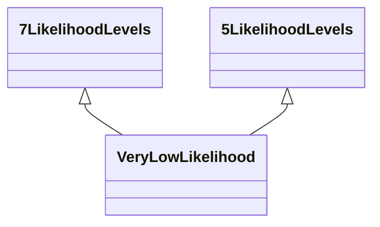

---
search:
  boost: 10.0
---

# Class: VeryLowLikelihood 


_Level where Likelihood is Very Low_


<div data-search-exclude markdown="1">


URI: [risk:VeryLowLikelihood](https://w3id.org/lmodel/dpv/risk/VeryLowLikelihood)





## Inheritance
* [5LikelihoodLevels](5LikelihoodLevels.md)
    * **VeryLowLikelihood** [ [7LikelihoodLevels](7LikelihoodLevels.md)]


## Class Properties

| Property | Value |
| --- | --- |
| Class URI | [risk:VeryLowLikelihood](https://w3id.org/lmodel/dpv/risk/VeryLowLikelihood) |


## Slots

| Name | Cardinality and Range | Description | Inheritance |
| ---  | --- | --- | --- |


## In Subsets


* [RiskSubset](RiskSubset.md)


## Aliases


* Very Low Likelihood


## Comments

* The suggested quantitative value for this concept is 0.1 on a scale of 0
to 1


## Identifier and Mapping Information


### Annotations

| property | value |
| --- | --- |
| upstream_iri | https://w3id.org/dpv/risk/owl#VeryLowLikelihood |
| dpv_extension_slug | risk |


### Schema Source


* from schema: https://w3id.org/lmodel/dpv/risk


## Mappings

| Mapping Type | Mapped Value |
| ---  | ---  |
| self | risk:VeryLowLikelihood |
| native | risk:VeryLowLikelihood |
| exact | dpv_risk:VeryLowLikelihood, dpv_risk_owl:VeryLowLikelihood |


## LinkML Source

<!-- TODO: investigate https://stackoverflow.com/questions/37606292/how-to-create-tabbed-code-blocks-in-mkdocs-or-sphinx -->

### Direct

<details>
```yaml
name: VeryLowLikelihood
annotations:
  upstream_iri:
    tag: upstream_iri
    value: https://w3id.org/dpv/risk/owl#VeryLowLikelihood
  dpv_extension_slug:
    tag: dpv_extension_slug
    value: risk
description: Level where Likelihood is Very Low
comments:
- 'The suggested quantitative value for this concept is 0.1 on a scale of 0

  to 1'
in_subset:
- risk_subset
from_schema: https://w3id.org/lmodel/dpv/risk
aliases:
- Very Low Likelihood
exact_mappings:
- dpv_risk:VeryLowLikelihood
- dpv_risk_owl:VeryLowLikelihood
is_a: 5LikelihoodLevels
mixins:
- 7LikelihoodLevels
class_uri: risk:VeryLowLikelihood

```
</details>

### Induced

<details>
```yaml
name: VeryLowLikelihood
annotations:
  upstream_iri:
    tag: upstream_iri
    value: https://w3id.org/dpv/risk/owl#VeryLowLikelihood
  dpv_extension_slug:
    tag: dpv_extension_slug
    value: risk
description: Level where Likelihood is Very Low
comments:
- 'The suggested quantitative value for this concept is 0.1 on a scale of 0

  to 1'
in_subset:
- risk_subset
from_schema: https://w3id.org/lmodel/dpv/risk
aliases:
- Very Low Likelihood
exact_mappings:
- dpv_risk:VeryLowLikelihood
- dpv_risk_owl:VeryLowLikelihood
is_a: 5LikelihoodLevels
mixins:
- 7LikelihoodLevels
class_uri: risk:VeryLowLikelihood

```
</details></div>