---
search:
  boost: 10.0
---

# Class: Actor 


_Actors and Entities involved in provision, use, and management of_

_Technology_


<div data-search-exclude markdown="1">


URI: [tech:Actor](https://w3id.org/lmodel/dpv/tech/Actor)

```mermaid
 classDiagram
    class Actor
    click Actor href "../Actor/"
      Actor <|-- Deployer
        click Deployer href "../Deployer/"
      Actor <|-- Designer
        click Designer href "../Designer/"
      Actor <|-- Developer
        click Developer href "../Developer/"
      Actor <|-- Distributor
        click Distributor href "../Distributor/"
      Actor <|-- DpvAuditor
        click DpvAuditor href "../DpvAuditor/"
      Actor <|-- DpvCustomer
        click DpvCustomer href "../DpvCustomer/"
      Actor <|-- DpvOperator
        click DpvOperator href "../DpvOperator/"
      Actor <|-- DpvProducer
        click DpvProducer href "../DpvProducer/"
      Actor <|-- DpvProvider
        click DpvProvider href "../DpvProvider/"
      Actor <|-- DpvSubject
        click DpvSubject href "../DpvSubject/"
      Actor <|-- DpvUser
        click DpvUser href "../DpvUser/"
      Actor <|-- Evaluator
        click Evaluator href "../Evaluator/"
      Actor <|-- Importer
        click Importer href "../Importer/"
      Actor <|-- Installer
        click Installer href "../Installer/"
      Actor <|-- Maintainer
        click Maintainer href "../Maintainer/"
      Actor <|-- Manufacturer
        click Manufacturer href "../Manufacturer/"
      Actor <|-- Owner
        click Owner href "../Owner/"
      Actor <|-- Partner
        click Partner href "../Partner/"
      Actor <|-- Purchaser
        click Purchaser href "../Purchaser/"
      Actor <|-- Supplier
        click Supplier href "../Supplier/"
      Actor <|-- SystemIntegrator
        click SystemIntegrator href "../SystemIntegrator/"
      
      
```





## Inheritance
* **Actor**
    * [Deployer](Deployer.md)
    * [Designer](Designer.md)
    * [Distributor](Distributor.md)
    * [DpvCustomer](DpvCustomer.md)
    * [DpvOperator](DpvOperator.md)
    * [DpvProducer](DpvProducer.md)
    * [DpvProvider](DpvProvider.md)
    * [DpvSubject](DpvSubject.md)
    * [Importer](Importer.md)
    * [Installer](Installer.md)
    * [Maintainer](Maintainer.md)
    * [Manufacturer](Manufacturer.md)
    * [Owner](Owner.md)
    * [Partner](Partner.md)
    * [Purchaser](Purchaser.md)
    * [Supplier](Supplier.md)


## Class Properties

| Property | Value |
| --- | --- |
| Class URI | [tech:Actor](https://w3id.org/lmodel/dpv/tech/Actor) |


## Slots

| Name | Cardinality and Range | Description | Inheritance |
| ---  | --- | --- | --- |


## In Subsets


* [TechSubset](TechSubset.md)


## Aliases


* Actor


## Identifier and Mapping Information


### Annotations

| property | value |
| --- | --- |
| upstream_iri | https://w3id.org/dpv/tech/owl#Actor |
| dpv_extension_slug | tech |


### Schema Source


* from schema: https://w3id.org/lmodel/dpv/tech


## Mappings

| Mapping Type | Mapped Value |
| ---  | ---  |
| self | tech:Actor |
| native | tech:Actor |
| exact | dpv_tech:Actor, dpv_tech_owl:Actor |


## LinkML Source

<!-- TODO: investigate https://stackoverflow.com/questions/37606292/how-to-create-tabbed-code-blocks-in-mkdocs-or-sphinx -->

### Direct

<details>
```yaml
name: Actor
annotations:
  upstream_iri:
    tag: upstream_iri
    value: https://w3id.org/dpv/tech/owl#Actor
  dpv_extension_slug:
    tag: dpv_extension_slug
    value: tech
description: 'Actors and Entities involved in provision, use, and management of

  Technology'
in_subset:
- tech_subset
from_schema: https://w3id.org/lmodel/dpv/tech
aliases:
- Actor
exact_mappings:
- dpv_tech:Actor
- dpv_tech_owl:Actor
class_uri: tech:Actor

```
</details>

### Induced

<details>
```yaml
name: Actor
annotations:
  upstream_iri:
    tag: upstream_iri
    value: https://w3id.org/dpv/tech/owl#Actor
  dpv_extension_slug:
    tag: dpv_extension_slug
    value: tech
description: 'Actors and Entities involved in provision, use, and management of

  Technology'
in_subset:
- tech_subset
from_schema: https://w3id.org/lmodel/dpv/tech
aliases:
- Actor
exact_mappings:
- dpv_tech:Actor
- dpv_tech_owl:Actor
class_uri: tech:Actor

```
</details></div>