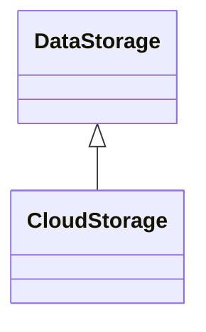

---
search:
  boost: 10.0
---

# Class: CloudStorage 


_Storage utilising cloud technologies_


<div data-search-exclude markdown="1">


URI: [tech:CloudStorage](https://w3id.org/lmodel/dpv/tech/CloudStorage)





## Inheritance
* **CloudStorage** [ [DataStorage](DataStorage.md)]


## Class Properties

| Property | Value |
| --- | --- |
| Class URI | [tech:CloudStorage](https://w3id.org/lmodel/dpv/tech/CloudStorage) |


## Slots

| Name | Cardinality and Range | Description | Inheritance |
| ---  | --- | --- | --- |


## In Subsets


* [TechSubset](TechSubset.md)


## Aliases


* Cloud Storage


## Identifier and Mapping Information


### Annotations

| property | value |
| --- | --- |
| upstream_iri | https://w3id.org/dpv/tech/owl#CloudStorage |
| dpv_extension_slug | tech |


### Schema Source


* from schema: https://w3id.org/lmodel/dpv/tech


## Mappings

| Mapping Type | Mapped Value |
| ---  | ---  |
| self | tech:CloudStorage |
| native | tech:CloudStorage |
| exact | dpv_tech:CloudStorage, dpv_tech_owl:CloudStorage |


## LinkML Source

<!-- TODO: investigate https://stackoverflow.com/questions/37606292/how-to-create-tabbed-code-blocks-in-mkdocs-or-sphinx -->

### Direct

<details>
```yaml
name: CloudStorage
annotations:
  upstream_iri:
    tag: upstream_iri
    value: https://w3id.org/dpv/tech/owl#CloudStorage
  dpv_extension_slug:
    tag: dpv_extension_slug
    value: tech
description: Storage utilising cloud technologies
in_subset:
- tech_subset
from_schema: https://w3id.org/lmodel/dpv/tech
aliases:
- Cloud Storage
exact_mappings:
- dpv_tech:CloudStorage
- dpv_tech_owl:CloudStorage
mixins:
- DataStorage
class_uri: tech:CloudStorage

```
</details>

### Induced

<details>
```yaml
name: CloudStorage
annotations:
  upstream_iri:
    tag: upstream_iri
    value: https://w3id.org/dpv/tech/owl#CloudStorage
  dpv_extension_slug:
    tag: dpv_extension_slug
    value: tech
description: Storage utilising cloud technologies
in_subset:
- tech_subset
from_schema: https://w3id.org/lmodel/dpv/tech
aliases:
- Cloud Storage
exact_mappings:
- dpv_tech:CloudStorage
- dpv_tech_owl:CloudStorage
mixins:
- DataStorage
class_uri: tech:CloudStorage

```
</details></div>