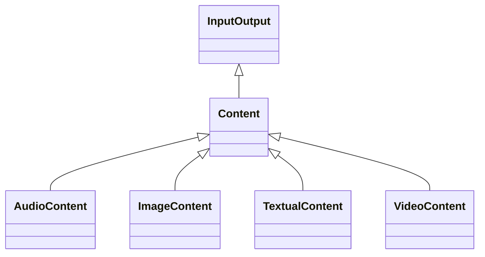

---
search:
  boost: 10.0
---

# Class: Content 


_Data or information in a particular form and structure_


<div data-search-exclude markdown="1">


URI: [tech:Content](https://w3id.org/lmodel/dpv/tech/Content)





## Inheritance
* **Content** [ [InputOutput](InputOutput.md)]
    * [AudioContent](AudioContent.md)
    * [ImageContent](ImageContent.md)
    * [TextualContent](TextualContent.md)
    * [VideoContent](VideoContent.md)


## Class Properties

| Property | Value |
| --- | --- |
| Class URI | [tech:Content](https://w3id.org/lmodel/dpv/tech/Content) |


## Slots

| Name | Cardinality and Range | Description | Inheritance |
| ---  | --- | --- | --- |


## In Subsets


* [TechSubset](TechSubset.md)


## Aliases


* Content


## Comments

* Content is a concept referring to information used in the context of
technologies producing or using them as inputs or outputs


## Identifier and Mapping Information


### Annotations

| property | value |
| --- | --- |
| upstream_iri | https://w3id.org/dpv/tech/owl#Content |
| dpv_extension_slug | tech |


### Schema Source


* from schema: https://w3id.org/lmodel/dpv/tech


## Mappings

| Mapping Type | Mapped Value |
| ---  | ---  |
| self | tech:Content |
| native | tech:Content |
| exact | dpv_tech:Content, dpv_tech_owl:Content |


## LinkML Source

<!-- TODO: investigate https://stackoverflow.com/questions/37606292/how-to-create-tabbed-code-blocks-in-mkdocs-or-sphinx -->

### Direct

<details>
```yaml
name: Content
annotations:
  upstream_iri:
    tag: upstream_iri
    value: https://w3id.org/dpv/tech/owl#Content
  dpv_extension_slug:
    tag: dpv_extension_slug
    value: tech
description: Data or information in a particular form and structure
comments:
- 'Content is a concept referring to information used in the context of

  technologies producing or using them as inputs or outputs'
in_subset:
- tech_subset
from_schema: https://w3id.org/lmodel/dpv/tech
aliases:
- Content
exact_mappings:
- dpv_tech:Content
- dpv_tech_owl:Content
mixins:
- InputOutput
class_uri: tech:Content

```
</details>

### Induced

<details>
```yaml
name: Content
annotations:
  upstream_iri:
    tag: upstream_iri
    value: https://w3id.org/dpv/tech/owl#Content
  dpv_extension_slug:
    tag: dpv_extension_slug
    value: tech
description: Data or information in a particular form and structure
comments:
- 'Content is a concept referring to information used in the context of

  technologies producing or using them as inputs or outputs'
in_subset:
- tech_subset
from_schema: https://w3id.org/lmodel/dpv/tech
aliases:
- Content
exact_mappings:
- dpv_tech:Content
- dpv_tech_owl:Content
mixins:
- InputOutput
class_uri: tech:Content

```
</details></div>