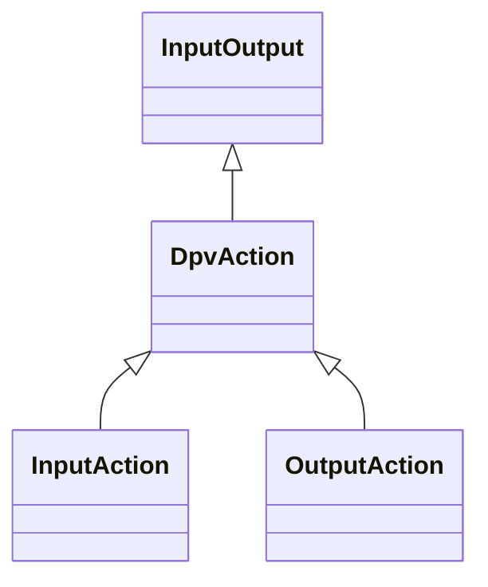

---
search:
  boost: 10.0
---

# Class: DpvAction 


_A process or activity, which could be physical or virtual_


<div data-search-exclude markdown="1">


URI: [tech:Action](https://w3id.org/lmodel/dpv/tech/Action)





## Inheritance
* [InputOutput](InputOutput.md)
    * **DpvAction**
        * [InputAction](InputAction.md) [ [Input](Input.md)]
        * [OutputAction](OutputAction.md) [ [Output](Output.md)]


## Class Properties

| Property | Value |
| --- | --- |
| Class URI | [tech:Action](https://w3id.org/lmodel/dpv/tech/Action) |


## Slots

| Name | Cardinality and Range | Description | Inheritance |
| ---  | --- | --- | --- |


## In Subsets


* [TechSubset](TechSubset.md)


## Aliases


* Action


## Comments

* Action is a concept referring to activities or tasks in the context of
technologies producing or using them as inputs or outputs


## Identifier and Mapping Information


### Annotations

| property | value |
| --- | --- |
| upstream_iri | https://w3id.org/dpv/tech/owl#Action |
| dpv_extension_slug | tech |


### Schema Source


* from schema: https://w3id.org/lmodel/dpv/tech


## Mappings

| Mapping Type | Mapped Value |
| ---  | ---  |
| self | tech:Action |
| native | tech:DpvAction |
| exact | dpv_tech:Action, dpv_tech_owl:Action |


## LinkML Source

<!-- TODO: investigate https://stackoverflow.com/questions/37606292/how-to-create-tabbed-code-blocks-in-mkdocs-or-sphinx -->

### Direct

<details>
```yaml
name: DpvAction
annotations:
  upstream_iri:
    tag: upstream_iri
    value: https://w3id.org/dpv/tech/owl#Action
  dpv_extension_slug:
    tag: dpv_extension_slug
    value: tech
description: A process or activity, which could be physical or virtual
comments:
- 'Action is a concept referring to activities or tasks in the context of

  technologies producing or using them as inputs or outputs'
in_subset:
- tech_subset
from_schema: https://w3id.org/lmodel/dpv/tech
aliases:
- Action
exact_mappings:
- dpv_tech:Action
- dpv_tech_owl:Action
is_a: InputOutput
class_uri: tech:Action

```
</details>

### Induced

<details>
```yaml
name: DpvAction
annotations:
  upstream_iri:
    tag: upstream_iri
    value: https://w3id.org/dpv/tech/owl#Action
  dpv_extension_slug:
    tag: dpv_extension_slug
    value: tech
description: A process or activity, which could be physical or virtual
comments:
- 'Action is a concept referring to activities or tasks in the context of

  technologies producing or using them as inputs or outputs'
in_subset:
- tech_subset
from_schema: https://w3id.org/lmodel/dpv/tech
aliases:
- Action
exact_mappings:
- dpv_tech:Action
- dpv_tech_owl:Action
is_a: InputOutput
class_uri: tech:Action

```
</details></div>