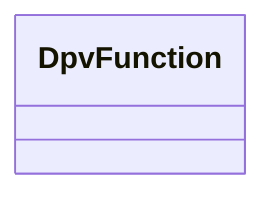

---
search:
  boost: 10.0
---

# Class: DpvFunction 


_Expression of what goals or purposes the technology's capabilities are_

_being used towards or developed for_


<div data-search-exclude markdown="1">


URI: [tech:Function](https://w3id.org/lmodel/dpv/tech/Function)





<!-- no inheritance hierarchy -->

## Class Properties

| Property | Value |
| --- | --- |
| Class URI | [tech:Function](https://w3id.org/lmodel/dpv/tech/Function) |


## Slots

| Name | Cardinality and Range | Description | Inheritance |
| ---  | --- | --- | --- |


## In Subsets


* [TechSubset](TechSubset.md)


## Aliases


* Function


## Comments

* Function is a broad concept that can include purposes such as identify
verification, capability such as image recognition, or specific security
measures such as encryption


## Identifier and Mapping Information


### Annotations

| property | value |
| --- | --- |
| upstream_iri | https://w3id.org/dpv/tech/owl#Function |
| dpv_extension_slug | tech |


### Schema Source


* from schema: https://w3id.org/lmodel/dpv/tech


## Mappings

| Mapping Type | Mapped Value |
| ---  | ---  |
| self | tech:Function |
| native | tech:DpvFunction |
| exact | dpv_tech:Function, dpv_tech_owl:Function |


## LinkML Source

<!-- TODO: investigate https://stackoverflow.com/questions/37606292/how-to-create-tabbed-code-blocks-in-mkdocs-or-sphinx -->

### Direct

<details>
```yaml
name: DpvFunction
annotations:
  upstream_iri:
    tag: upstream_iri
    value: https://w3id.org/dpv/tech/owl#Function
  dpv_extension_slug:
    tag: dpv_extension_slug
    value: tech
description: 'Expression of what goals or purposes the technology''s capabilities
  are

  being used towards or developed for'
comments:
- 'Function is a broad concept that can include purposes such as identify

  verification, capability such as image recognition, or specific security

  measures such as encryption'
in_subset:
- tech_subset
from_schema: https://w3id.org/lmodel/dpv/tech
aliases:
- Function
exact_mappings:
- dpv_tech:Function
- dpv_tech_owl:Function
class_uri: tech:Function

```
</details>

### Induced

<details>
```yaml
name: DpvFunction
annotations:
  upstream_iri:
    tag: upstream_iri
    value: https://w3id.org/dpv/tech/owl#Function
  dpv_extension_slug:
    tag: dpv_extension_slug
    value: tech
description: 'Expression of what goals or purposes the technology''s capabilities
  are

  being used towards or developed for'
comments:
- 'Function is a broad concept that can include purposes such as identify

  verification, capability such as image recognition, or specific security

  measures such as encryption'
in_subset:
- tech_subset
from_schema: https://w3id.org/lmodel/dpv/tech
aliases:
- Function
exact_mappings:
- dpv_tech:Function
- dpv_tech_owl:Function
class_uri: tech:Function

```
</details></div>