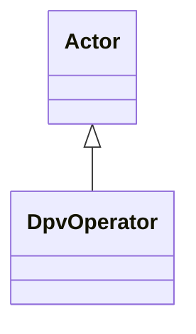

---
search:
  boost: 10.0
---

# Class: DpvOperator 


_Actor that operates the Technology_


<div data-search-exclude markdown="1">


URI: [tech:Operator](https://w3id.org/lmodel/dpv/tech/Operator)





## Inheritance
* [Actor](Actor.md)
    * **DpvOperator**


## Class Properties

| Property | Value |
| --- | --- |
| Class URI | [tech:Operator](https://w3id.org/lmodel/dpv/tech/Operator) |


## Slots

| Name | Cardinality and Range | Description | Inheritance |
| ---  | --- | --- | --- |


## In Subsets


* [TechSubset](TechSubset.md)


## Aliases


* Operator


## Comments

* Operator and User are similar concepts but may refer to different
actors, for example in the scenario where the user determines what
actions to perform on the technology and the operator executes these
actions by operating the technology


## Identifier and Mapping Information


### Annotations

| property | value |
| --- | --- |
| upstream_iri | https://w3id.org/dpv/tech/owl#Operator |
| dpv_extension_slug | tech |


### Schema Source


* from schema: https://w3id.org/lmodel/dpv/tech


## Mappings

| Mapping Type | Mapped Value |
| ---  | ---  |
| self | tech:Operator |
| native | tech:DpvOperator |
| exact | dpv_tech:Operator, dpv_tech_owl:Operator |
| close | iso22989:Stakeholder |


## LinkML Source

<!-- TODO: investigate https://stackoverflow.com/questions/37606292/how-to-create-tabbed-code-blocks-in-mkdocs-or-sphinx -->

### Direct

<details>
```yaml
name: DpvOperator
annotations:
  upstream_iri:
    tag: upstream_iri
    value: https://w3id.org/dpv/tech/owl#Operator
  dpv_extension_slug:
    tag: dpv_extension_slug
    value: tech
description: Actor that operates the Technology
comments:
- 'Operator and User are similar concepts but may refer to different

  actors, for example in the scenario where the user determines what

  actions to perform on the technology and the operator executes these

  actions by operating the technology'
in_subset:
- tech_subset
from_schema: https://w3id.org/lmodel/dpv/tech
aliases:
- Operator
exact_mappings:
- dpv_tech:Operator
- dpv_tech_owl:Operator
close_mappings:
- iso22989:Stakeholder
is_a: Actor
class_uri: tech:Operator

```
</details>

### Induced

<details>
```yaml
name: DpvOperator
annotations:
  upstream_iri:
    tag: upstream_iri
    value: https://w3id.org/dpv/tech/owl#Operator
  dpv_extension_slug:
    tag: dpv_extension_slug
    value: tech
description: Actor that operates the Technology
comments:
- 'Operator and User are similar concepts but may refer to different

  actors, for example in the scenario where the user determines what

  actions to perform on the technology and the operator executes these

  actions by operating the technology'
in_subset:
- tech_subset
from_schema: https://w3id.org/lmodel/dpv/tech
aliases:
- Operator
exact_mappings:
- dpv_tech:Operator
- dpv_tech_owl:Operator
close_mappings:
- iso22989:Stakeholder
is_a: Actor
class_uri: tech:Operator

```
</details></div>