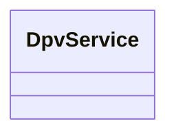

---
search:
  boost: 10.0
---

# Class: DpvService 


_The carrying out of a specific task or set of tasks as a service_


<div data-search-exclude markdown="1">


URI: [tech:Service](https://w3id.org/lmodel/dpv/tech/Service)





<!-- no inheritance hierarchy -->

## Class Properties

| Property | Value |
| --- | --- |
| Class URI | [tech:Service](https://w3id.org/lmodel/dpv/tech/Service) |


## Slots

| Name | Cardinality and Range | Description | Inheritance |
| ---  | --- | --- | --- |


## In Subsets


* [TechSubset](TechSubset.md)


## Aliases


* Service


## Comments

* This concept is distinct from dpv:Service as it represents the notion of
a technical service whereas dpv:Service can also refer to
organisational, legal, social, and other meanings of service


## Identifier and Mapping Information


### Annotations

| property | value |
| --- | --- |
| upstream_iri | https://w3id.org/dpv/tech/owl#Service |
| dpv_extension_slug | tech |


### Schema Source


* from schema: https://w3id.org/lmodel/dpv/tech


## Mappings

| Mapping Type | Mapped Value |
| ---  | ---  |
| self | tech:Service |
| native | tech:DpvService |
| exact | dpv_tech:Service, dpv_tech_owl:Service |


## LinkML Source

<!-- TODO: investigate https://stackoverflow.com/questions/37606292/how-to-create-tabbed-code-blocks-in-mkdocs-or-sphinx -->

### Direct

<details>
```yaml
name: DpvService
annotations:
  upstream_iri:
    tag: upstream_iri
    value: https://w3id.org/dpv/tech/owl#Service
  dpv_extension_slug:
    tag: dpv_extension_slug
    value: tech
description: The carrying out of a specific task or set of tasks as a service
comments:
- 'This concept is distinct from dpv:Service as it represents the notion of

  a technical service whereas dpv:Service can also refer to

  organisational, legal, social, and other meanings of service'
in_subset:
- tech_subset
from_schema: https://w3id.org/lmodel/dpv/tech
aliases:
- Service
exact_mappings:
- dpv_tech:Service
- dpv_tech_owl:Service
class_uri: tech:Service

```
</details>

### Induced

<details>
```yaml
name: DpvService
annotations:
  upstream_iri:
    tag: upstream_iri
    value: https://w3id.org/dpv/tech/owl#Service
  dpv_extension_slug:
    tag: dpv_extension_slug
    value: tech
description: The carrying out of a specific task or set of tasks as a service
comments:
- 'This concept is distinct from dpv:Service as it represents the notion of

  a technical service whereas dpv:Service can also refer to

  organisational, legal, social, and other meanings of service'
in_subset:
- tech_subset
from_schema: https://w3id.org/lmodel/dpv/tech
aliases:
- Service
exact_mappings:
- dpv_tech:Service
- dpv_tech_owl:Service
class_uri: tech:Service

```
</details></div>