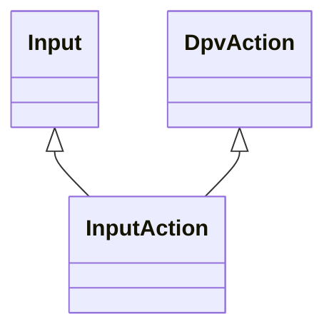

---
search:
  boost: 10.0
---

# Class: InputAction 


_Action provided as an input to a technology_


<div data-search-exclude markdown="1">


URI: [tech:InputAction](https://w3id.org/lmodel/dpv/tech/InputAction)





## Inheritance
* [InputOutput](InputOutput.md)
    * [DpvAction](DpvAction.md)
        * **InputAction** [ [Input](Input.md)]


## Class Properties

| Property | Value |
| --- | --- |
| Class URI | [tech:InputAction](https://w3id.org/lmodel/dpv/tech/InputAction) |


## Slots

| Name | Cardinality and Range | Description | Inheritance |
| ---  | --- | --- | --- |


## In Subsets


* [TechSubset](TechSubset.md)


## Aliases


* Input Action


## Comments

* Action can mean a physical action, such as the movements involved in
robotics


## Identifier and Mapping Information


### Annotations

| property | value |
| --- | --- |
| upstream_iri | https://w3id.org/dpv/tech/owl#InputAction |
| dpv_extension_slug | tech |


### Schema Source


* from schema: https://w3id.org/lmodel/dpv/tech


## Mappings

| Mapping Type | Mapped Value |
| ---  | ---  |
| self | tech:InputAction |
| native | tech:InputAction |
| exact | dpv_tech:InputAction, dpv_tech_owl:InputAction |


## LinkML Source

<!-- TODO: investigate https://stackoverflow.com/questions/37606292/how-to-create-tabbed-code-blocks-in-mkdocs-or-sphinx -->

### Direct

<details>
```yaml
name: InputAction
annotations:
  upstream_iri:
    tag: upstream_iri
    value: https://w3id.org/dpv/tech/owl#InputAction
  dpv_extension_slug:
    tag: dpv_extension_slug
    value: tech
description: Action provided as an input to a technology
comments:
- 'Action can mean a physical action, such as the movements involved in

  robotics'
in_subset:
- tech_subset
from_schema: https://w3id.org/lmodel/dpv/tech
aliases:
- Input Action
exact_mappings:
- dpv_tech:InputAction
- dpv_tech_owl:InputAction
is_a: DpvAction
mixins:
- Input
class_uri: tech:InputAction

```
</details>

### Induced

<details>
```yaml
name: InputAction
annotations:
  upstream_iri:
    tag: upstream_iri
    value: https://w3id.org/dpv/tech/owl#InputAction
  dpv_extension_slug:
    tag: dpv_extension_slug
    value: tech
description: Action provided as an input to a technology
comments:
- 'Action can mean a physical action, such as the movements involved in

  robotics'
in_subset:
- tech_subset
from_schema: https://w3id.org/lmodel/dpv/tech
aliases:
- Input Action
exact_mappings:
- dpv_tech:InputAction
- dpv_tech_owl:InputAction
is_a: DpvAction
mixins:
- Input
class_uri: tech:InputAction

```
</details></div>