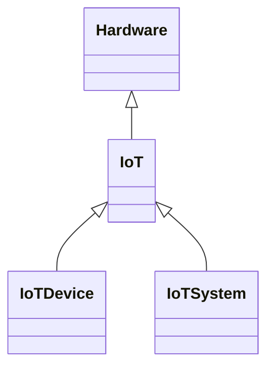

---
search:
  boost: 10.0
---

# Class: IoT 


_IoT is the infrastructure of interconnected entities, people, systems_

_and information resources together with services that process and react_

_to information from the physical world and virtual world_


<div data-search-exclude markdown="1">


URI: [tech:IoT](https://w3id.org/lmodel/dpv/tech/IoT)





## Inheritance
* **IoT** [ [Hardware](Hardware.md)]


## Class Properties

| Property | Value |
| --- | --- |
| Class URI | [tech:IoT](https://w3id.org/lmodel/dpv/tech/IoT) |


## Slots

| Name | Cardinality and Range | Description | Inheritance |
| ---  | --- | --- | --- |


## In Subsets


* [TechSubset](TechSubset.md)


## Aliases


* Internet of Things (IoT)


## Identifier and Mapping Information


### Annotations

| property | value |
| --- | --- |
| dct_source | ISO/IEC 22989:2022 |
| upstream_iri | https://w3id.org/dpv/tech/owl#IoT |
| dpv_extension_slug | tech |


### Schema Source


* from schema: https://w3id.org/lmodel/dpv/tech


## Mappings

| Mapping Type | Mapped Value |
| ---  | ---  |
| self | tech:IoT |
| native | tech:IoT |
| exact | dpv_tech:IoT, dpv_tech_owl:IoT |
| related | iso22989:AISystem |


## LinkML Source

<!-- TODO: investigate https://stackoverflow.com/questions/37606292/how-to-create-tabbed-code-blocks-in-mkdocs-or-sphinx -->

### Direct

<details>
```yaml
name: IoT
annotations:
  dct_source:
    tag: dct_source
    value: ISO/IEC 22989:2022
  upstream_iri:
    tag: upstream_iri
    value: https://w3id.org/dpv/tech/owl#IoT
  dpv_extension_slug:
    tag: dpv_extension_slug
    value: tech
description: 'IoT is the infrastructure of interconnected entities, people, systems

  and information resources together with services that process and react

  to information from the physical world and virtual world'
in_subset:
- tech_subset
from_schema: https://w3id.org/lmodel/dpv/tech
aliases:
- Internet of Things (IoT)
exact_mappings:
- dpv_tech:IoT
- dpv_tech_owl:IoT
related_mappings:
- iso22989:AISystem
mixins:
- Hardware
class_uri: tech:IoT

```
</details>

### Induced

<details>
```yaml
name: IoT
annotations:
  dct_source:
    tag: dct_source
    value: ISO/IEC 22989:2022
  upstream_iri:
    tag: upstream_iri
    value: https://w3id.org/dpv/tech/owl#IoT
  dpv_extension_slug:
    tag: dpv_extension_slug
    value: tech
description: 'IoT is the infrastructure of interconnected entities, people, systems

  and information resources together with services that process and react

  to information from the physical world and virtual world'
in_subset:
- tech_subset
from_schema: https://w3id.org/lmodel/dpv/tech
aliases:
- Internet of Things (IoT)
exact_mappings:
- dpv_tech:IoT
- dpv_tech_owl:IoT
related_mappings:
- iso22989:AISystem
mixins:
- Hardware
class_uri: tech:IoT

```
</details></div>