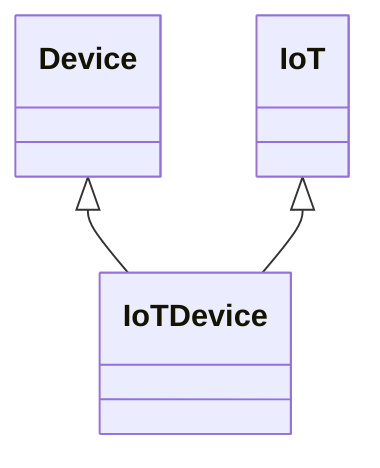

---
search:
  boost: 10.0
---

# Class: IoTDevice 


_An entity of an IoT system that interacts and communicates with the_

_physical world through sensing or actuating_


<div data-search-exclude markdown="1">


URI: [tech:IoTDevice](https://w3id.org/lmodel/dpv/tech/IoTDevice)





## Inheritance
* **IoTDevice** [ [Device](Device.md) [IoT](IoT.md)]


## Class Properties

| Property | Value |
| --- | --- |
| Class URI | [tech:IoTDevice](https://w3id.org/lmodel/dpv/tech/IoTDevice) |


## Slots

| Name | Cardinality and Range | Description | Inheritance |
| ---  | --- | --- | --- |


## In Subsets


* [TechSubset](TechSubset.md)


## Aliases


* IoT Device


## Identifier and Mapping Information


### Annotations

| property | value |
| --- | --- |
| dct_source | ISO/IEC 22989:2022 |
| upstream_iri | https://w3id.org/dpv/tech/owl#IoTDevice |
| dpv_extension_slug | tech |


### Schema Source


* from schema: https://w3id.org/lmodel/dpv/tech


## Mappings

| Mapping Type | Mapped Value |
| ---  | ---  |
| self | tech:IoTDevice |
| native | tech:IoTDevice |
| exact | dpv_tech:IoTDevice, dpv_tech_owl:IoTDevice |


## LinkML Source

<!-- TODO: investigate https://stackoverflow.com/questions/37606292/how-to-create-tabbed-code-blocks-in-mkdocs-or-sphinx -->

### Direct

<details>
```yaml
name: IoTDevice
annotations:
  dct_source:
    tag: dct_source
    value: ISO/IEC 22989:2022
  upstream_iri:
    tag: upstream_iri
    value: https://w3id.org/dpv/tech/owl#IoTDevice
  dpv_extension_slug:
    tag: dpv_extension_slug
    value: tech
description: 'An entity of an IoT system that interacts and communicates with the

  physical world through sensing or actuating'
in_subset:
- tech_subset
from_schema: https://w3id.org/lmodel/dpv/tech
aliases:
- IoT Device
exact_mappings:
- dpv_tech:IoTDevice
- dpv_tech_owl:IoTDevice
mixins:
- Device
- IoT
class_uri: tech:IoTDevice

```
</details>

### Induced

<details>
```yaml
name: IoTDevice
annotations:
  dct_source:
    tag: dct_source
    value: ISO/IEC 22989:2022
  upstream_iri:
    tag: upstream_iri
    value: https://w3id.org/dpv/tech/owl#IoTDevice
  dpv_extension_slug:
    tag: dpv_extension_slug
    value: tech
description: 'An entity of an IoT system that interacts and communicates with the

  physical world through sensing or actuating'
in_subset:
- tech_subset
from_schema: https://w3id.org/lmodel/dpv/tech
aliases:
- IoT Device
exact_mappings:
- dpv_tech:IoTDevice
- dpv_tech_owl:IoTDevice
mixins:
- Device
- IoT
class_uri: tech:IoTDevice

```
</details></div>