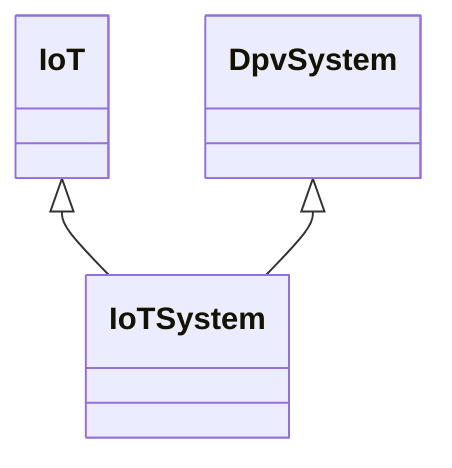

---
search:
  boost: 10.0
---

# Class: IoTSystem 


_A specific system that is an implementation or application of the IoT_

_framework and contains interconnected IoT devices and their_

_communication network along with other hardware and software required_

_for providing functionalities_


<div data-search-exclude markdown="1">


URI: [tech:IoTSystem](https://w3id.org/lmodel/dpv/tech/IoTSystem)





## Inheritance
* **IoTSystem** [ [IoT](IoT.md) [DpvSystem](DpvSystem.md)]


## Class Properties

| Property | Value |
| --- | --- |
| Class URI | [tech:IoTSystem](https://w3id.org/lmodel/dpv/tech/IoTSystem) |


## Slots

| Name | Cardinality and Range | Description | Inheritance |
| ---  | --- | --- | --- |


## In Subsets


* [TechSubset](TechSubset.md)


## Aliases


* IoT System


## Identifier and Mapping Information


### Annotations

| property | value |
| --- | --- |
| dct_source | ISO/IEC 22989:2022 |
| upstream_iri | https://w3id.org/dpv/tech/owl#IoTSystem |
| dpv_extension_slug | tech |


### Schema Source


* from schema: https://w3id.org/lmodel/dpv/tech


## Mappings

| Mapping Type | Mapped Value |
| ---  | ---  |
| self | tech:IoTSystem |
| native | tech:IoTSystem |
| exact | dpv_tech:IoTSystem, dpv_tech_owl:IoTSystem |
| related | iso22989:AISystem |


## LinkML Source

<!-- TODO: investigate https://stackoverflow.com/questions/37606292/how-to-create-tabbed-code-blocks-in-mkdocs-or-sphinx -->

### Direct

<details>
```yaml
name: IoTSystem
annotations:
  dct_source:
    tag: dct_source
    value: ISO/IEC 22989:2022
  upstream_iri:
    tag: upstream_iri
    value: https://w3id.org/dpv/tech/owl#IoTSystem
  dpv_extension_slug:
    tag: dpv_extension_slug
    value: tech
description: 'A specific system that is an implementation or application of the IoT

  framework and contains interconnected IoT devices and their

  communication network along with other hardware and software required

  for providing functionalities'
in_subset:
- tech_subset
from_schema: https://w3id.org/lmodel/dpv/tech
aliases:
- IoT System
exact_mappings:
- dpv_tech:IoTSystem
- dpv_tech_owl:IoTSystem
related_mappings:
- iso22989:AISystem
mixins:
- IoT
- DpvSystem
class_uri: tech:IoTSystem

```
</details>

### Induced

<details>
```yaml
name: IoTSystem
annotations:
  dct_source:
    tag: dct_source
    value: ISO/IEC 22989:2022
  upstream_iri:
    tag: upstream_iri
    value: https://w3id.org/dpv/tech/owl#IoTSystem
  dpv_extension_slug:
    tag: dpv_extension_slug
    value: tech
description: 'A specific system that is an implementation or application of the IoT

  framework and contains interconnected IoT devices and their

  communication network along with other hardware and software required

  for providing functionalities'
in_subset:
- tech_subset
from_schema: https://w3id.org/lmodel/dpv/tech
aliases:
- IoT System
exact_mappings:
- dpv_tech:IoTSystem
- dpv_tech_owl:IoTSystem
related_mappings:
- iso22989:AISystem
mixins:
- IoT
- DpvSystem
class_uri: tech:IoTSystem

```
</details></div>